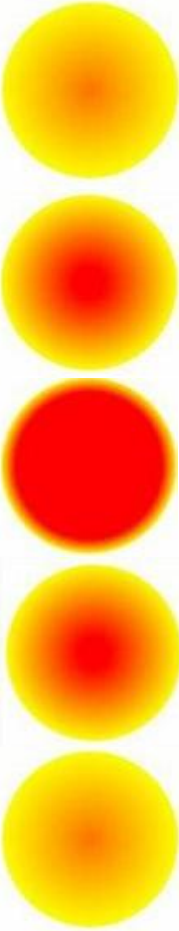

Разработайте WPF-приложение «Пульсар», изображающее круг, плавно меняющий свое состояние.

Используйте элемент «Эллипс» с радиальной градиентной заливкой **RadialGradientBrush** для свойства **Fill** (заливка)., плавно меняющий свое состояние от одного цвета к другому.

Примерная схема реализации:

{width=179px height=931px}

Подсказка: можете воспользоваться примером <https://metanit.com/sharp/wpf/16.3.php>