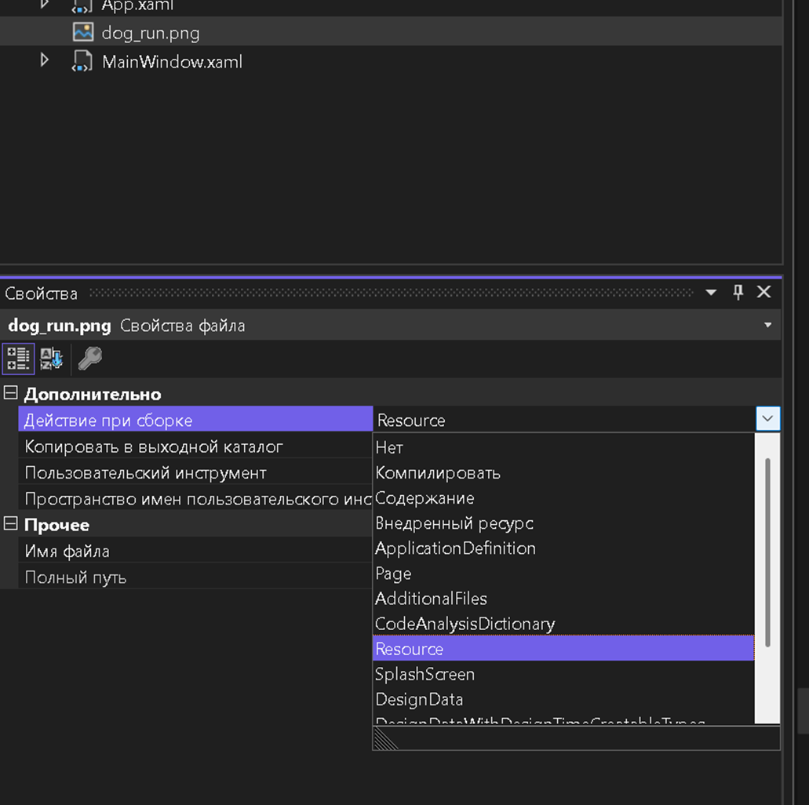
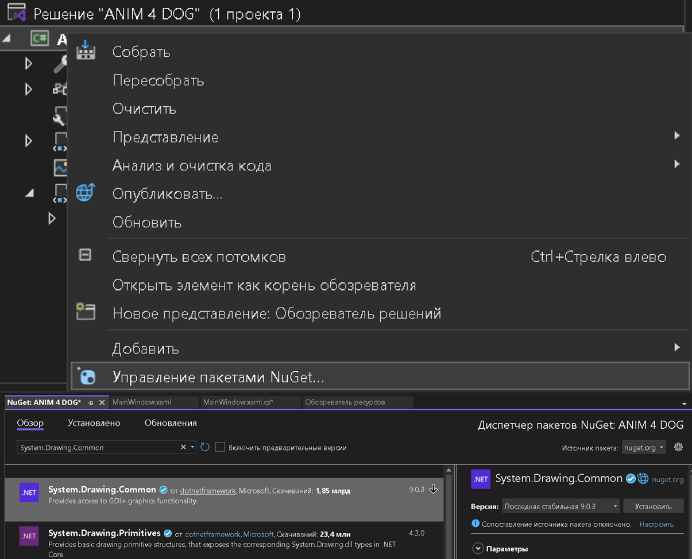
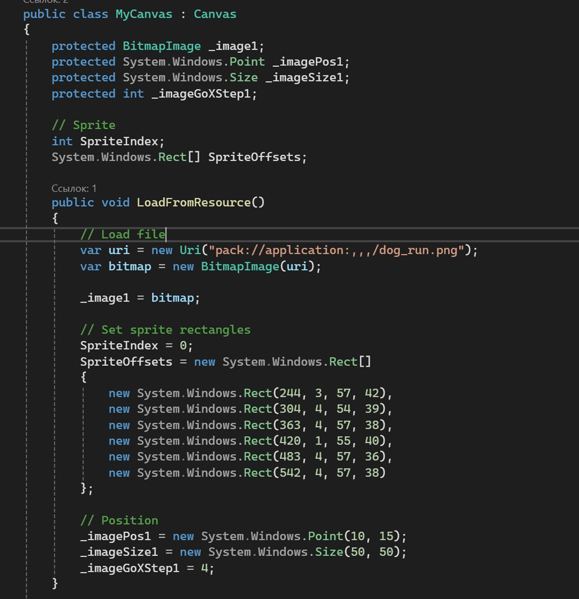
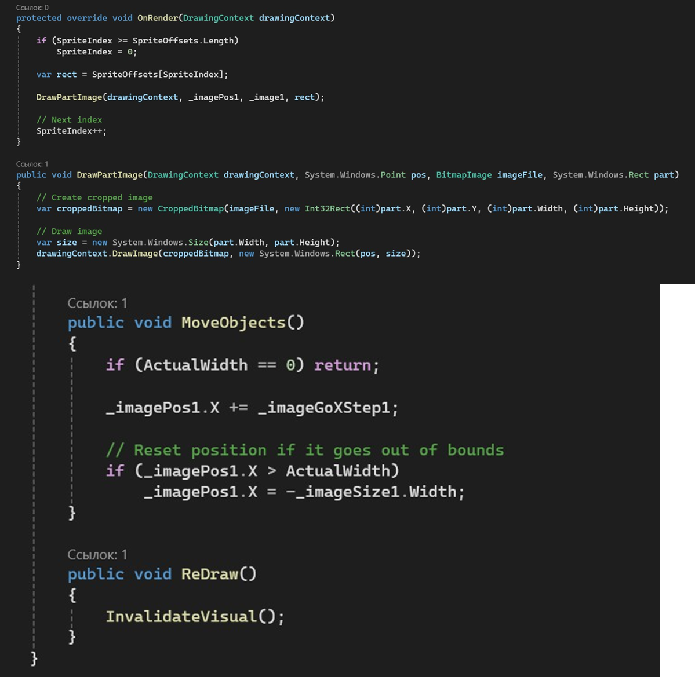
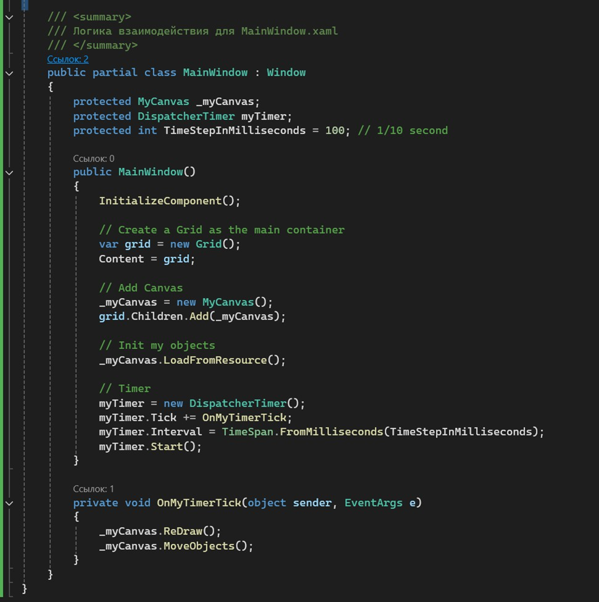

1\.Сохраните эту картинку себе на компьютер:

{width=913px height=58px}

2\. Добавьте картинку в проект и пометьте как Resource:

{width=1031px height=1026px}

3\.Добавьте NuGet пакет System.Drawing.Common:

{width=1205px height=974px}

4\.Измените файл **MainWindow.xaml.cs:**

{width=1160px height=1201px}

{width=1199px height=1169px}

{width=1214px height=1219px}

3\.Запустите и протестируйте проект.