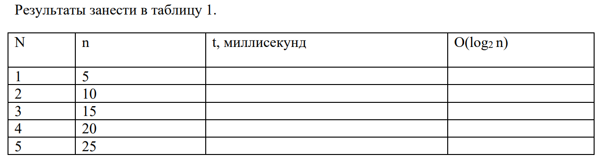

**Условие:** Составьте программу вычисления суммы факториалов по заданному варианту. Измерьте время выполнения для значений N = 5, 10, 15, 20, 25. Результаты занесите в таблицу и постройте график зависимости времени выполнения от N.

{width=1283px height=345px}

**Варианты:**

1. `S = 1! + 2! + 3! + ... + N!`

2. `S = 2! + 4! + 6! + ... + (2N)!`

3. `S = 1! + 3! + 5! + ... + (2N-1)!`

4. `S = 1! + 4! + 7! + ... + (3N-2)!`

5. `S = 2! + 5! + 8! + ... + (3N-1)!`

6. `S = 1²! + 2²! + 3²! + ... + N²!`

7. `S = 1! + (1+2)! + (1+2+3)! + ... + (1+2+...+N)!`

8. `S = 1! × 1 + 2! × 2 + 3! × 3 + ... + N! × N`

9. `S = 1!/1 + 2!/2 + 3!/3 + ... + N!/N`

10. `S = 1! + 1!×2! + 1!×2!×3! + ... + 1!×2!×...×N!`

11. `S = 1! + (1!+2!) + (1!+2!+3!) + ... + (1!+2!+...+N!)`

12. `S = 1! - 2! + 3! - 4! + ... + (-1)^(N+1)⋅N!`

**Дополнительно:**

Графики можно построить как в excel так и с помощью python (в ide или в среде google collab. Например, <https://colab.research.google.com/drive/186-tsAHDP_1Lw6Zo_M7CM2988QvjvxR4?usp=sharing>)

