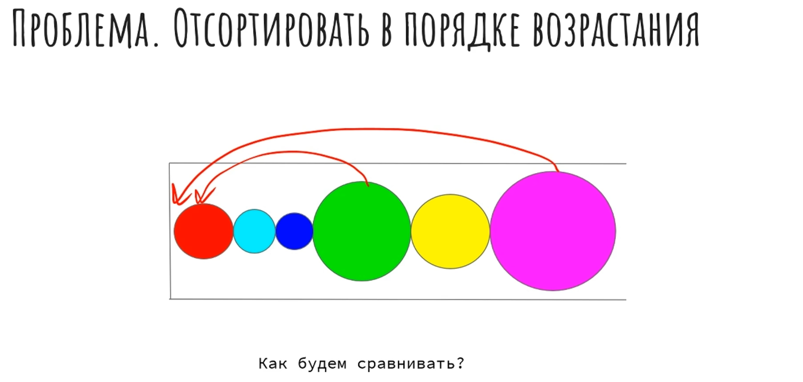
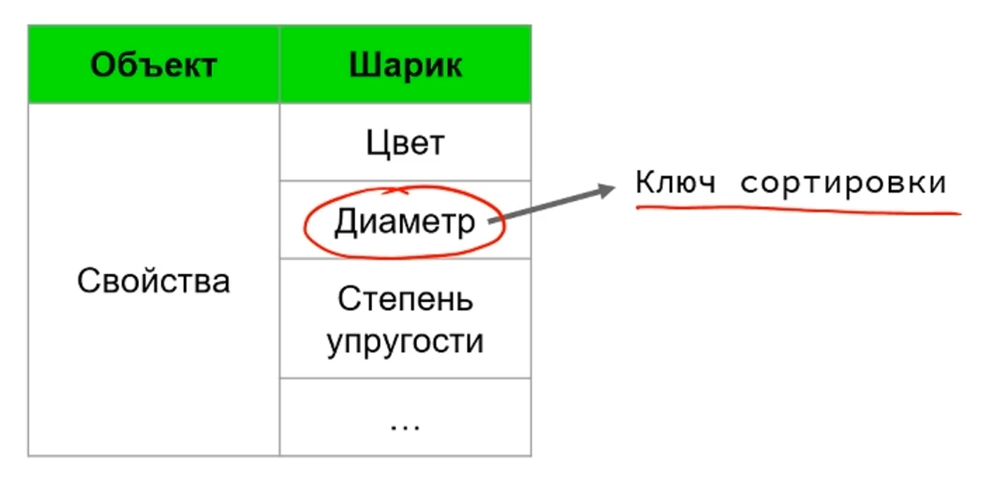
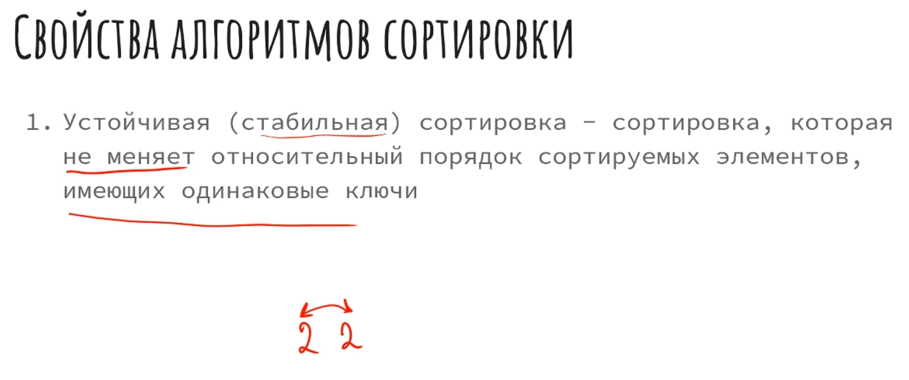
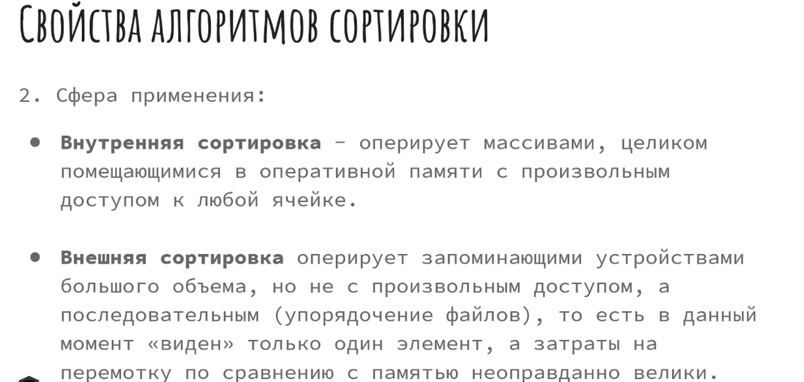

**Цель работы:** изучение описания и разработка алгоритмов, анализ сложности алгоритмов через подсчет элементарных операций и разработка программ сортировки.

1. **Теоретические сведения**

Для получения функции трудоемкости алгоритма, выраженной в элементарных операциях, используем следующие элементарные операции:

1. Простое присваивание: *а ¬ b*

2. Одномерная индексация *a\[i\]*

3. Арифметические операции: \* / - +

4. Операции сравнения: *a \< b*

5. Логические операции *\{or, and, not}*

Алгоритм сортировки -- это алгоритм для упорядочения данных. Отсортировать элементы можно в 2 направлениях: по возрастанию и по убыванию.

В случае, когда элемент списка имеет несколько полей, поле, служащее критерием порядка, называется **ключом сортировки.** На практике в качестве ключа часто выступает число, а в остальных полях хранятся какие-либо данные, никак не влияющие на работу алгоритма.  Устойчивая сортировка не меняет взаимного расположения элементов с одинаковыми ключами.

{width=2420px height=1153px}

Свойство, по которому мы будем сравнивать 2 объекта ( в данном случае шарики) и называется ключом сортировки.

{width=1424px height=719px}

{width=2340px height=980px}

{width=2468px height=1174px}

{width=2372px height=721px}

## Требования к отчету

**Структура отчета:**

1. **Титульный лист**

2. **Цель работы**

3. **Условие задания**

4. **Код программы**

5. **Скриншоты тестирования программы**

6. **Выводы**

### **Пример оформления отчета**

[Требования\_к\_оформлению\_отчета\_2.pdf](./Требования_к_оформлению_отчета_2.pdf)