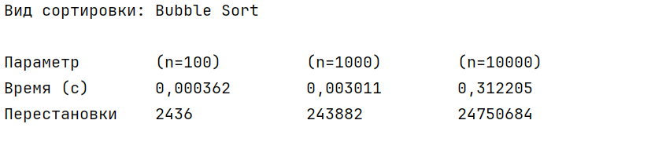

## Общие требования:

Реализовать два указанных в варианте алгоритма сортировки на языке C#, обеспечив возможность измерения времени их выполнения с использованием класса `Stopwatch` и подсчёта количества элементарных операций (например, перестановок или сравнений). Для каждого алгоритма провести серию экспериментов на массивах размером 100, 1 000 и 10 000 элементов, заполненных случайными целыми числами. По результатам тестирования оформить сводную таблицу, содержащую время выполнения и количество выполненных операций, а также сделать обоснованные выводы о практической эффективности реализованных алгоритмов в контексте их теоретической временной сложности.

## Варианты заданий

Теория: <https://programm.top/c-sharp/algorithm/array-sort/>

Сортировки в гифках: <https://proglib.io/p/sort-gif>

### **Вариант 1**

**Алгоритмы для реализации:**

1. Случайная сортировка (Bogosort) - **O(n×n!)**

2. Шейкерная сортировка (Cocktail sort) - **O(n²)**

### **Вариант 2**

**Алгоритмы для реализации:**

1. Сортировка вставками (Insertion sort) - **O(n²)**

2. Сортировка по частям (Stooge sort) - **O(n^2.7095)**

### **Вариант 3**

**Алгоритмы для реализации:**

1. Блинная сортировка (Pancake sort) - **O(n²)**

2. Сортировка Шелла (Shell sort) - **O(n log²n)** - **O(n²)**

### **Вариант 4**

**Алгоритмы для реализации:**

1. Сортировка слиянием (Merge sort) - **O(n log n)**

2. Сортировка выбором (Selection sort) - **O(n²)**

### **Вариант 5**

**Алгоритмы для реализации:**

1. Быстрая сортировка (Quick sort) - **O(n log n)** в среднем, **O(n²)** в худшем случае

2. Гномья сортировка (Gnome sort) - **O(n²)**

### **Вариант 6**

**Алгоритмы для реализации:**

1. Сортировка бинарным деревом (Tree sort) - **O(n log n)**

2. Сортировка расчёской (Comb sort) - **O(n²)** в худшем случае, **O(n log n)** в среднем

### **Вариант 7**

**Алгоритмы для реализации:**

1. Сортировка подсчетом (Counting sort) - **O(n+k)**, где k - диапазон значений

2. Случайная сортировка (Bogosort) - **O(n×n!)**

### **Вариант 8**

**Алгоритмы для реализации:**

1. Шейкерная сортировка (Cocktail sort) - **O(n²)**

2. Сортировка слиянием (Merge sort) - **O(n log n)**

### **Вариант 9**

**Алгоритмы для реализации:**

1. Сортировка вставками (Insertion sort) - **O(n²)**

2. Быстрая сортировка (Quick sort) - **O(n log n)**

### **Вариант 10**

**Алгоритмы для реализации:**

1. Сортировка по частям (Stooge sort) - **O(n^2.7095)**

2. Сортировка бинарным деревом (Tree sort) - **O(n log n)**

### **Вариант 11**

**Алгоритмы для реализации:**

1. Блинная сортировка (Pancake sort) - **O(n²)**

2. Сортировка расчёской (Comb sort) - **O(n²)** - **O(n log n)**

### **Вариант 12**

**Алгоритмы для реализации:**

1. Гномья сортировка (Gnome sort) - **O(n²)**

2. Сортировка подсчетом (Counting sort) - **O(n+k)**

## Сводная таблица сложностей алгоритмов:

| Алгоритм                        | Лучший случай | Средний случай | Худший случай | Память   |
|---------------------------------|---------------|----------------|---------------|----------|
| **Случайная сортировка**        | O(n)          | O(n×n!)        | O(∞)          | O(1)     |
| **Шейкерная сортировка**        | O(n)          | O(n²)          | O(n²)         | O(1)     |
| **Сортировка вставками**        | O(n)          | O(n²)          | O(n²)         | O(1)     |
| **Сортировка по частям**        | O(n^2.7095)   | O(n^2.7095)    | O(n^2.7095)   | O(n)     |
| **Блинная сортировка**          | O(n)          | O(n²)          | O(n²)         | O(1)     |
| **Сортировка Шелла**            | O(n log n)    | O(n log²n)     | O(n²)         | O(1)     |
| **Сортировка слиянием**         | O(n log n)    | O(n log n)     | O(n log n)    | O(n)     |
| **Сортировка выбором**          | O(n²)         | O(n²)          | O(n²)         | O(1)     |
| **Быстрая сортировка**          | O(n log n)    | O(n log n)     | O(n²)         | O(log n) |
| **Гномья сортировка**           | O(n)          | O(n²)          | O(n²)         | O(1)     |
| **Сортировка бинарным деревом** | O(n log n)    | O(n log n)     | O(n²)         | O(n)     |
| **Сортировка расчёской**        | O(n log n)    | O(n²)          | O(n²)         | O(1)     |
| **Сортировка подсчетом**        | O(n+k)        | O(n+k)         | O(n+k)        | O(k)     |

## Пример оформления программы с использованием Stopwatch

```
using System;
using System.Diagnostics;
class Program
{
    static (int[], int) BubbleSort(int[] arr)
    {
        int count = 0;
        for (int i = 0; i < arr.Length; i++)
        for (int j = 0; j < arr.Length - 1; j++)
            if (arr[j] > arr[j + 1])
            {
                int t = arr[j + 1];
                arr[j + 1] = arr[j];
                arr[j] = t;
                count++;
            }
        return (arr, count);
    }
    static void UniqueTime()
    {
        Random random = new Random();
        int[] sizes = { 100, 1000, 10_000 };
        double[] times = new double[sizes.Length];
        int[] swaps = new int[sizes.Length];
        for (int i = 0; i < sizes.Length; i++)
        {
            int[] arr = new int[sizes[i]];
            for (int j = 0; j < sizes[i]; j++)
            {
                arr[j] = random.Next(-100, 101);
            }
            Stopwatch stopwatch = Stopwatch.StartNew();
            var result = BubbleSort(arr);
            stopwatch.Stop();
            times[i] = stopwatch.Elapsed.TotalSeconds;
            swaps[i] = result.Item2;
        }
        Console.WriteLine("Вид сортировки: Bubble Sort");
        Console.WriteLine();
        Console.WriteLine($"{"Параметр",-15} {"(n=100)",-15} {"(n=1000)",-15} {"(n=10000)",-15}");
        Console.WriteLine($"{"Время (с)",-15} {times[0],-15:F6} {times[1],-15:F6} {times[2],-15:F6}");
        Console.WriteLine($"{"Перестановки",-15} {swaps[0],-15} {swaps[1],-15} {swaps[2],-15}");
    }
    static void Main()
    {
        UniqueTime();
    }
}
```

## Тестирование программы

{width=827px height=181px}

Данный алгоритм имеет сложность **O(n²)**, т.к. первый цикл имеет сложность **O(n)**, второй цикл -- **O(n/2)**. По правилу умножения: **O(n) × O(n/2) = O(n²/2)**, но так как константы в общей сложности не учитываются, то итоговая сложность -- **O(n²)**.

**Таблица результатов (пример для двух алгоритмов):**

| Параметр     | Алгоритм 1 (n=100) | Алгоритм 1 (n=1000) | Алгоритм 1 (n=10000) | Алгоритм 2 (n=100) | Алгоритм 2 (n=1000) | Алгоритм 2 (n=10000) |
|--------------|--------------------|---------------------|----------------------|--------------------|---------------------|----------------------|
| Время (с)    | 0\.003524          | 0\.198670           | 11\.685689           | 0\.001234          | 0\.045678           | 0\.987654            |
| Перестановки | 2302               | 249192              | 24720985             | 1500               | 150000              | 15000000             |

## Пример вывода для сравнения сортировок

**Выводы**: В результате проведённого эксперимента эффективным из представленных алгоритмов является быстрая сортировка, которая полностью оправдывает своё название. Имея незначительную разницу во времени при упорядочивании небольших массивов (до 1'000 элементов), она проявляет весь свой потенциал при работе с большими массивами данных (свыше 10'000 элементов), что является ключевым преимуществом при работе в крупных проектах.

Сортировка слиянием при упорядочивании небольших массивов (до 1'000 элементов) демонстрирует хорошие показатели, однако при сортировке массивов среднего и большого объёма (свыше 10'000 элементов) она показывает неудовлетворительные результаты. Сортировки пузырьком, выбором и вставками имеют схожие алгоритмы работы и показывают неудовлетворительные результаты с массивами любой разрядности. Самым медленным способом сортировки является шейкерная. Она показывает худшие результаты в массивах любой размерности и к работе с коммерческими проектами категорически не допускается.