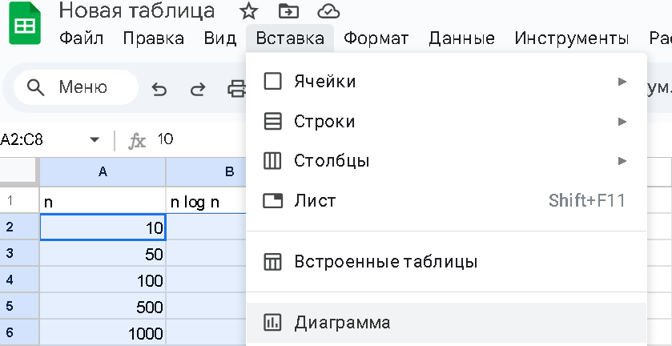
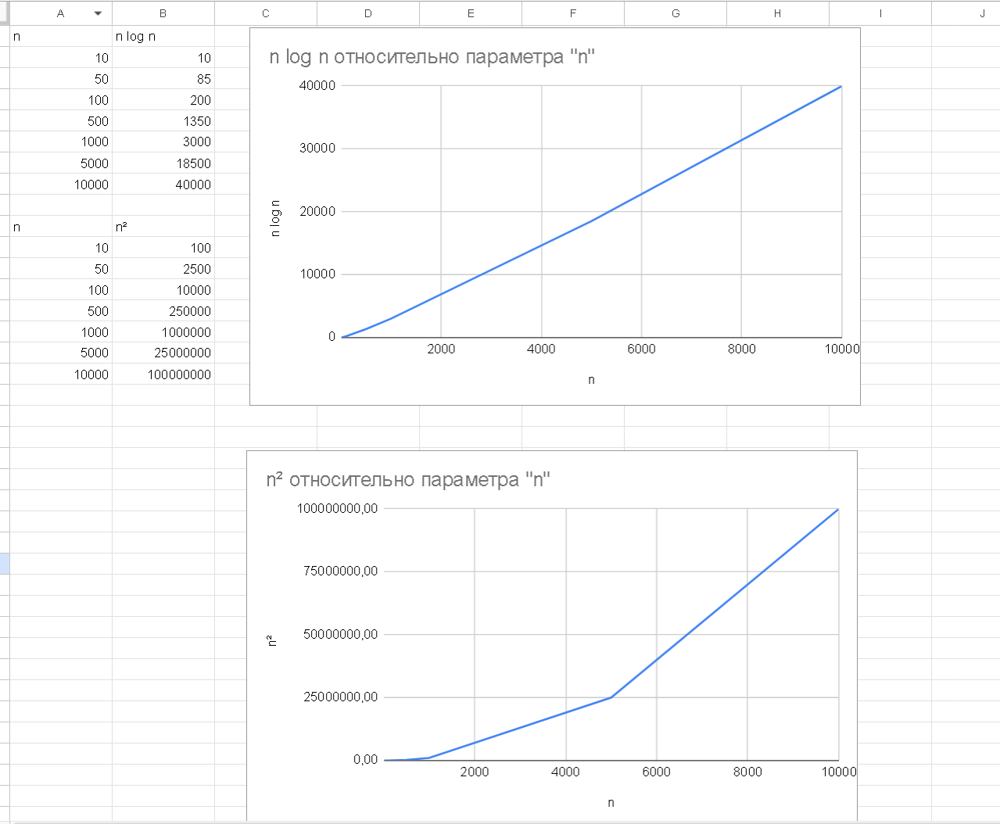

Построить графики функций сложности алгоритмов сортировки согласно варианту и проанализировать их рост при увеличении размера входных данных.

**Инструменты:** Excel, Google Sheets или <https://www.geogebra.org/graphing>

**Параметры для анализа:** n = 10, 50, 100, 500, 1000, 5000, 10000

## **Вариант 1**

**Построить графики:**

1. f(n) = n × n! (Случайная сортировка)

2. f(n) = n² (Шейкерная сортировка)

**Задание:** Сравнить экстремальный рост факториальной функции с квадратичной. При каких n факториальная функция становится нереализуемой на практике?

### **Вариант 2**

**Построить графики:**

1. f(n) = n² (Сортировка вставками)

2. f(n) = n².⁷⁰⁹⁵ (Сортировка по частям)

**Задание:** Проанализировать, насколько медленнее растет функция Stooge sort по сравнению с квадратичной.

### **Вариант 3**

**Построить графики:**

1. f(n) = n² (Блинная сортировка)

2. f(n) = n × log²n (Сортировка Шелла)

**Задание:** Сравнить традиционный квадратичный алгоритм с улучшенной версией. Найти точку, где Shell sort становится эффективнее.

### **Вариант 4**

**Построить графики:**

1. f(n) = n × log n (Сортировка слиянием)

2. f(n) = n² (Сортировка выбором)

**Задание:** Наглядно показать преимущество O(n log n) над O(n²) при больших n.

### **Вариант 5**

**Построить графики:**

1. f(n) = n × log n (Быстрая сортировка - средний случай)

2. f(n) = n² (Гномья сортировка)

**Задание:** Сравнить один из самых быстрых алгоритмов с одним из простейших.

### **Вариант 6**

**Построить графики:**

1. f(n) = n × log n (Сортировка бинарным деревом)

2. f(n) = n × log n и f(n) = n² (Сортировка расчёской - лучший и худший случаи)

**Задание:** Показать разницу между стабильным и нестабильным алгоритмом схожей сложности.

### **Вариант 7**

**Построить графики:**

1. f(n) = n + k, где k = 1000 (Сортировка подсчетом)

2. f(n) = n × n! (Случайная сортировка)

**Задание:** Сравнить самый эффективный алгоритм для специфичных данных с самым неэффективным.

### **Вариант 8**

**Построить графики:**

1. f(n) = n² (Шейкерная сортировка)

2. f(n) = n × log n (Сортировка слиянием)

**Задание:** Сравнить две устойчивые сортировки с разной сложностью.

### **Вариант 9**

**Построить графики:**

1. f(n) = n² (Сортировка вставками)

2. f(n) = n × log n (Быстрая сортировка)

**Задание:** Проанализировать разницу между простой и сложной реализацией.

### **Вариант 10**

**Построить графики:**

1. f(n) = n².⁷⁰⁹⁵ (Сортировка по частям)

2. f(n) = n × log n (Сортировка бинарным деревом)

**Задание:** Сравнить рекурсивный алгоритм с древовидным.

### **Вариант 11**

**Построить графики:**

1. f(n) = n² (Блинная сортировка)

2. f(n) = n × log n и f(n) = n² (Сортировка расчёской)

**Задание:** Сравнить два улучшенных варианта пузырьковой сортировки.

### **Вариант 12**

**Построить графики:**

1. f(n) = n² (Гномья сортировка)

2. f(n) = n + k, где k = 1000 (Сортировка подсчетом)

**Задание:** Сравнить алгоритм общего назначения со специализированным.

---

**Для каждого графика ответить на вопросы:**

1. При каких значениях n разница между алгоритмами становится существенной?

2. Какой алгоритм эффективнее для малых данных? Для больших данных?

3. В каких практических ситуациях предпочтительнее каждый из алгоритмов?

-  Сформулировать рекомендации по выбору алгоритма сортировки

-  Объяснить, почему некоторые алгоритмы редко используются на практике

-  Сделать вывод о важности анализа сложности алгоритмов

---

## Пример выполнения в гугл таблицах

{width=839px height=432px}

{width=1279px height=1054px}

