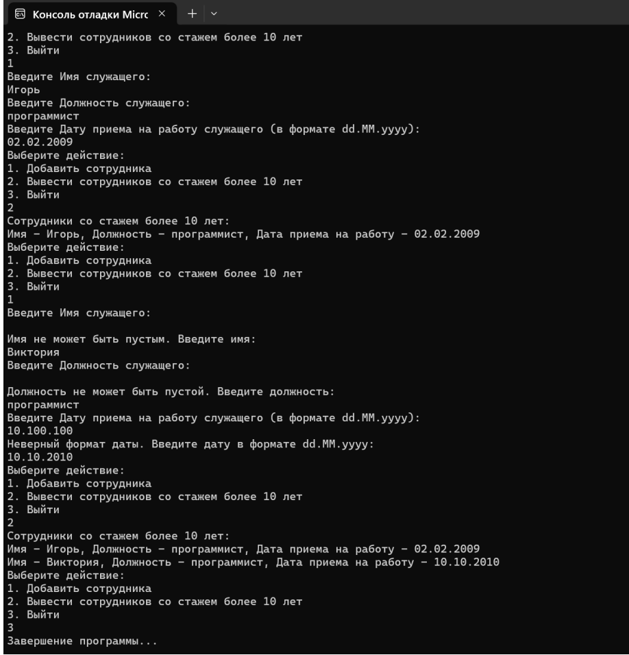

**Цель работы:** изучить особенности объявления и использования пользовательских типов данных на примере структур в языке программирования C#. Научиться создавать структуры, определять их поля и методы, а также применять их в решении практических задач для организации и обработки данных.

## Теоретическая справка:

<https://professorweb.ru/my/csharp/charp_theory/level9/9_6.php>

### Задание 1

Создать консольное приложение на языке C# в соответствии со следующими требованиями:

1\. Поля структуры являются приватными.

2\. Создать в структуре конструктор с параметрами. Имена параметров конструктора должны совпадать с именами полей структуры.

3\. Реализовать в структуре метод вывода приватных полей на экран.

4\. Реализовать в структуре решение задачи (вывод данных, соответствующих запросу) в виде метода.

5\. Объявить в методе `Main` список (\`List\`) элементов структуры.

6\. Организовать ввод данных пользователем. Данные вводятся с консоли по одной структуре за один раз и при вводе проверяются на допустимость (числа, даты и т.д.).

7\. Пользователь может чередовать ввод данных в список и вывод данных, соответствующих запросу.

### Задание 2.

Добавить в программу любой делегат и выполнить его вызов.

#### Варианты заданий:



---

*  № вар.

*  Поля структуры

*  Запрос

---

*  1

*  Модель авиалайнера\
   Производитель\
   Взлетный вес\
   Кол-во пассажиров

*  Вывести данные об авиалайнере с минимальным взлетным весом в пересчете на одного пассажира.\
   Примечание: таких авиалайнеров может быть несколько.

---

*  2

*  Наименование\
   Цена\
   Дата производства\
   Срок годности в сутках\
   Количество

*  Вывести сведения о всех товарах и их общую стоимость, срок годности которых истечет не позднее следующих 2 суток.

---

*  3

*  № поезда\
   Пункт отправления\
   Дата и время отправления\
   Дата и время прибытия

*  Вывести данные о поезде с максимальным временем пребывания в пути.\
   Примечание: таких поездов может быть несколько.

---

*  4

*  Название фильма\
   Продолжительность в минутах\
   Бюджет фильма

*  Вывести данные о фильмах с самой дорогой и самой дешевой стоимостью производства одной минуты фильма.

---

*  5

*  № авиарейса\
   Дата и время вылета\
   Дата и время прилета\
   Расстояние

*  Вывести данные об авиарейсе с максимальной скоростью.\
   Примечание: допускается, что авиарейс начнётся до полуночи, а завершится уже после полуночи.\
   Примечание: таких авиарейсов может быть несколько.

---

*  6

*  № поезда\
   Направление\
   Дата и время отправления\
   Дата и время прибытия

*  Вывести данные о поездах, пребывающих в пути более суток.

---

*  7

*  Название фильма\
   Время начала сеанса\
   Стоимость билета

*  Вывести сведения о сеансах, начинающихся после 18:00 и стоимостью билета выше средней.

---

*  8

*  Госномер\
   Модель\
   Год выпуска\
   Дата регистрации

*  Вывести сведения о машинах, произведенных до 2010 года и зарегистрированных менее года назад.

---

*  9

*  Госномер\
   Модель\
   Грузоподъемность\
   Дата регистрации

*  Вывести сведения о машинах, зарегистрированных менее 3 лет назад и имеющих грузоподъемность более 5 тонн.

---

*  10

*  ФИО\
   Должность\
   Дата подписания контракта\
   Срок действия контракта

*  Вывести сведения о работниках, подписавших контракт менее года назад.

---

*  11

*  Госномер\
   Тип (легковая, грузовая, автобус)\
   Модель\
   Дата прохождения техосмотра

*  Вывести сведения о легковых машинах, прошедших техосмотр более года назад.

---

*  12

*  ФИО\
   Должность\
   Дата приема на работу

*  Определить средний стаж работы и вывести сведения о работниках, стаж которых выше среднего.



:::tip 

Основные ошибки в лабораторных:

• Невнимательное чтение задания лабораторной.

• Метод Main имеет параметры или возвращаемое значение.

• Псевдокод перечисляет все возможные действия пользователя друг за другом. Это означает, что все эти действия принудительно будут выполняться друг за другом, а это не соответствует постановке задачи.

• Методы, работающие со структурой, находятся вне самой структуры.

:::

## Требования к отчету

**Структура отчета:**

1\. Титульный лист;

2\. Цель работы;

3\. Условие задания;

4\. Код программы;

5\. Скриншот работы программы.

6\. Вывод.

## Пример выполнения задания:



---

*  № вар.

*  Поля структуры

*  Запрос

---

*  15

*  Имя

   Должность

   Дата приема на работу

*  Вывести сведения о работниках, стаж которых превышает 10 лет.



```
using System.Diagnostics;
using System.IO.Pipes;
using System.Xml.Linq;

//Создание структуры
struct Employee
{
    private String name;
    private String position;
    private DateTime date;

    //Конструктор с параметрами
    public Employee(string name, string position, DateTime date)
    {
        this.name = name;
        this.position = position;
        this.date = date;
    }

    // Геттеры
    public String getName(String name) => this.name;
    public String getPosition(String position) => this.position;
    public String getDate() => date.ToShortDateString();

    //Метод для получения стажа сотрудника
    public int GetExperience()
    {
        return DateTime.Now.Year - date.Year;
    }

    public override string ToString()
    {
        return $"Имя - {name}, Должность - {position}, Дата приема на работу - {date.ToShortDateString()}";
    }
}

public class Program
{
    public static void Main(string[] args)
    {
        //Список для элементво структуры
        var people = new List<Employee>();

        while (true)
        {
            Console.WriteLine("Выберите действие:");
            Console.WriteLine("1. Добавить сотрудника");
            Console.WriteLine("2. Вывести сотрудников со стажем более 10 лет");
            Console.WriteLine("3. Выйти");

            int choice = int.Parse(Console.ReadLine());
            switch(choice)
            {
                case 1:
                    Console.WriteLine("Введите Имя служащего: ");
                    string name;
                    // Проверка на пустую строку
                    while (string.IsNullOrWhiteSpace(name = Console.ReadLine()))
                    {
                        Console.WriteLine("Имя не может быть пустым. Введите имя:");
                    }

                    Console.WriteLine("Введите Должность служащего: ");
                    string position;
                    //Проверка на пустую строку
                    while (string.IsNullOrWhiteSpace(position = Console.ReadLine()))
                    {
                        Console.WriteLine("Должность не может быть пустой. Введите должность:");
                    }

                    Console.WriteLine("Введите Дату приема на работу служащего (в формате dd.MM.yyyy): ");
                    DateTime date;
                    while (!DateTime.TryParse(Console.ReadLine(), out date))
                    {
                        Console.WriteLine("Неверный формат даты. Введите дату в формате dd.MM.yyyy:");
                    }

                    people.Add(new Employee(name, position, date));
                    break;
                case 2:
                    Console.WriteLine("Сотрудники со стажем более 10 лет:");
                    foreach (var person in people)
                    {
                        if (person.GetExperience() > 10)
                        {
                            Console.WriteLine(person);
                        }
                    }
                    break;
                case 3:
                    Console.WriteLine("Завершение программы...");
                    return;
            }
        }
    }
}
```

Скриншот работы программы представлен на рисунке 1:

{width=918px height=956px}

```
                                                        Рисунок 1 – Выполнение программы
```

### Пример делегата для данной программы

```
// Делегат для вывода информации о сотруднике
delegate void PrintEmployee(Employee employee);

// Метод для вывода информации о сотруднике в консоль
static void PrintToConsole(Employee employee)
{
    Console.WriteLine(employee);
}

// Создаем экземпляр делегата и связываем его с методом PrintToConsole
PrintEmployee printEmployee = PrintToConsole;
```

**Вызов делегата (фрагмент оператора** `switch` **в методе** `Main`**):**

```
case 2:
    Console.WriteLine("Сотрудники со стажем более 10 лет:");
    foreach (var person in people)
    {
        if (person.GetExperience() > 10)
        {
            // Используем делегат для вывода информации о сотруднике
            printEmployee(person);
        }
    }
    break;
```

## Примечание:

**Оценка 5:** Отчет оформлен согласно образцу оформления, выполнены все задания.

**Оценка 4:** Отчет оформлен согласно образцу оформления, выполнено задание 1.

**Оценка 3:** Отчет оформлен согласно образцу оформления, в задании 1 организовать простой ввод данных без учета пунктов 6 и 7.