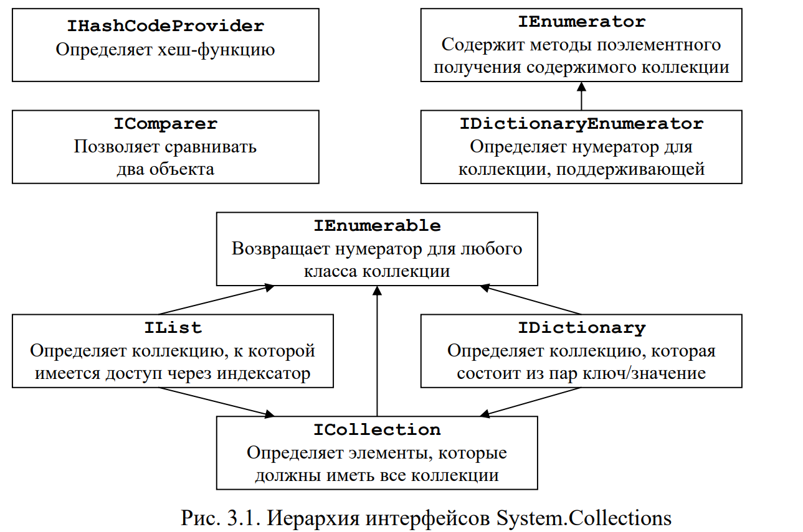

**Цель лабораторной работы:** Изучить интерфейсы и классы коллекций библиотеки .NET Framework, основные свойства и методы этих классов, применяемые при работе с коллекциями. Научиться работать с обобщениями в .NET.

### Интерфейсы коллекций

В C# под коллекцией понимается группа объектов. Пространство имен System.Collections содержит множество интерфейсов и классов, которые определяют и реализуют коллекции различных типов (динамические массивы, стеки, очереди, словари, хеш-таблицы и т.п.).

Интерфейсы, которые поддерживают коллекции и их иерархия приведены на рисунке 3.1.

Рис. 3.1. Иерархия интерфейсов System.Collections

{width=1289px height=855px}


### Cтек (Stack)

Класс коллекции, предназначенный для поддержки стека, называется **Stack**. Он реализует интерфейсы ICollection, IEnumerable и ICloneable. *Стек – это динамическая коллекция, которая при необходимости увеличивается, чтобы принять для хранения новые элементы, причем каждый раз, когда стек должен расшириться, его емкость удваивается.*

В классе Stack определены следующие конструкторы:

| **Прототип конструктора**    | **Описание**                                                  |
|------------------------------|---------------------------------------------------------------|
| public Stack()               | Создает пустой стек емкостью 10 элементов                     |
| public Stack(int capacity)   | Создает пустой стек с начальной емкостью capacity             |
| public Stack (ICollection c) | Создает стек, который инициализируется элементами коллекции c |

Помимо методов, определенных в интерфейсах, которые реализует класс Stack, в нем определены собственные методы, перечисленные в таблице:

| **Метод**                                   | **Описание**                                                              |
|---------------------------------------------|---------------------------------------------------------------------------|
| public virtual bool Contains(object v)      | Возвращает true, если в вызывающем стеке содержится объект v, иначе false |
| public virtual void Clear()                 | Очищает стек (устанавливает свойство Count равным нулю)                   |
| public virtual object Peek()                | Возвращает элемент, расположенный в вершине стека, но не удаляет его      |
| public virtual object Pop()                 | Возвращает элемент, расположенный в вершине стека, и удаляет его          |
| public virtual void Push(object v)          | Помещает объект v в стек                                                  |
| public static Stack Synchronized(Stack stk) | Возвращает синхронизированную версию стека stk                            |
| public virtual object\[\] ToArray()         | Возвращает массив, который содержит копии элементов вызывающего стека     |

### Очередь (Queue)

Класс коллекции, предназначенный для поддержки очереди, называется **Queue**. Он реализует интерфейсы ICollection, IEnumerable и ICloneable\*. Очередь – это динамическая коллекция, которая при необходимости увеличивается, чтобы принять для хранения новые элементы, причем каждый раз, когда такая необходимость возникает, текущий размер очереди умножается на коэффициент роста, который по умолчания равен значению 2/0.\*

В классе Queue определены следующие конструкторы:

| **Конструктор**                            | **Описание**                                                                        |
|--------------------------------------------|-------------------------------------------------------------------------------------|
| public Queue()                             | Создает пустую очередь с начальной емкостью в 32 элемента и коэффициентом роста 2,0 |
| public Queue(int capacity)                 | Создает пустую очередь с начальной емкостью capacity и коэффициентом роста 2,0      |
| public Queue(int capacity, float growFact) | Создает пустую очередь с начальной емкостью capacity и коэффициентом роста growFact |
| public Queue (ICollection **c**)           | Создает очередь, которая инициализируется элементами коллекции **c**                |

Помимо методов, определенных в интерфейсах, которые реализует класс Queue, в нем определены также собственные методы, перечисленные в таблице.

| **Метод**                                 | **Описание**                                                                          |
|-------------------------------------------|---------------------------------------------------------------------------------------|
| public virtual bool Contains(object v)    | Возвращает true, если в вызывающей очереди содержится объект v, иначе false           |
| public virtual void Clear()               | Очищает очередь (устанавливает свойство Count равным нулю)                            |
| public virtual object Dequeue()           | Возвращает объекта из начала вызывающей очереди, при этом объект из очереди удаляется |
| public virtual void Enqueue(object v)     | Добавляет объект v в конец очереди                                                    |
| public virtual object Peek()              | Возвращает элемент из начала вызывающей очереди, но не удаляет его                    |
| public static Queue Synchronized(Queue q) | Возвращает синхронизированную версию очереди q                                        |
| public virtual object\[\] ToArray()       | Возвращает массив, который содержит копии элементов вызывающей очереди                |
| public virtual void TrimToSize()          | Устанавливает свойство Capacity равным значению свойства Count                        |

### Обобщения (Generics)

Ниже приведена общая форма объявления обобщенного класса:

```
class имя_класса<список_параметров_типа> { // ...
```

А вот как выглядит синтаксис объявления ссылки на обобщенный класс:

```
имя_класса<список_аргументов_типа> имя_переменной = new имя_класса<список_параметров_типа>
(список_аргументов_конструктора);
```

Давайте рассмотрим пример использования нескольких обобщенных классов:

```
namespace ConsoleApplication1 
{ 
    // Создадим обобщенный класс имеющий параметр типа T 
    class MyObj<T> 
    { 
        T obj; 
 
        public MyObj(T obj) 
        { 
            this.obj = obj; 
        } 
 
        public void objectType() 
        { 
            Console.WriteLine("Тип объекта: " + typeof(T)); 
        } 
    } 
 
    // Обобщенный класс с несколькими параметрами 
    class MyObjects<T, V, E> 
    { 
        T obj1; 
        V obj2; 
        E obj3; 

        public MyObjects(T obj1, V obj2, E obj3) 
        { 
            this.obj1 = obj1; 
            this.obj2 = obj2; 
            this.obj3 = obj3; 
        } 
 
        public void objectsType() 
        { 
            Console.WriteLine("\nТип объекта 1: " + typeof(T)+ 
                "\nТип объекта 2: " + typeof(V) + 
                "\nТип объекта 3: " + typeof(E)); 
        } 
    } 
 
    class Program 
    { 
        static void Main() 
        { 
            // Создадим экземпляр обобщенного класса типа int 
            MyObj<int> obj1 = new MyObj<int>(25); 
            obj1.objectType(); 
 
            MyObjects<string, byte, decimal> obj2 = new MyObjects<string, byte, decimal>("Alex",26,12.333m); 
            obj2.objectsType(); 
 
            Console.ReadLine(); 
        } 
    } 
}
```

Дополнительно: к коллекциям можно применить методы LINQ.

Пример сортировки по убыванию:

```
List<int> average = new List<int>() {0,1,2,3,4,5 }; 
List<int> result = average.OrderByDescending(f => f).ToList(); 
foreach (var s in result) Console.WriteLine(s); 
 
string[] fruits = { "apple", "banana", "mango", "orange", "passionfruit", "grape" }; 
 
string[] newFruits = fruits.OrderByDescending(x=>x).ToArray(); 
foreach(var s in newFruits) project.SendInfoToLog(s); // passionfruit, orange, mango,
```

<https://metanit.com/sharp/tutorial/15.1.php>\\

<https://zenno.club/discussion/threads/ispolzuem-linq-dlja-bystroj-vyborki-iz-spiskov.122514/>

## Требования к отчету

**Структура отчета:**

1. **Титульный лист**

2. **Цель работы**

3. **Условие задания**

4. **Код программы**

5. **Скриншоты тестирования программы**

6. **Вывод по цели работы**

## Примечания

-  **Оценка 5 (отлично)**:\
   Выполнены все задания.

-  **Оценка 4 (хорошо)**:\
   Выполнены любые 2 задания.

-  **Оценка 3 (удовлетворительно)**:\
   Выполнено любое задание.