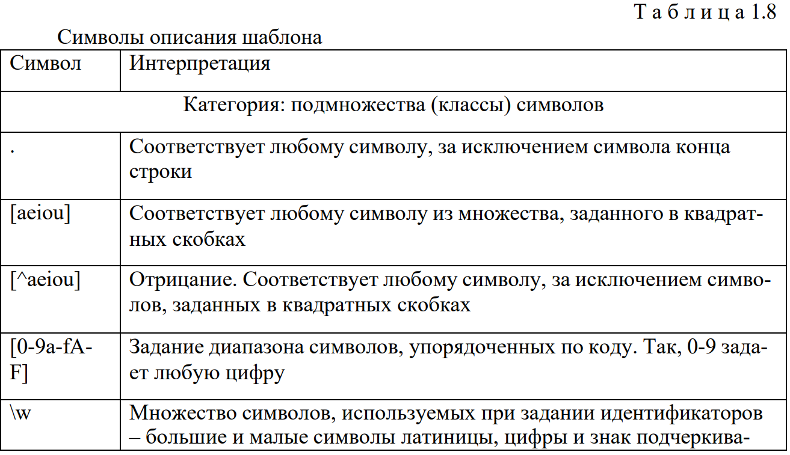
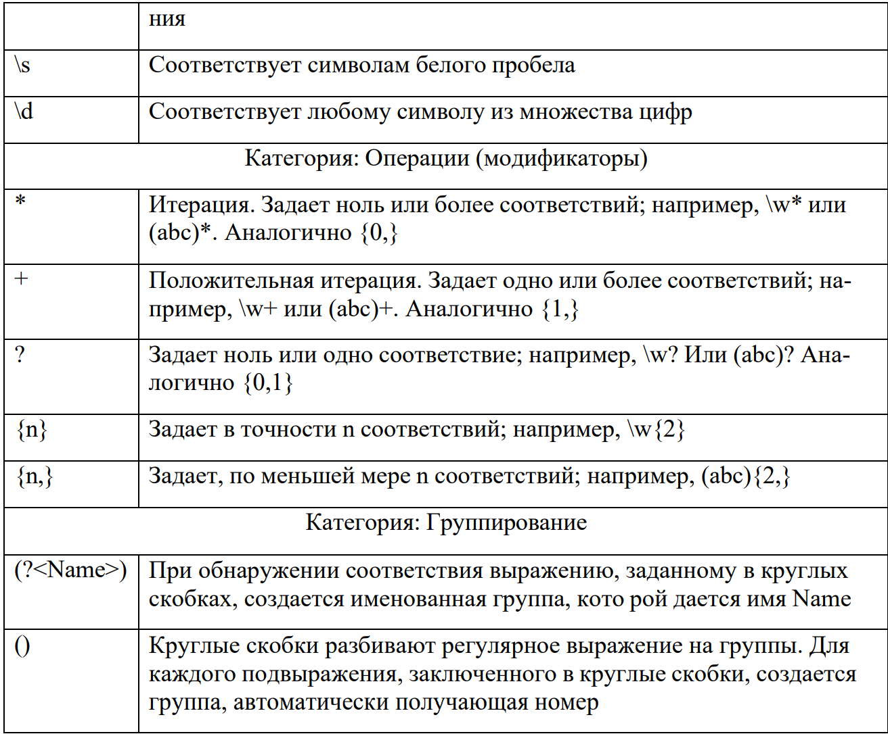

**Цель лабораторной работы:** освоить принципы поиска и сопоставления строковых данных с использованием регулярных выражений, написать программу с их использованием.

## Теоретическая справка

### Пространство имен RegularExpression 

Регулярные выражения – это один из способов поиска подстрок (соответствий) в строках. Осуществляется с помощью просмотра строки в поисках некоторого шаблона (табл. 1.8). Очень эффективны библиотеки, интерпретирующие регулярные выражения, обычно пишутся на низкоуровневых высокопроизводительных языках (С, C++, Assembler). С помощью регулярных выражений выполняются три действия: • проверка наличия соответствующей шаблону подстроки; • поиск и выдача пользователю соответствующих шаблону подстрок; • замена соответствующих шаблону подстрок

### Синтаксис регулярных выражений

Регулярное выражение на C# задается строковой константой. Обычно используется @-константа. В С# работа с регулярными выражениями выглядит следующим образом: 

```
Regex re = new Regex(«образец», «опции»); 
MatchCollection me = re.Matches(―строка для поиска‖); 
iCountMatchs = me.Count
```

где re – это объект типа Regex. В конструкторе ему передается образец поиска и опции.

{width=1313px height=757px}

{width=1312px height=1086px}

### Класс Regex

 Это основной класс, объекты которого определяют регулярные выражения. В конструктор класса передается в качестве параметра строка, задающая регулярное выражение. Основные методы класса Regex: 

▪ метод **Match** запускает поиск первого соответствия. Параметром передается строка поиска. Метод возвращает объект класса Match, описывающий результат поиска. 

#### Пример программы. Поиск первого соответствия шаблону

```
string FindMatch(string str, string strpat){
Regex pat = new Regex(strpat);
Match match =pat.Match(str);
string found = "";
if (match.Success) {
found =match.Value;
Console.WriteLine("Строка ={0}\tОбразец={1}\t Найдено={2}",
str,strpat,found);
}
return(found);
}
public void TestSinglePat(){
string str, strpat, found;
Console.WriteLine("Поиск по образцу");
//образец задает подстроку, начинающуюся с символа a,
//далее идут буквы или цифры.
str ="start"; strpat =@"a\w+";
found = FindMatch(str,strpat); //art
str ="fab77cd efg";
found = FindMatch(str,strpat); //ab77cd
//образец задает подстроку, начинающуюся с символа a,
//заканчивающуюся f с возможными символами b и d в середине
strpat = "a(b|d)*f"; 
str = "fabadddbdf";
found = FindMatch(str,strpat); //adddbdf
}
```

▪ метод **Matches** позволяет разыскать все непересекающиеся вхождения подстрок, удовлетворяющие образцу. В качестве результата возвращается объект **MatchCollection**, представляющий коллекцию объектов Match.

####  Пример программы. Поиск всех соответствий шаблону

```
void FindMatches(string str, string strpat) {
Regex pat = new Regex(strpat);
MatchCollection match =pat.Matches(str);
Console.WriteLine("Строка ={0}\tОбразец={1}\t Найдено={2}",
str,strpat,match.Count);
}
Console.WriteLine("око и рококо");
strpat="око"; str = "рококо";
FindMatches(str, strpat); //найдено одно соответствие
```

▪ метод **NextMatch** запускает новый поиск. 

 ▪ метод **Split** является обобщением метода Split класса String.

Он позволяет, используя образец, разделить искомую строку на элементы.

```
static void Main() {
string si = "Один, Два, Три, Строка для разбора";
Regex theRegex = new Regex(" |, |,");
int id = 1;
foreach (string substring in theRegex.Split(si))
Console.WriteLine("{0}: {1}", id++, substring);
}
```

▪ метод **Replace** – позволяет делать замену найденного образца.

Метод перегружен. При вызове метода передаются две строки: первая задает строку, в которой необходимо произвести замену, а вторая – на что нужно заменить найденную подстроку.

```
Regex r = new Regex(@"(a+)");
string s="bacghghaaab";
s=r.Replace(s,"_$1_"); // $1 – соответствует группе (а+)
Console.WriteLine("{0}",s);
```

Третий параметр указывает, сколько замен нужно произвести:

```
Regex r = new Regex(@"(dotsite)");
string s="dotsitedotsitedotsiterulez";
s=r.Replace(s,"f",1); Console.WriteLine("{0}",s);
```

Четвертый параметр указывает, с какого вхождения производить замены:

```
Regex r = new Regex(@"(dotsite)");
string s="dotsitedotsitedotsiterulez";
s=r.Replace(s,"f",2,1); Console.WriteLine("{0}",s);
```

### Классы Match и MatchCollection

Коллекция **MatchCollection**, позволяет получить доступ к каждому ее элементу – объекту **Match**. Для этого можно использовать цикл **foreach**. При работе с объектами класса Match наибольший интерес представляют свойства класса. 

Рассмотрим основные свойства: 

− свойства **Index**, **Length** и **Value** наследованы от прародителя **Capture**. 

Они описывают найденную подстроку – индекс начала подстроки в искомой строке, длину подстроки и ее значение;

 − свойство Groups класса Match возвращает коллекцию групп – объект GroupCollection, который позволяет работать с группами, созданными в процессе поиска соответствия; 

− свойство Captures, наследованное от объекта Group, возвращает коллекцию CaptureCollection.

#### Пример программы. Поиск всех образцов, соответствующих регулярному выражению

```
public static void Main( ) {
string si = "Это строка для поиска";
// найти любой пробельный символ следующий за непробельным
Regex theReg = new Regex(@"(\S+)\s");
// получить коллекцию результата поиска
MatchCollection theMatches = theReg.Matches (si);
// перебор всей коллекции
foreach (Match theMatch in theMatches) {
Console.WriteLine( "theMatch.Length: {0}", theMatch.Length);
if (theMatch.Length != 0)
Console.WriteLine("theMatch: {0}", theMatch.ToString( ));
}
}
```

### Классы Group и GroupCollection