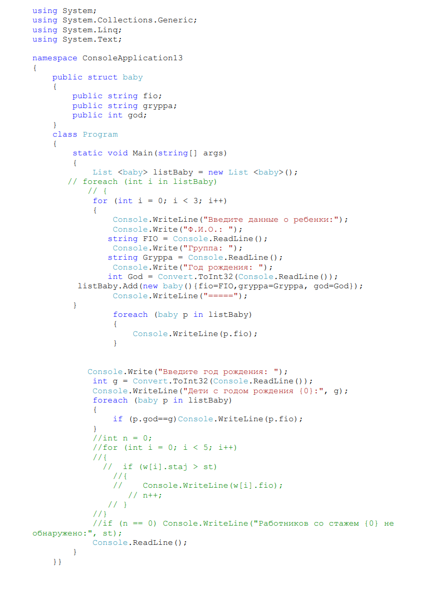

Ниже представлен список заданий по вариантам. При выполнении задания необходимо соблюдать общие требования к программе.

**Вариант 1**. Написать программу учета сдачи экзаменов студентами одной группы. Предусмотреть выдачу информации о задолжниках, а также студентов заслуживших повышенную стипендию.

**Вариант 2.** Написать программу учета книг в библиотеке. Необходимо предусмотреть выдачу информации о задолжниках.

**Вариант 3**. Написать программу учета продажи и поступления товаров в магазин. Предусмотреть выдачу товаров с истекающим сроком годности.

**Вариант 4**. Написать программу учета платежей, осуществляемых на автозаправочных станциях.

**Вариант 5**. Написать программу учета звонков (входящий, исходящий, непринятый) мобильного телефона.

**Вариант 6**. Написать программу учета купленных товаров в супермаркете.

**Вариант 7**. Написать программу, ведущую электронный учет детей на зачисление их в детский сад.

**Вариант 8**. Написать программу учета сдачи студентами спортивных нормативов.

**Вариант 9**. Написать программу учета пациентов на прием к врачу в поликлинике. По запросу можно узнать, сколько пациентов и какие именно записаны к конкретному врачу, а также сколько врач принял пациентов за указанный период времени.

**Вариант 10**. Написать программу учета машин на автостоянке.

**Вариант 11**. Написать программу учета мебели и оргтехники на предприятии.

**Вариант 12**. Написать программу банковских операций со счетом. При желании можно получить список совершенных действий со счетом.

### **Пример программы**

{width=852px height=1134px}