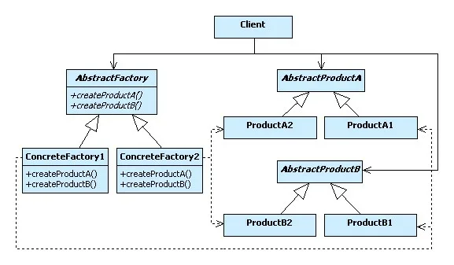
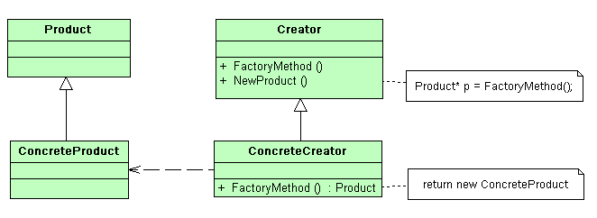
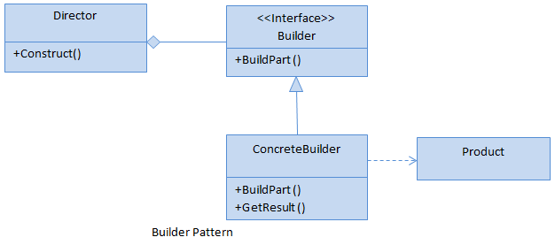
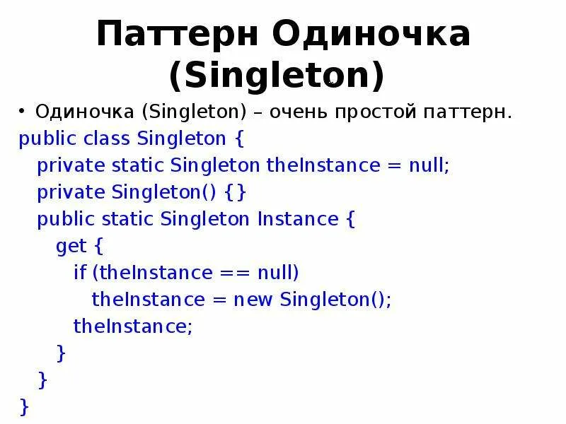
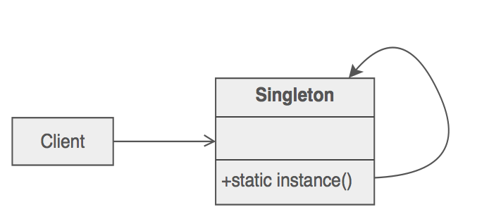
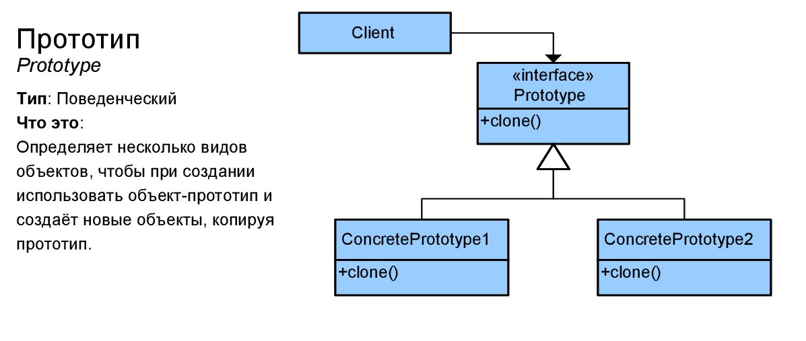

**Цель работы:** научиться разрабатывать программы с использованием порождающих шаблонов проектирования.

## Теоретическая справка:

Основные отношения: <https://www.nookery.ru/introduction-to-patterns-to-c/>

Как добавить в visual studio генератор диаграмм классов:  <https://www.nookery.ru/domain-specific-language/>

<https://learn.microsoft.com/ru-ru/visualstudio/ide/class-designer/designing-and-viewing-classes-and-types?view=visualstudio>

**Порождающие шаблоны проектирования** **(Creational Patterns)** -- это одна из трех групп шаблонов проектирования, которые используются в программировании, содержит 7 паттернов проектирования. Они ориентированы на задачи создания объектов и управлением процессом их создания. Порождающие шаблоны подразумевают использование абстракций и интерфейсов, чтобы скрыть детали конкретной реализации объектов, что упрощает систему и делает ее более гибкой.

Главная цель порождающих шаблонов проектирования -- облегчить процесс создания объектов, сделать его более гибким и удобным для разработчика.

### **Абстрактная фабрика**

**Абстрактная фабрика** (Abstract Factory) – это порождающий паттерн проектирования, который позволяет создавать семейства связанных объектов, не привязываясь к конкретным классам создаваемых объектов.\
Нам нужен такой способ создавать объекты, чтобы они сочетались с другими одного и того же семейства. Кроме того, мы не хотим вносить изменения в существующий код при добавлении новых объектов в программу.\
Шаблон реализуется созданием абстрактного класса **Factory**, который представляет собой интерфейс для создания компонентов системы (например, для оконного интерфейса он может создавать окна и кнопки). Затем пишутся классы, реализующие этот интерфейс.

Этот шаблон предоставляет интерфейс для создания семейств взаимосвязанных или взаимозависимых объектов, не специфицируя их конкретных классов. Как и в реальной жизни фабрика имеет некую специализацию, создавая товары или устройства какого-либо определенного типа.

***Фабрика, которая выпускает, например, мебель, не может производить, например, еще и компоненты для смартфонов. В программировании фабрика объектов может создавать только объекты определенного типа, которые используют единый интерфейс.***

Самыми главными преимуществами данного паттерна в С#, является упрощение создания объектов различных классов, использующих единый интерфейс. Паттерн предоставляет интерфейс для создания семейств, связанных между собой, или независимых объектов, конкретные классы которых неизвестны. От класса «абстрактная фабрика» наследуются классы конкретных фабрик, которые содержат методы создания конкретных объектов-продуктов, являющихся наследниками класса «абстрактный продукт», объявляющего интерфейс для их создания.

{width=577px height=337px}

Ниже приведена формальная реализация паттерна на языке C#

```
abstract class AbstractFactory
{
public abstract AbstractProductA CreateProductA();
public abstract AbstractProductB CreateProductB();
}
class ConcreteFactory1: AbstractFactory
{
public override AbstractProductA CreateProductA()
{
return new ProductA1();
}
public override AbstractProductB CreateProductB()
{
return new ProductB1();
}
}
class ConcreteFactory2: AbstractFactory
{
public override AbstractProductA CreateProductA()
{
return new ProductA2();
}
public override AbstractProductB CreateProductB()
{
return new ProductB2();
}
}
abstract class AbstractProductA
{}
abstract class AbstractProductB
{}
class ProductA1: AbstractProductA
{}
class ProductB1: AbstractProductB
{}
class ProductA2: AbstractProductA
{}
class ProductB2: AbstractProductB
{}
class Client
{
private AbstractProductA abstractProductA;
private AbstractProductB abstractProductB;
public Client(AbstractFactory factory)
{
abstractProductB = factory.CreateProductB();
abstractProductA = factory.CreateProductA();
}
public void Run()
{ }
}
```

#### Пример

<https://bool.dev/blog/detail/porozhdayushchie-shablony-abstract-factory>

<https://devpractice.ru/patterns-abstract-factory/>

### Фабричный метод

**Фабричный метод** -- это порождающий паттерн, который предоставляет интерфейс для создания объектов в суперклассе, но позволяет подклассам изменять тип создаваемого объект.

В момент создания наследники могут определить, какой класс создавать. Иными словами, Фабрика делегирует создание объектов наследникам родительского класса. Это позволяет использовать в коде программы не специфические классы, а манипулировать абстрактными объектами на более высоком уровне. Шаблон определяет интерфейс для создания объекта, но оставляет подклассам решение о том, какой класс инстанцировать. Фабричный метод позволяет классу делегировать создание подклассов. Используется, когда:

− классу заранее неизвестно, объекты каких подклассов ему нужно создавать;

− класс спроектирован так, чтобы объекты, которые он создаёт, специфицировались подклассами;

− класс делегирует свои обязанности одному из нескольких вспомогательных подклассов, и планируется локализовать знание о том, какой класс принимает эти обязанности на себя

Структура:

**Product** – продукт; определяет интерфейс объектов, создаваемых абстрактным методом. **ConcreteProduct** – конкретный продукт, реализует интерфейс **Product**.

**Creator** – создатель; объявляет фабричный метод, который возвращает объект типа **Product**. Может также содержать реализацию этого метода «по умолчанию»; может вызывать фабричный метод для создания объекта типа **Product**.

**ConcreteCreator** – конкретный создатель; переопределяет фабричный метод таким образом, чтобы он создавал и возвращал объект класса **ConcreteProduct**.

{width=662px height=242px}

Формальное определение паттерна на языке C# может выглядеть следующим образом

```
abstract class Product
{}
class ConcreteProductA : Product
{}
class ConcreteProductB : Product
{}
abstract class Creator
{
public abstract Product FactoryMethod();
}
class ConcreteCreatorA : Creator
{
public override Product FactoryMethod() { return new
ConcreteProductA(); }
}
class ConcreteCreatorB : Creator
{
public override Product FactoryMethod() { return new
ConcreteProductB(); }
}
```

#### Пример

<https://www.nookery.ru/factory-method/>

### Строитель

**Строитель (Builder)** - это порождающий паттерн проектирования, который позволяет разделить создание экземпляра класса на несколько шагов. Данный паттерн может быть полезен, когда созданние какого-либо экземпляра класса требует много разных этапов и когда также важно, в каком порядке эти этапы будут выполняться.

:::quote 

❌ Проблема заключается в том, что у нас может быть какой-то сложный объект и его создание может привести к огромному количеству кода в конструкторе Паттерн Builder (Строитель) состоить из двух участников:

:::

-  **Строитель (Builder)** – предоставляет методы для сборки частей экземпляра класса;

-  **Распорядитель (Director)** – определяет саму стратегию того, как будет происходить сборка: определяет, в каком порядке будут вызываться методы Строителя.

{width=626px height=277px}

Формальное описание паттерна на языке C#.

```
class Client
{
void Main()
{
Builder builder = new ConcreteBuilder();
Director director = new Director(builder);
director.Construct();
Product product = builder.GetResult();
}
}
class Director
{
Builder builder;
public Director(Builder builder)
{
this.builder = builder;
}
public void Construct()
{
builder.BuildPartA();
builder.BuildPartB();
builder.BuildPartC();
}
}
abstract class Builder
{
public abstract void BuildPartA();
public abstract void BuildPartB();
public abstract void BuildPartC();
public abstract Product GetResult();
}
class Product
{
List<object> parts = new List<object>();
public void Add(string part)
{
parts.Add(part);
}
}
class ConcreteBuilder : Builder
{
Product product = new Product();
public override void BuildPartA()
{
product.Add("Part A");
}
public override void BuildPartB()
{
product.Add("Part B");
}
public override void BuildPartC()
{
product.Add("Part C");
}
public override Product GetResult()
{
return product;
}
}
```

Участники паттерна:

− **Product**: представляет объект, который должен быть создан. В данном случае все части объекта заключены в списке parts;

− **Builder**: определяет интерфейс для создания различных частей объекта **Product**;

**− ConcreteBuilder:** конкретная реализация **Buildera**. Создает объект **Product** и определяет интерфейс для доступа к нему;

− **Director**: распорядитель – создает объект, используя объекты **Builder**

#### **Пример**

<https://andrey.moveax.ru/post/patterns-oop-creational-builder>

### Одиночка

{width=800px height=600px}

{width=694px height=294px}

### Прототип

{width=1197px height=507px}

#### Пример

<https://bool.dev/blog/detail/porozhdayushchie-patterny-prototype-sharp>

## Примечания

-  **Оценка 5 (отлично)**:

Выполнены полностью задания 1-3, построены UML-диаграммы.

-  **Оценка 4 (хорошо)**:

Выполнены полностью задания 1-3 или выполнены любые 2 задания с построенными UML-диаграммами.

-  **Оценка 3 (удовлетворительно)**:

Выполнено любое задание, к нему построена UML-диаграмма или выполнены любые 2 задания.