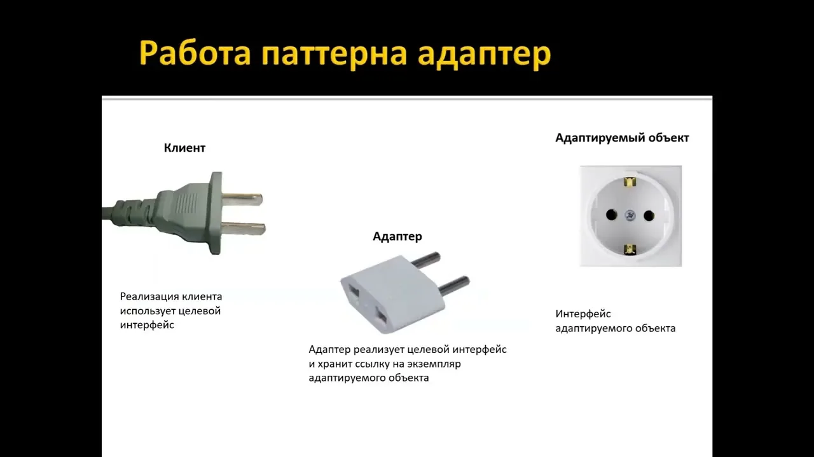
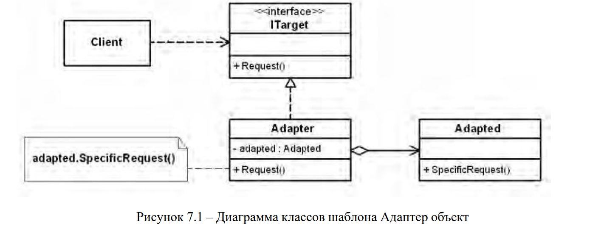
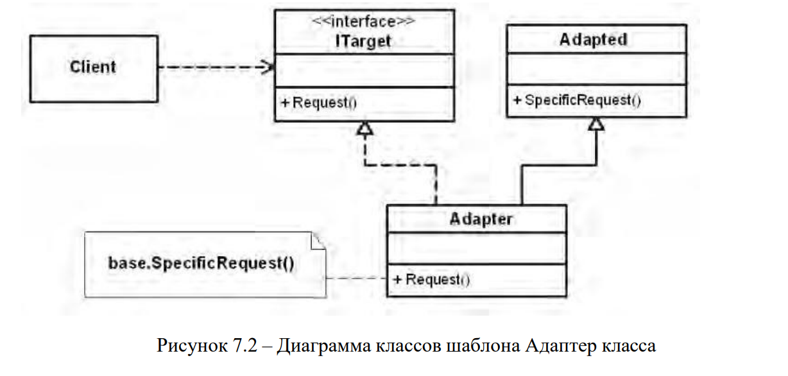
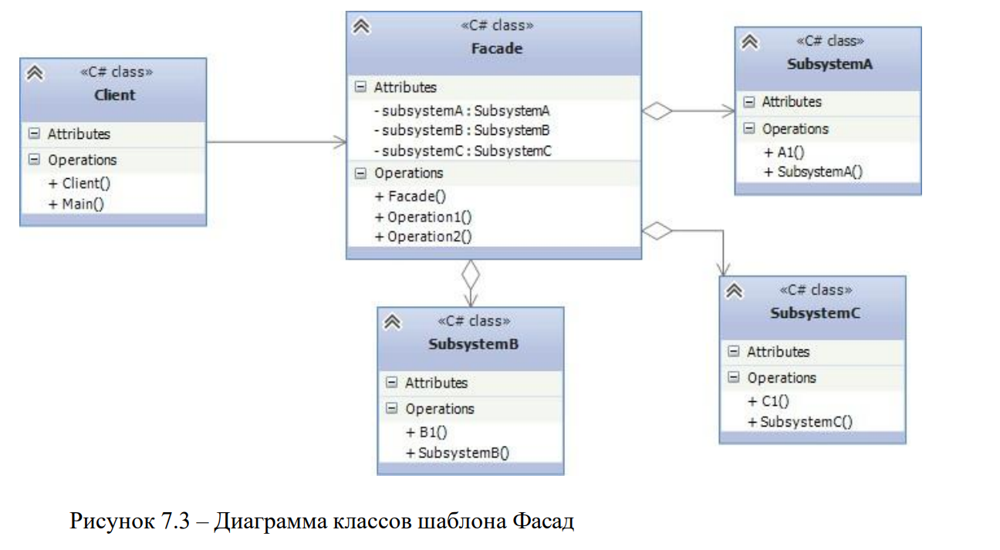
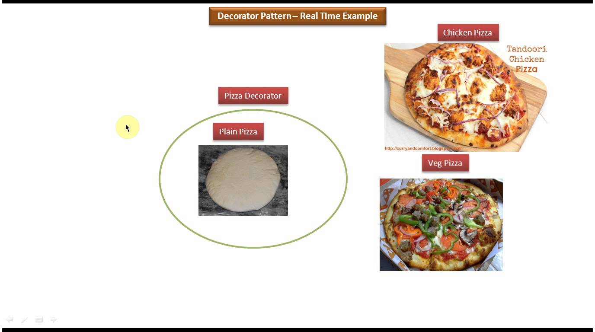
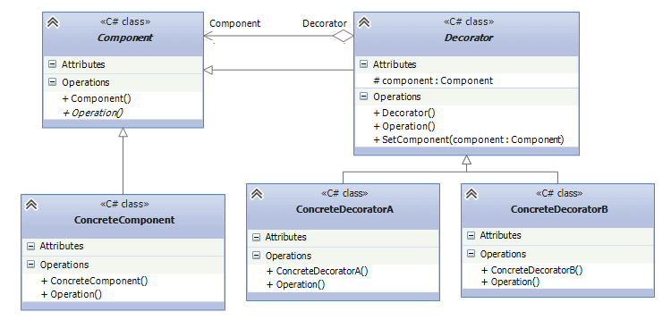
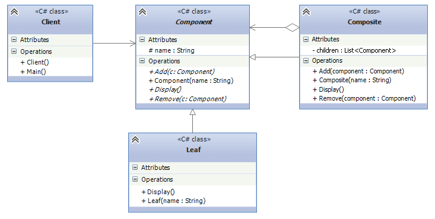

**Цель работы:** изучить структурные шаблоны проектирования и научиться использовать их для решения практических задач.

## Теоретическая справка

### Адаптер

Адаптер – структурный шаблон проектирования, предназначенный для преобразования интерфейса класса к другому интерфейсу, на который рассчитан клиент. Адаптер делает возможной совместную работу классов с несовместимыми интерфейсами.

{width=1280px height=720px}

*Проблема.*

Как обеспечить взаимодействие несовместимых интерфейсов или как создать единый устойчивый интерфейс для нескольких классов с разными интерфейсами?

*Решение.*

Преобразовать исходный интерфейс класса к другому виду с помощью промежуточного объекта-адаптера.

Основными участниками решения являются:

− **Client** – клиент, использующий целевой интерфейс;

− **ITarget** – целевой интерфейс;

− **Adapter** – адаптер, реализующий интерфейс **ITarget**;

− **Adapted** – адаптируемый класс, имеющий интерфейс, несовместимый с интерфейсом клиента

Шаблон Адаптер имеет следующие разновидности:

− адаптер объекта применяет для адаптации одного интерфейса к другому композицию объектов адаптируемого класса (рисунок 7.1).

− адаптер класса использует для адаптации наследование адаптируемому классу (рисунок 7.2).

{width=1389px height=542px}

{width=1228px height=586px}

*Результаты.*

Система становится независимой от интерфейса внешних классов (компонентов, библиотек). При переходе на использование внешних классов не требуется переделывать всю систему, достаточно переделать один класс Adapter.

Результаты применения адаптеров классов и объектов различаются.

*Адаптер объекта:*

− позволяет работать объекту **Adapter** со многими адаптируемыми объектами (например, с объектами класса Adapted и его производных классов);

− отличается сложностью при замещении операций класса **Adapted** (для этого может потребоваться создать класс производный от **Adapted**, и добавить в класс **Adapter** ссылку на этот производный класс).

*Адаптер классов:*

− обеспечивает простой доступ к элементам адаптируемого класса, поскольку **Adapter** является производным классом от **Adapted**;

− характеризуется легкостью изменения адаптером операций адаптируемого класса **Adapted**;

− обладает возможностью работы только с одним адаптируемым классом (возможность адаптировать классы, производные от **Adaptee**, отсутствует).

*Реализация.*

Простейший пример реализации шаблона Адаптер объекта на языке C# представлен ниже.

```
// Представляет целевой интерфейс
public interface ITarget
{
void Request();
}
// Представляет адаптируемые объекты
class Adapted
{
public void SpecificRequest()
{
Console.WriteLine("Вызван SpecificRequest()");
}
}
// Представляет объекты-адаптеры
public class Adapter : ITarget
{
Adapted adapted = new Adapted();
public void Request()
{
adapted.SpecificRequest();
}
}
// Клиент
class Client
{
static void Main(string[] args)
{
ITarget target = new Adapter();
target.Request();
}
}
```

Отличие реализации шаблона Адаптер класса будет заключаться только в коде класса **Adapter**.

```
// Представляет объекты-адаптеры
public class Adapter : Adapted, ITarget
{
public void Request()
{
base.SpecificRequest();
}
}
```

### Фасад

Фасад – структурный шаблон проектирования, позволяющий скрыть сложность подсистемы путем сведения всех возможных вызовов к одному объекту (фасадному объекту), делегирующему их объектам подсистемы. Шаблон Фасад объединяет группу объектов в рамках одного специализированного интерфейса и переадресует вызовы его методов к этим объектам.

*Проблема.*

Как обеспечить унифицированный интерфейс с подсистемой, если нежелательна высокая степень связанности с этой подсистемой или реализация подсистемы может измениться?

*Решение.*

Определить одну точку взаимодействия с подсистемой – **фасадный объект**, обеспечивающий единый упрощенный интерфейс с подсистемой и возложить на него обязанность по взаимодействию с классами подсистемы.

*Участники решения:*

− **Client** – взаимодействует с фасадом и не имеет доступа к классам подсистемы;

− **Facade** – перенаправляет запросы клиентов к классам подсистемы;

− **Классы подсистемы** – выполняют работу, порученную объектом **Facade**, ничего не зная о существовании фасада, то есть не хранят ссылок на него.

*Результаты:*

− клиенты изолируются от классов (компонентов) подсистемы, что уменьшает число объектов, с которыми клиенты взаимодействуют, и упрощает работу с подсистемой;

− снижается степень связанности между клиентами и подсистемой, что позволяет изменять классы подсистемы, не затрагивая при этом клиентов

{width=1296px height=713px}


*Реализация*.

Формальное определение программы в C# может выглядеть так:

```
class SubsystemA
{
public void A1()
{}
}
class SubsystemB
{
public void B1()
{}
}
class SubsystemC
{
public void C1()
{}
}
public class Facade
{
SubsystemA subsystemA;
SubsystemB subsystemB;
SubsystemC subsystemC;
public Facade(SubsystemA sa, SubsystemB sb, SubsystemC sc)
{
subsystemA = sa;
subsystemB = sb;
subsystemC = sc;
}
public void Operation1()
{
subsystemA.A1();
subsystemB.B1();
subsystemC.C1();
}
public void Operation2()
{
subsystemB.B1();
subsystemC.C1();
}
}
class Client
{
public void Main()
{
Facade facade = new Facade(new SubsystemA(),
new SubsystemB(), new SubsystemC());
facade.Operation1();
facade.Operation2();
}
}
```

*Участники*

• Классы **SubsystemA**, **SubsystemB**, **SubsystemC** и т.д. являются компонентами сложной подсистемы, с которыми должен взаимодействовать клиент

• **Client** взаимодействует с компонентами подсистемы

• **Facade** - непосредственно фасад, который предоставляет интерфейс клиенту для работы с компонентами

### Декоратор

Декоратор (Decorator) представляет структурный шаблон проектирования, который позволяет динамически подключать к объекту дополнительную функциональность. Для определения нового функционала в классах нередко используется наследование. Декораторы же предоставляет наследованию более гибкую альтернативу, поскольку позволяют динамически в процессе выполнения определять новые возможности у объектов.

{width=1376px height=768px}

*Когда следует использовать декораторы?*

Когда надо динамически добавлять к объекту новые функциональные возможности. При этом данные возможности могут быть сняты с объекта Когда применение наследования неприемлемо. Например, если нам надо определить множество различных функциональностей и для каждой функциональности наследовать отдельный класс, то структура классов может очень сильно разрастись. Еще больше она может разрастись, если нам необходимо создать классы, реализующие все возможные сочетания добавляемых функциональностей. Схематически шаблон "Декоратор" можно выразить следующим образом:

{width=750px height=358px}

Формальная организация паттерна в C# могла бы выглядеть следующим образом:

```
abstract class Component
{
public abstract void Operation();
}
class ConcreteComponent : Component
{
public override void Operation()
{}
}
abstract class Decorator : Component
{
protected Component component;
public void SetComponent(Component component)
{this.component = component;
}
public override void Operation()
{
if (component != null)
component.Operation();
}
}
class ConcreteDecoratorA : Decorator
{
public override void Operation()
{
base.Operation();
}
}
class ConcreteDecoratorB : Decorator
{
public override void Operation()
{
base.Operation();
}
}
```

*Участники*

-  **Component**: абстрактный класс, который определяет интерфейс для наследуемых объектов.

-  **ConcreteComponent**: конкретная реализация компонента, в которую с помощью декоратора добавляется новая функциональность.

-  **Decorator**: собственно декоратор, реализуется в виде абстрактного класса и имеет тот же базовый класс, что и декорируемые объекты. Поэтому базовый класс Component должен быть по возможности легким и определять только базовый интерфейс.

   Класс декоратора также хранит ссылку на декорируемый объект в виде объекта базового класса Component и реализует связь с базовым классом как через наследование, так и через отношение агрегации.

-  **Классы** ConcreteDecoratorA и ConcreteDecoratorB представляют дополнительные функциональности, которыми должен быть расширен объект ConcreteComponent

### Компоновщик

Паттерн Компоновщик (Composite) объединяет группы объектов в древовидную структуру по принципу "часть-целое и позволяет клиенту одинаково работать как с отдельными объектами, так и с группой объектов. Образно реализацию паттерна можно представить в виде меню, которое имеет различные пункты. Эти пункты могут содержать подменю, в которых, в свою очередь, также имеются пункты. То есть пункт меню служит с одной стороны частью меню, а с другой стороны еще одним меню. В итоге мы однообразно можем работать как с пунктом меню, так и со всем меню в целом.

Когда использовать Composite?

-  Когда объекты должны быть реализованы в виде иерархической древовидной структуры

-  Когда клиенты единообразно должны управлять как целыми объектами, так и их составными частями. То есть целое и его части должны реализовать один и тот же интерфейс

{width=733px height=370px}

Формальное определение паттерна на C# могло бы выглядеть так:

```
class Client
{
public void Main()
{
Component root = new Composite("Root");
Component leaf = new Leaf("Leaf");
Composite subtree = new Composite("Subtree");
root.Add(leaf);
root.Add(subtree);
root.Display();
}
}
abstract class Component
{
protected string name;
public Component(string name)
{
this.name = name;
}
public abstract void Display();
public abstract void Add(Component c);
public abstract void Remove(Component c);
}
class Composite : Component
{
List<Component> children = new List<Component>();
public Composite(string name)
: base(name)
{}
public override void Add(Component component)
{
children.Add(component);
}
public override void Remove(Component component)
{
children.Remove(component);
}
public override void Display()
{
Console.WriteLine(name);
foreach (Component component in children)
{
component.Display();
}
}
}
class Leaf : Component
{
public Leaf(string name)
: base(name)
{}
public override void Display()
{
Console.WriteLine(name);
}
public override void Add(Component component)
{
throw new NotImplementedException();
}
public override void Remove(Component component)
{
throw new NotImplementedException();
}
}
```

### Участники

• **Component**: определяет интерфейс для всех компонентов в древовидной структуре

• **Composite**: представляет компонент, который может содержать другие компоненты и реализует механизм для их добавления и удаления

• **Leaf**: представляет отдельный компонент, который не может содержать другие компоненты

• **Client**: клиент, который использует компоненты

## Требования к отчету

**Структура отчета:**

1. **Титульный лист**

2. **Цель работы**

3. **Условие задания**

4. **UML-диаграмма (при наличии)**

5. **Код программы**

6. **Скриншоты тестирования программы**

7. **Вывод по цели работы**

## Примечания

-  **Оценка 5 (отлично)**:

Выполнены полностью задания 1-3, построены UML-диаграммы.

-  **Оценка 4 (хорошо)**:

Выполнены полностью задания 1-3 или выполнены любые 2 задания с построенными UML-диаграммами.

-  **Оценка 3 (удовлетворительно)**:

Выполнено любое задание, к нему построена UML-диаграмма или выполнены любые 2 задания.