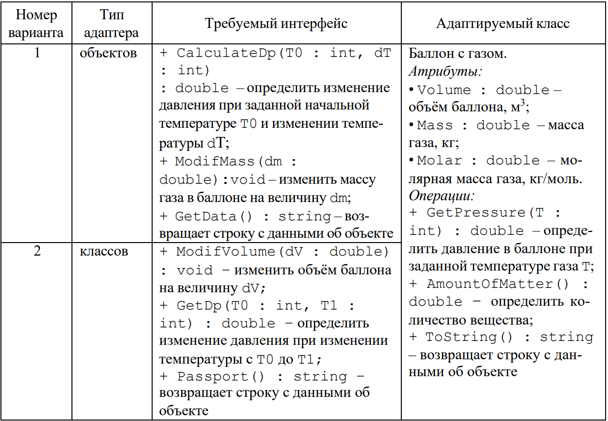

**Паттерн Адаптер.** Разработать программу, которая содержит указанные классы (таблица 1), задействованные в шаблоне Адаптер. Для адаптера объектов атрибуты класса должны быть реализованы как автоматические свойства, а для шаблона Адаптер классов – как защищённые поля.

Таблица 1 – Варианты заданий для разработки приложения с использованием шаблона Адаптер

{width=1259px height=873px}

**Паттерн Фасад**. Разработать программу для расчета стоимости туристической путевки, которая должна содержать класс-фасад и заданный набор классов. Классы (виды путевок): пляжный отдых, экскурсия, горные лыжи. Параметры: длительность, страна, гостиница (число звезд), рацион питания (двухразовый, трехразовый, всё включено.

**Паттерн Декоратор**. Необходимо разработать программу, которая сравнивает двух супергероев и определяет, у кого из них больше шансов выжить в битве. В мире существуют два типа героев: зелёные и красные. Каждый герой может обладать одной или несколькими сверхспособностями: суперсила, суперловкость и суперинтеллект.

Шанс на выживание героя зависит от его типа и наличия сверхспособностей:

• У красных героев базовый шанс на выживание чуть выше, чем у зелёных.

• Каждая сверхспособность увеличивает шанс на выживание:

-  Суперсила -- на 4 единицы.

-  Суперловкость -- на 3 единицы.

-  Суперинтеллект -- на 7 единиц.

В битве двух супергероев выживает тот, у кого итоговое значение шанса на выживание больше. **Требования:**

1\. Используйте паттерн проектирования "Декоратор" для добавления сверхспособностей героям.

2\. Реализуйте классы для героев (зелёных и красных) и декораторы для каждой сверхспособности.

3\. Напишите метод, который сравнивает двух героев и возвращает результат битвы (кто выжил).

### Решение(Код без UML)

<https://cloud.mail.ru/public/Jihx/7qu4XFArD>