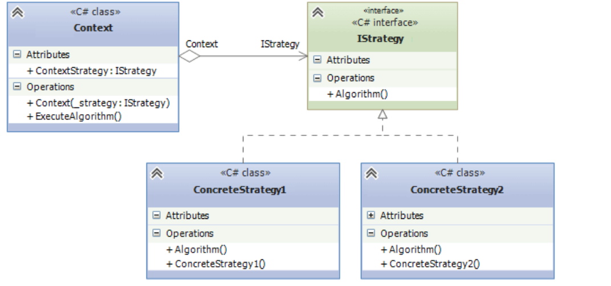
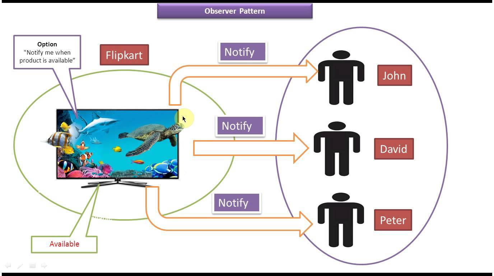
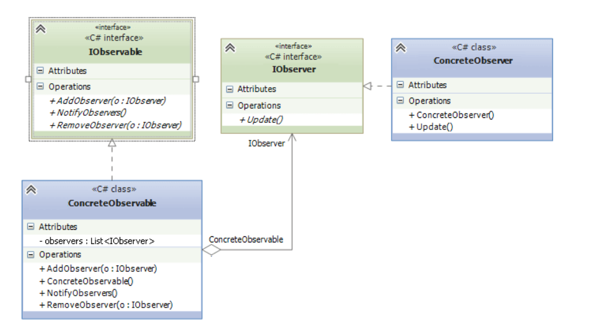
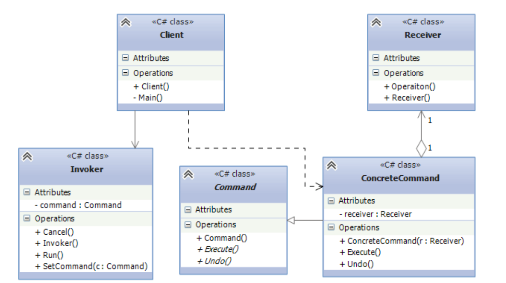
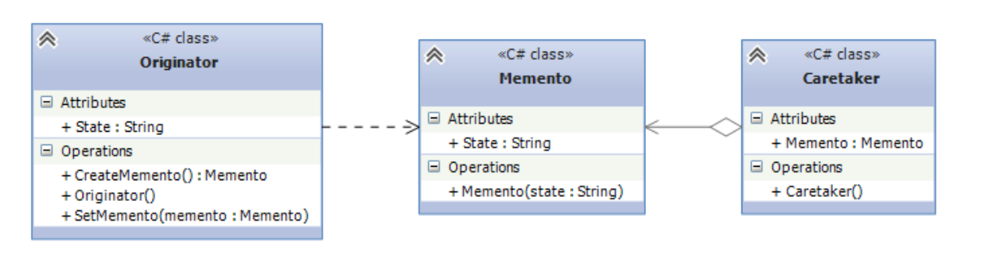
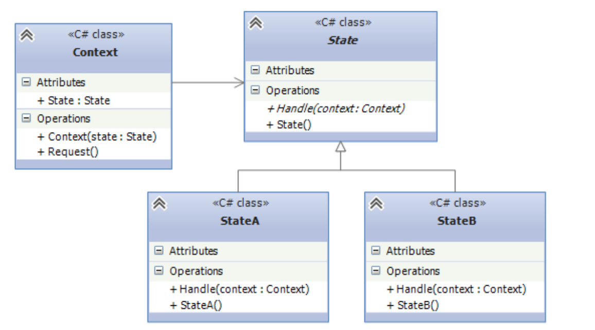
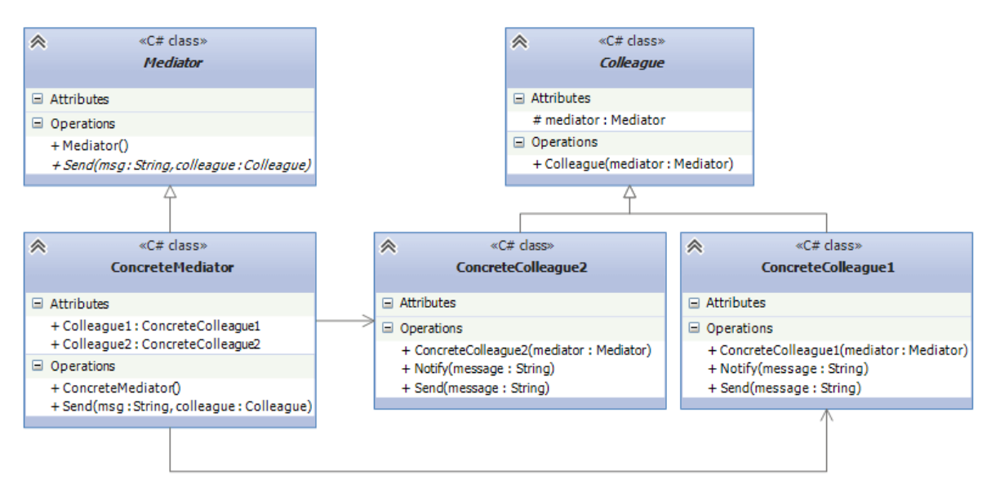

**Цель работы:** изучить поведенческие шаблоны проектирования и научиться использовать их для решения практических задач.

## Теоретическая справка:

Третья группа паттернов называются **поведенческими** - они определяют алгоритмы и взаимодействие между классами и объектами, то есть их поведение.

### Стратегия

**Назначение:** определяет семейство алгоритмов, инкапсулирует каждый из них и делает их взаимозаменяемыми. Стратегия позволяет изменять алгоритмы независимо от клиентов, которые ими пользуются.\
**Другими словами**: стратегия инкапсулирует определенное поведение с возможностью его подмены.

При этом замена алгоритма происходит независимо от объекта, который использует данный алгоритм.

**Пример из жизни:** Возьмём пример с пузырьковой сортировкой. Мы её реализовали, но с ростом объёмов данных сортировка работа стала выполняться очень медленно. Тогда мы сделали быструю сортировку. Алгоритм работает быстрее на больших объёмах, но на маленьких он очень медленный. Тогда мы реализовали стратегию, при которой для маленьких объёмов данных используется пузырьковая сортировка, а для больших объёмов -- быстрая.

**Простыми словами:** Шаблон стратегия позволяет переключаться между алгоритмами или стратегиями в зависимости от ситуации.

Когда использовать стратегию?

-  Когда есть несколько схожих классов , которые отличаются поведением. Можно задать один основной класс, а разные варианты поведения вынести в отдельные классы и при необходимости их применять;

-  Когда необходимо обеспечить выбор из нескольких вариантов решений, которые можно легко менять в зависимости от условий;

-  Когда необходимо менять поведение классов и объектов на стадии выполнения программы;

-  Когда класс, применяющий определенную функциональность, ничего не должен знать о ее реализации

{width=1072px height=503px}

Формальное определение паттерна на языке C# может выглядеть следующим образом:

```
public interface IStrategy
{
 void Algorithm();
}
public class ConcreteStrategy1 : IStrategy
{
 public void Algorithm()
 {}
}
public class ConcreteStrategy2 : IStrategy
{
 public void Algorithm()
 {}
}
public class Context
{
 public IStrategy ContextStrategy { get; set; }
 public Context(IStrategy _strategy)
 {
 ContextStrategy = _strategy;
 }
 public void ExecuteAlgorithm()
 {
 ContextStrategy.Algorithm();
 }
}
```

**Участники:**

Из диаграммы и кода можно выделить таких участников:

-  Абстрактный класс Strategy (он может быть заменен интерфейсом), который определяет метод `Algorithm()`. Это общий интерфейс для всех реализующих его алгоритмов. Вместо интерфейса здесь также можно было бы использовать абстрактный класс.

-  Классы ConcreteStrategyA и ConcreteStrategyB, ConcreteStrategyC, которые реализуют интерфейс IStrategy, предоставляя переопределяя метод `Algorithm()`. Подобных классов-реализаций может быть множество.

-  Класс Context хранит ссылку на объект IStrategy и связан с интерфейсом IStrategy отношением агрегации.

Паттерн стратегия очень распространенный паттерн в фреймворке:

-  **LINQ** (Language Integrated Query) -- это набор методов расширения, принимающих стратегии фильтрации, получения проекции и т. д. Коллекции принимают стратегии сравнения элементов, а значит, любой класс, который принимает IComparer\<T> или IEqualityComparer\<T>, использует паттерн «Стратегия».

### Наблюдатель

Паттерн "Наблюдатель" (Observer) представляет поведенческий шаблон проектирования, который использует отношение "один ко многим". В этом отношении есть один наблюдаемый объект и множество наблюдателей. И при изменении наблюдаемого объекта автоматически происходит оповещение всех наблюдателей

**Другими словами:** наблюдатель уведомляет все заинтересованные стороны о произошедшем событии или об изменении своего состояния.

{width=1376px height=768px}

Когда использовать паттерн Наблюдатель?

-  Когда система состоит из множества классов, объекты которых должны находиться в согласованных состояниях

-  Когда общая схема взаимодействия объектов предполагает две стороны: одна рассылает сообщения и является главным, другая получает сообщения и реагирует на них. Отделение логики обеих сторон позволяет их рассматривать независимо и использовать отдельно друга от друга.

-  Когда существует один объект, рассылающий сообщения, и множество подписчиков, которые получают сообщения. При этом точное число подписчиков заранее неизвестно и процессе работы программы может изменяться.

{width=1215px height=645px}

Формальное определение паттерна на языке C# может выглядеть следующим образом:

```
interface IObservable
{
 void AddObserver(IObserver o);
 void RemoveObserver(IObserver o);
 void NotifyObservers();
}
class ConcreteObservable : IObservable
{
 private List<IObserver> observers;
 public ConcreteObservable()
 {
 observers = new List<IObserver>();
 }
 public void AddObserver(IObserver o)
 {
 observers.Add(o);
 }
public void RemoveObserver(IObserver o)
 {
 observers.Remove(o);
 }
 public void NotifyObservers()
 {
 foreach (IObserver observer in observers)
 observer.Update();
 }
}
interface IObserver
{
 void Update();
}
class ConcreteObserver :IObserver
{
 public void Update()
 {
 }
}
```

**Участники**

• IObservable: представляет наблюдаемый объект. Определяет три метода: AddObserver() (для добавления наблюдателя), RemoveObserver() (удаление набюдателя) и NotifyObservers() (уведомление наблюдателей)

• ConcreteObservable: конкретная реализация интерфейса IObservable. Определяет коллекцию объектов наблюдателей.

• IObserver: представляет наблюдателя, который подписывается на все уведомления наблюдаемого объекта. Определяет метод Update(), который вызывается наблюдаемым объектом для уведомления наблюдателя.

• ConcreteObserver: конкретная реализация интерфейса IObserver.

### Команда

Паттерн "Команда" (Command) позволяет инкапсулировать запрос на выполнение определенного действия в виде отдельного объекта. Этот объект запроса на действие и называется командой. При этом объекты, инициирующие запросы на выполнение действия, отделяются от объектов, которые выполняют это действие.

Команды могут использовать параметры, которые передают ассоциированную с командой информацию. Кроме того, команды могут ставиться в очередь и также могут быть отменены.

Паттерн «Команда» позволяет спрятать действие в объекте и отвязать источник этого действия от места его исполнения. Классический пример -- проектирование пользовательского интерфейса. Пункт меню не должен знать, что происходит при его активизации пользователем, он должен знать лишь о некотором действии, которое нужно выполнить при нажатии кнопки.

Когда использовать Паттерн Команда?

-  Когда необходимо обеспечить выполнение очереди запросов, а также их возможную отмену.

-  Когда надо поддерживать логгирование изменений в результате запросов. Использование логов может помочь восстановить состояние системы - для этого необходимо будет использовать последовательность запротоколированных команд.

-  Когда необходимо параметризировать объекты выполняемым действием, ставить запросы в очередь или поддерживать операции отмены (undo) и повтора (redo) действий.

{width=1227px height=686px}

Формальное определение на языке C# может выглядеть следующим образом:

```
abstract class Command
{
 public abstract void Execute();
 public abstract void Undo();
}
// конкретная команда
class ConcreteCommand : Command
{
 Receiver receiver;
 public ConcreteCommand(Receiver r)
 {
 receiver = r;
 }
 public override void Execute()
 {
 receiver.Operation();
 }
 public override void Undo()
 {}
}
// получатель команды
class Receiver
{
 public void Operation()
 { }
}
// инициатор команды
class Invoker
{
 Command command;
 public void SetCommand(Command c)
 {
 command = c;
 }
 public void Run()
 {
 command.Execute();
 }
 public void Cancel()
 {
 command.Undo();
 }
}
class Client
{
 void Main()
 {
 Invoker invoker = new Invoker();
 Receiver receiver = new Receiver();
 ConcreteCommand command=new ConcreteCommand(receiver);
 invoker.SetCommand(command);
 invoker.Run();
 }
}
```

**Участники**

• Command: интерфейс, представляющий команду. Обычно определяет метод Execute() для выполнения действия, а также нередко включает метод Undo(), реализация которого должна заключаться в отмене действия команды

• ConcreteCommand: конкретная реализация команды, реализует метод Execute(), в котором вызывается определенный метод, определенный в классе Receiver

• Receiver: получатель команды. Определяет действия, которые должны выполняться в результате запроса.

• Invoker: инициатор команды - вызывает команду для выполнения определенного запроса

• Client: клиент - создает команду и устанавливает ее получателя с помощью метода SetCommand()

### Хранитель

Паттерн Хранитель (Memento) позволяет выносить внутреннее состояние объекта за его пределы для последующего возможного восстановления объекта без нарушения принципа инкапсуляции

-  Не нарушая инкапсуляции, паттерн Memento получает и сохраняет за пределами объекта его внутреннее состояние так, чтобы позже можно было восстановить объект в таком же состоянии.

-  Является средством для инкапсуляции "контрольных точек" программы.

-  Паттерн Memento придает операциям "Отмена" (undo) или "Откат" (rollback) статус "полноценного объекта".

\
**Пример из жизни** -- **ремонт тормозов на автомобиле**. Механики-любители используют паттерн, чтобы собрать части тормозной системы: колёса удаляются с обеих сторон, чтобы сделать видимыми правые и левые тормоза, при этом разбирается только одна сторона, другая служит напоминанием (Memento) о том, как части тормозной системы собраны вместе. Только после того, как завершена работа с одной стороны, разбирается другая сторона, при этом в качестве Memento выступает уже первая сторона.

**Другой пример** -- **текстовый редактор**, который позволяет изменять форматирование текста и других элементов, но при этом пользователь может эти изменения отменить. Перед выполнением команды сохраняется текущее состояние редактора, чтобы потом иметь возможность отменить операцию.

{width=1257px height=325px}

Формальная структура паттерна на языке C#:

```
class Memento
{
 public string State { get; private set;}
 public Memento(string state)
 {
 this.State = state;
 }
}
class Caretaker
{
 public Memento Memento { get; set; }
}
class Originator
{
 public string State { get; set; }
 public void SetMemento(Memento memento)
 {
 State = memento.State;
 }
 public Memento CreateMemento()
 {
 return new Memento(State);
 }
}
```

Участники

• Memento: хранитель, который сохраняет состояние объекта Originator и предоставляет полный доступ только этому объекту Originator

• Originator: создает объект хранителя для сохранения своего состояния

• Caretaker: выполняет только функцию хранения объекта Memento, в то же время у него нет полного доступа к хранителю и никаких других операций над хранителем, кроме собственно сохранения, он не производит

### Состояние

Состояние (State) - шаблон проектирования, который позволяет объекту изменять свое поведение в зависимости от внутреннего состояния.

Паттерн «Состояние» предполагает выделение базового класса или интерфейса для всех допустимых операций и наследника для каждого возможного состояния

**Пример из жизни:** Допустим, в графическом редакторе вы выбрали кисть. Она меняет своё поведение в зависимости от настройки цвета, т. е. рисует линию выбранного цвета.

**Простыми словами:** Шаблон позволяет менять поведение класса при изменении состояния.

Когда использовать Паттерн Состояние ?

-  Когда поведение объекта должно зависеть от его состояния и может изменяться динамически во время выполнения

-  Когда в коде методов объекта используются многочисленные условные конструкции, выбор которых зависит от текущего состояния объекта

{width=1156px height=642px}

Формальное определение паттерна на C#:

```
class Program
{
 static void Main()
 {
 Context context = new Context(new StateA());
 context.Request(); // Переход в состояние StateB
 context.Request(); // Переход в состояние StateA
 }
}
abstract class State
{
 public abstract void Handle(Context context);
}
class StateA : State
{
 public override void Handle(Context context)
 {
 context.State = new StateB();
 }
}
class StateB : State
{
 public override void Handle(Context context)
 {
 context.State = new StateA();
 }
}
class Context
{
 public State State { get; set; }
 public Context(State state)
 {
 this.State = state;
 }
 public void Request()
 {
 this.State.Handle(this);
 }
}
```

**Участники паттерна**

• State: определяет интерфейс состояния

• Классы StateA и StateB - конкретные реализации состояний

• Context: представляет объект, поведение которого должно динамически изменяться в соответствии с состоянием. Выполнение же конкретных действий делегируется объекту состояния

### Посредник

Паттерн Посредник (Mediator) представляет такой шаблон проектирования, который обеспечивает взаимодействие множества объектов без необходимости ссылаться друг на друга. Тем самым достигается слабосвязанность взаимодействующих объектов.

**Пример из жизни:** Общим примером будет, когда вы говорите с кем-то по мобильнику, то между вами и собеседником находится мобильный оператор. То есть сигнал передаётся через него, а не напрямую. В данном примере оператор -- посредник.

**Другими словами:** посредник -- это клей, связывающий несколько независимых классов между собой. Он избавляет классы от необходимости ссылаться друг на друга, позволяя тем самым их независимо изменять и анализировать.

Когда используется паттерн Посредник?

-  Когда имеется множество взаимосвязаных объектов, связи между которыми сложны и запутаны.

-  Когда необходимо повторно использовать объект, однако повторное использование затруднено в силу сильных связей с другими объектами.

{width=1225px height=593px}

Формальная структура классов и связей между ними с применением паттерна на языке C#:

```
abstract class Mediator
{
 public abstract void Send(string msg, Colleague colleague);
}
abstract class Colleague
{
 protected Mediator mediator;
 public Colleague(Mediator mediator)
 {
 this.mediator = mediator;
 }
}
class ConcreteColleague1 : Colleague
{
 public ConcreteColleague1(Mediator mediator)
 : base(mediator)
 { }
 public void Send(string message)
 {
 mediator.Send(message, this);
 }
 public void Notify(string message)
 { }
}
class ConcreteColleague2 : Colleague
{
 public ConcreteColleague2(Mediator mediator)
 : base(mediator)
 { }
 public void Send(string message)
 {
 mediator.Send(message, this);
 }
 public void Notify(string message)
 { }
}
class ConcreteMediator : Mediator
{
 public ConcreteColleague1 Colleague1 { get; set; }
 public ConcreteColleague2 Colleague2 { get; set; }
 public override void Send(string msg, Colleague colleague)
 {
 if (Colleague1 == colleague)
 Colleague2.Notify(msg);
 else
 Colleague1.Notify(msg);
 }
}
```

**Участники**

• Mediator: представляет интерфейс для взаимодействия с объектами Colleague

• Colleague: представляет интерфейс для взаимодействия с объектом Mediator

• ConcreteColleague1 и ConcreteColleague2: конкретные классы коллег, которые обмениваются друг с другом через объект Mediator

• ConcreteMediator: конкретный посредник, реализующий интерфейс типа Mediator

## Требования к отчету

**Структура отчета:**

1. **Титульный лист**

2. **Цель работы**

3. **Условие задания**

4. **UML-диаграмма (при наличии)**

5. **Код программы**

6. **Скриншоты тестирования программы**

7. **Вывод по цели работы**

## Примечания

-  **Оценка 5 (отлично)**:

Выполнены полностью задания 1-3, построены UML-диаграммы.

-  **Оценка 4 (хорошо)**:

Выполнены полностью задания 1-3 или выполнены любые 2 задания с построенными UML-диаграммами.

-  **Оценка 3 (удовлетворительно)**:

Выполнено любое задание, к нему построена UML-диаграмма или выполнены любые 2 задания.