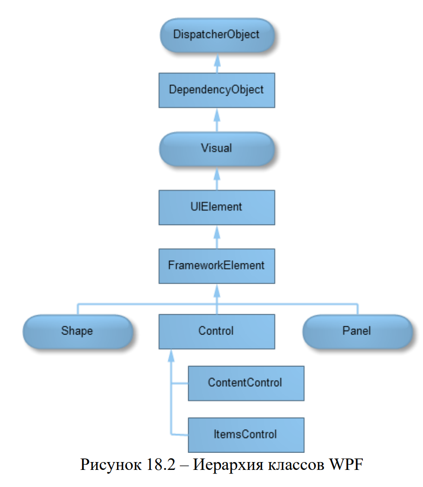
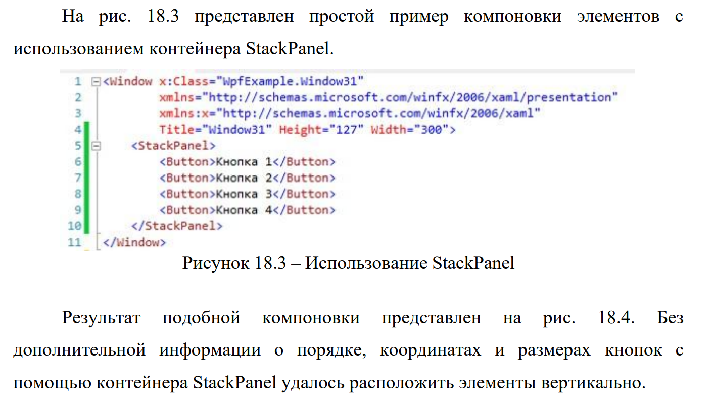
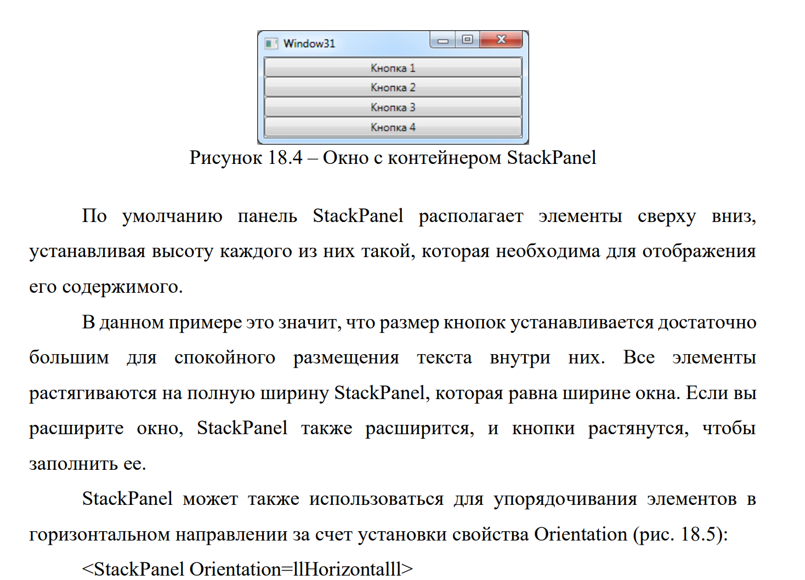
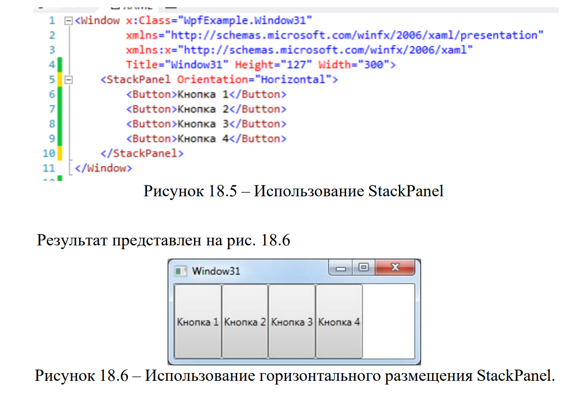
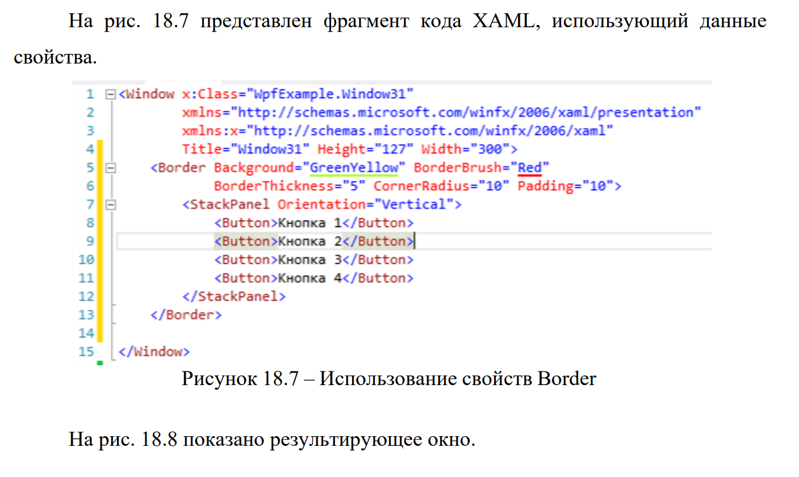
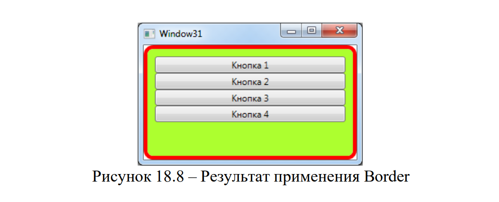
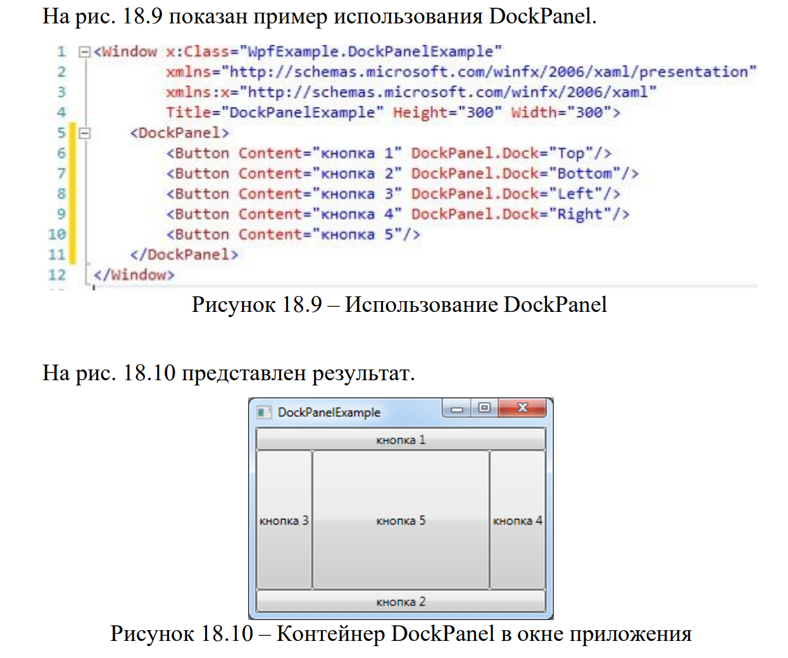
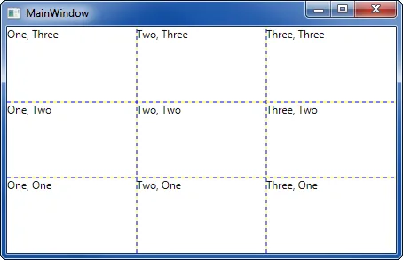
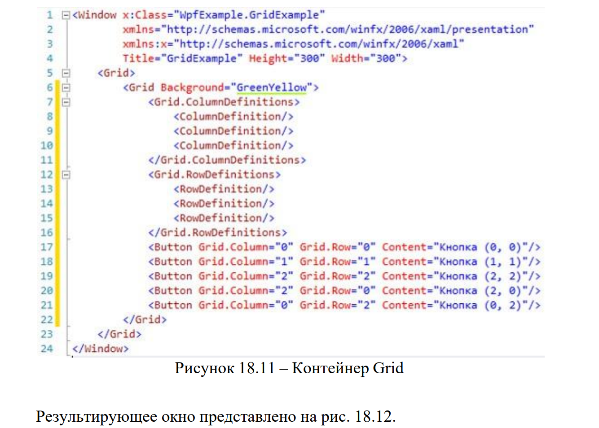
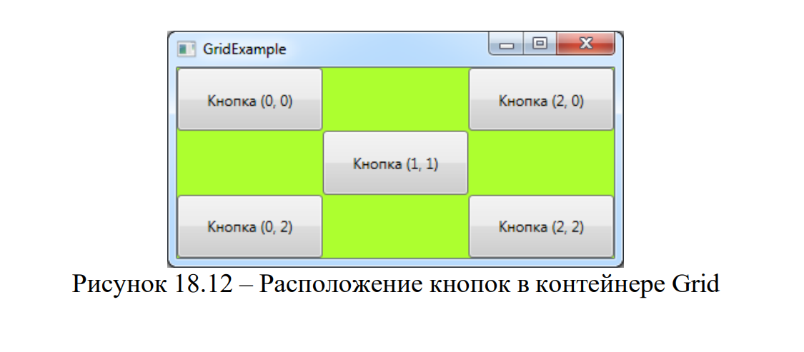

**Цель лабораторной работы**: научиться проектировать интерфейс приложений на основе технологии WPF.

## Теоретическая справка:

### Класс Window.

**Объект** `**Window**` – основной элемент традиционных приложений, в котором отображается их содержимое.\
В Windows Presentation Foundation (WPF) за объектом `Window` скрывается обычное окно Win32.

Операционная система **не различает** окна с WPF- и Win32-содержимым:

-  Обрамление рисуется одинаково.

-  На панели задач они неотличимы друг от друга.

**Обрамление (Chrome)** -- это область окна, которая обрамляет клиентскую зону и содержит кнопки:

-  `Minimize` (Свернуть)

-  `Maximize` (Развернуть)

-  `Close` (Закрыть)

Объект `Window` -- это **абстракция окна Win32** (аналогично классу `Form` в Windows Forms), предоставляющая простые методы и свойства.

---

#### Основные методы

| Метод     | Описание                                                     |
|-----------|--------------------------------------------------------------|
| `Show()`  | Показывает окно на экране                                    |
| `Hide()`  | Скрывает окно (аналог `Visibility = Hidden` или `Collapsed`) |
| `Close()` | Закрывает окно окончательно                                  |

---

#### Управление внешним видом и поведением

| Свойство                | Описание                                          |
|-------------------------|---------------------------------------------------|
| `Icon`                  | Иконка приложения                                 |
| `Title`                 | Заголовок окна                                    |
| `WindowStyle`           | Стиль оформления окна                             |
| `Left`, `Top`           | Положение окна на экране                          |
| `WindowStartupLocation` | Начальная позиция (`CenterScreen`, `CenterOwner`) |
| `Topmost`               | Поверх всех окон (`true`/`false`)                 |
| `ShowInTaskbar`         | Отображение на панели задач                       |

---

#### События

-  `Activated`  -- возникает при активации окна

-  `Deactivated` -- возникает, когда окно становится неактивным\
   (например, при переключении между приложениями)

---

#### Пример определения окна в XAML

Ниже показано стандартное определение окна, генерируемое Visual Studio:

```xml
<Window x:Class="Example.MainWindow"
        xmlns="http://schemas.microsoft.com/winfx/2006/xaml/presentation"
        xmlns:x="http://schemas.microsoft.com/winfx/2006/xaml"
        Title="MainWindow" Height="350" Width="525">
    <Grid>
        <!-- Содержимое окна -->
    </Grid>
</Window>
```

Окно может содержать только один дочерний элемент. Для размещения в окне множества дочерних элементов управления в WPF используется подход: сначала в фрейме окна размещается специализированная панель (контейнер компоновки), а затем, в данном контейнере располагаются элементы управления.

### Контейнеры компоновки

Для размещения элементов управления в WPF используются **специализированные компоненты -- контейнеры компоновки**.

В Windows Forms применялся механизм **абсолютного позиционирования**:

-  Координаты верхнего левого угла (`Top`, `Left`)

-  Размеры (`Width`, `Height`)

В WPF компоновка **определяется контейнером**, а не задаётся явно.

---

#### Принципы компоновки в WPF

1. **Размер определяется содержимым**\
   Элементы не должны иметь явно заданных размеров. Они растягиваются, чтобы вместить своё содержимое.\
   Можно задавать минимальные и максимальные ограничения через `MinWidth`, `MaxWidth`, `MinHeight`, `MaxHeight`.

2. **Позиция задаётся контейнером**\
   Элементы не указывают свои экранные координаты. Их упорядочивает контейнер на основе:

   -  размера

   -  порядка

   -  дополнительной информации (специфичной для контейнера)\
      Для отступов используется свойство `Margin`.

3. **Разделение доступного пространства**\
   Контейнеры распределяют пространство между дочерними элементами, стараясь выделить каждому **предпочтительный размер** (основанный на содержимом).\
   При наличии свободного места оно может быть дополнительно распределено.

4. **Вложенность контейнеров**\
   Контейнеры могут быть вложены друг в друга. Типичный интерфейс строится на базе `Grid`, внутри которого размещаются другие панели, группирующие:

   -  текстовые поля с метками

   -  списки

   -  кнопки

   -  значки на панелях инструментов и т.д.

---

Все контейнеры компоновки WPF -- это **панели**, унаследованные от абстрактного класса\
[`System.Windows`](http://System.Windows)`.Controls.Panel` (см. **рис. 18.2**).

{width=915px height=1054px}

`Panel` добавляет общие возможности для всех производных классов, но сам является **абстрактным** и не может быть создан напрямую.

WPF предоставляет набор готовых панелей, перечисленных в **табл. 18.1**.\
Все они находятся в пространстве имён [`System.Windows`](http://System.Windows)`.Controls`.

---

#### Таблица 18.1 – Контейнеры компоновки WPF



---

*  

   Контейнер

*  

   Описание

---

*  

   `StackPanel`

*  

   Размещает элементы в горизонтальном или вертикальном стеке. Этот контейнер компоновки обычно используется в небольших разделах крупного и более сложного окна.

---

*  

   `WrapPanel`

*  

   Размещает элементы в последовательностях строк с переносом. В горизонтальной ориентации WrapPanel располагает элементы в строке слева направо, затем переходит к следующей строке. В вертикальной ориентации WrapPanel располагает элементы сверху вниз, используя дополнительные колонки для дополнения оставшихся элементов.

---

*  

   `DockPanel`

*  

   Выравнивает элементы по краю контейнера.

---

*  

   `Grid`

*  

   Выстраивает элементы в строки и колонки невидимой таблицы. Это один из наиболее гибких и широко используемых контейнеров компоновки.

---

*  

   `UniformGrid`

*  

   Помещает элементы в невидимую таблицу, устанавливая одинаковый размер для всех ячеек. Данный контейнер компоновки используется нечасто.

---

*  

   

*  

   




:::quote 

**Примечание.** `Grid` -- основной и наиболее функциональный контейнер, с которого обычно начинается построение интерфейса.

:::

### Контейнер StackPanel

{width=1413px height=817px}

{width=1468px height=1058px}

{width=1287px height=867px}

#### Свойства компоновки элементов управления

Размещение элементов управления определяется **контейнером**, однако сами элементы могут влиять на этот процесс, явно задавая **свойства компоновки**.

В **таблице 18.2** представлены основные свойства, влияющие на позиционирование и размеры дочерних элементов внутри контейнера.

---

#### Таблица 18.2 – Свойства компоновки



---

*  Свойство

*  Описание

---

*  `HorizontalAlignment`

*  Определяет позиционирование элемента по горизонтали при наличии свободного места.\
   **Доступные значения:** `Center`, `Left`, `Right`, `Stretch`.

---

*  `VerticalAlignment`

*  Определяет позиционирование элемента по вертикали при наличии свободного места.\
   **Доступные значения:** `Center`, `Top`, `Bottom`, `Stretch`.

---

*  `Margin`

*  Добавляет пространство вокруг элемента.\
   Представляет собой экземпляр структуры [`System.Windows`](http://System.Windows)`.Thickness` с отдельными значениями для верхней, нижней, левой и правой граней.

---

*  `MinWidth` / `MinHeight`

*  Устанавливают **минимальные** размеры элемента.\
   Если элемент превышает доступное пространство, он будет усечён.

---

*  `MaxWidth` / `MaxHeight`

*  Устанавливают **максимальные** размеры элемента.\
   Даже если в контейнере есть свободное место, элемент не будет увеличен сверх этих пределов (в том числе при `Stretch`).

---

*  `Width` / `Height`

*  Явно задают **фиксированный размер** элемента.\
   Переопределяют поведение `Stretch`, но **не могут выйти за пределы**, установленные свойствами `MinWidth`, `MinHeight`, `MaxWidth` и `MaxHeight`.



---

**Важно**

-  Свойства `Width` и `Height` имеют **приоритет над** `**Stretch**`, но ограничены минимальными и максимальными значениями.

-  Использование `Margin` позволяет управлять отступами между элементами.

-  Значение `Stretch` заставляет элемент занимать **всё доступное пространство**, если не заданы фиксированные размеры.

### Элемент Border

Border не является одной из панелей компоновки, но это удобный элемент, который часто используется.

Класс Border принимает единственную порцию вложенного содержимого (которым часто является панель компоновки) и добавляет фон или рамку вокруг него. Для работы с Border понадобятся свойства, перечисленные в табл. 18.3.

| Свойство                        | Описание                                                                                                                                                |
|---------------------------------|---------------------------------------------------------------------------------------------------------------------------------------------------------|
| `Background`                    | С помощью объекта **Brush** устанавливает фон, который появляется под содержимым. Можно использовать сплошной цвет либо что-нибудь более сложное        |
| `BorderBrush и BorderThickness` | Устанавливают цвет рамки, который появляется на границе объекта Border, и толщину рамки. Для отображения рамки потребуется установить **оба** свойства. |
| `CornerRadius`                  | Позволяет скруглить углы рамки. Чем больше значение CornerRadius, тем заметнее эффект                                                                   |
| `Padding`                       | Добавляет пространство между рамкой и содержимым внутри нее                                                                                             |

{width=1407px height=841px}

{width=1120px height=455px}

### Элементы WrapPanel и DockPanel

#### WrapPanel

Панель `WrapPanel` располагает элементы управления в доступном пространстве -- **по одной строке или колонке за раз**.

-  По умолчанию свойство `Orientation` установлено в `Horizontal`:

   -  Элементы располагаются **слева направо**, затем переносятся на **следующие строки**.

-  При установке `Orientation = Vertical`:

   -  Элементы размещаются **в несколько колонок**.

:::quote 

`WrapPanel`, как и `StackPanel`, предназначена для **управления мелкими деталями интерфейса**, а не для компоновки всего окна.\
**Пример:** размещение кнопок на панели инструментов.

:::

---

#### DockPanel

Панель `DockPanel` реализует **компоновку с пристыковкой** -- элементы растягиваются вдоль одной из внешних границ.

**Аналогия:** панель инструментов, пристыкованная к верхней части окна.

-  Пристыкованные элементы **выбирают один аспект компоновки**:

   -  Если пристыковать элемент **к верхней границе** -- он растянется **по ширине** контейнера, высота определяется содержимым (или `MinHeight`).

   -  Если пристыковать элемент **к левой границе** -- он растянется **по высоте** контейнера, ширина определяется содержимым.

---

### Присоединённое свойство Dock

Дочерние элементы `DockPanel` прикрепляются к одной из сторон с помощью **присоединённого свойства** `Dock`.

Важно:

-  Элементы **не имеют** этого свойства по умолчанию.

-  Они **приобретают его** после помещения в контейнер `DockPanel`.

**Доступные значения:** `Left`, `Top`, `Right`, `Bottom`.

---

### Пример использования

{width=1245px height=1040px}

:::quote 

Последний элемент (без явного `Dock`) заполняет **оставшееся пространство** в центре.

:::

### Контейнер Grid

Элемент управления `Grid` -- это **наиболее мощный контейнер компоновки** в WPF.\
Большая часть того, что можно реализовать с помощью других панелей, достижима и в `Grid`.

`Grid` идеально подходит для **разбиения окна на меньшие области**, которыми затем управляют другие контейнеры.

:::quote 

При создании нового окна в Visual Studio XAML-документ автоматически добавляет `Grid` в качестве **контейнера первого уровня**, вложенного в корневой элемент `Window`.

:::

---

#### Визуализация сетки

`Grid` -- невидимый элемент, но для отладки можно включить отображение границ:

```xml
<Grid ShowGridLines="True">
    ...
</Grid>
```

Свойство `ShowGridLines`:

-  **Не предназначено** для оформления интерфейса.

-  Используется для **наглядной отладки**:

   -  Показывает, как `Grid` разделяет пространство на колонки и строки.

   -  Позволяет точно контролировать распределение ширины и высоты.

{width=454px height=293px}

---

#### Этапы построения компоновки в Grid

1. **Определить количество колонок и строк**\
   Заполняются коллекции `Grid.ColumnDefinitions` и `Grid.RowDefinitions`.

2. **Разместить элементы**\
   Каждому дочернему элементу назначаются:

   -  Номер строки (присоединённое свойство `Grid.Row`)

   -  Номер колонки (присоединённое свойство `Grid.Column`)

---

#### Структура определений

| Коллекция                | Содержит                   | Описание             |
|--------------------------|----------------------------|----------------------|
| `Grid.ColumnDefinitions` | Объекты `ColumnDefinition` | Задают колонки сетки |
| `Grid.RowDefinitions`    | Объекты `RowDefinition`    | Задают строки сетки  |

Каждое определение может содержать параметры:

-  `Width` / `Height`

-  `MinWidth` / `MinHeight`

-  `MaxWidth` / `MaxHeight`

---

#### Пример простого Grid

Например, если необходимо создать две строки и три колонки, то используются следующие дескрипторы:

{width=1334px height=954px}

{width=1125px height=493px}

---

#### Типы размеров колонок и строк

| Режим             | Значение          | Описание                                                    |
|-------------------|-------------------|-------------------------------------------------------------|
| **Абсолютный**    | `50`              | Фиксированная ширина/высота в пикселях                      |
| **Авто**          | `Auto`            | Размер подстраивается под содержимое                        |
| **Звёздочка**     | `*`               | Пропорциональное распределение доступного пространства      |
| Двойная звёздочка | `2*`, `3*` и т.д. | Элемент получает в 2, 3 и более раз больше места, чем с `*` |

:::quote 

`*` означает «взять **всё оставшееся пространство**».\
`2*`, `3*` -- пропорциональное распределение между несколькими звёздочными колонками.

:::

## Требования к отчету

**Структура отчета:**

1. **Титульный лист**

2. **Цель работы**

3. **Условие задания**

4. **Код программы**

5. **Скриншоты тестирования программы**

6. **Вывод по цели работы**

## Примечания

-  **Оценка 5 (отлично)**:

Выполнены полностью все задания.

-  **Оценка 4 (хорошо)**:

Выполнены полностью любые 3 задания.

-  **Оценка 3 (удовлетворительно)**:

Выполнены полностью любые 2 задания.