По аналогии к задаче 1 составить форму для решения уравнения:

Ниже представлено **12 вариантов задания 2**, в каждом изменены:

-  Обозначения переменных

-  Количество и типы пределов суммирования

-  Дополнительные коэффициенты

-  Структура выражения

---

### Вариант 1

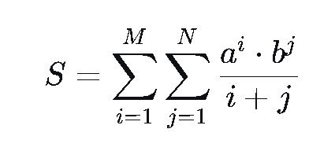{width=425px height=192px}

---

### Вариант 2

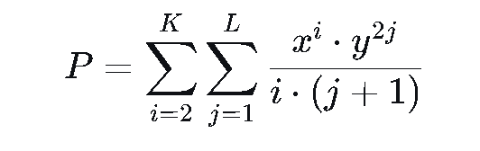{width=532px height=168px}

### Вариант 3

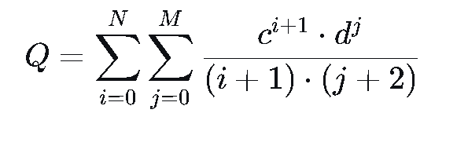{width=581px height=186px}

---

### Вариант 4

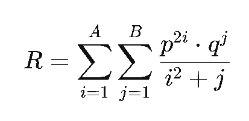{width=413px height=202px}

---

### Вариант 5

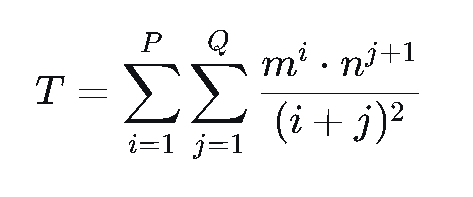{width=473px height=197px}

---

### Вариант 6

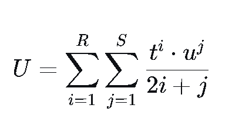{width=395px height=230px}

---

### Вариант 7

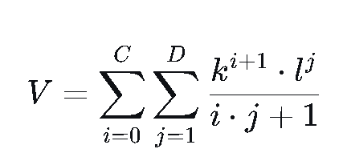{width=427px height=206px}

---

### Вариант 8

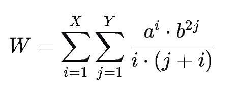{width=470px height=183px}

---

### Вариант 9

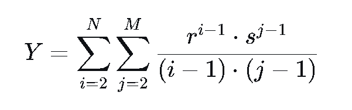{width=601px height=189px}

---

### Вариант 10

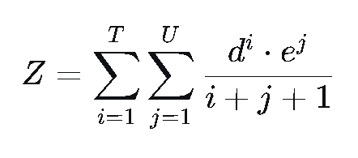{width=442px height=195px}

---

### Вариант 11

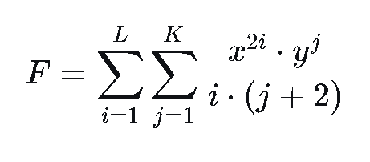{width=461px height=202px}

---

### Вариант 12

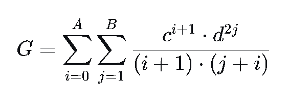{width=565px height=206px}

---

Все варианты:

-  Сохраняют **двойную сумму**

-  Используют **степени и произведения**

-  В знаменателе -- **комбинации индексов**

-  Подходят для программной реализации в **WPF (два поля ввода, кнопка, вывод результата)**

При необходимости могу дополнить варианты **разными типами N/K** или добавить **условия**, например `i ≠ j`, факториалы и т.п.