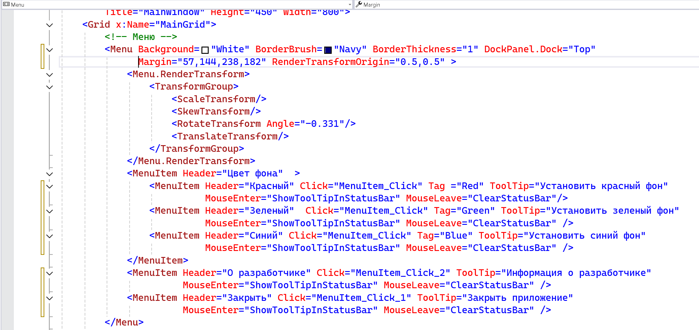
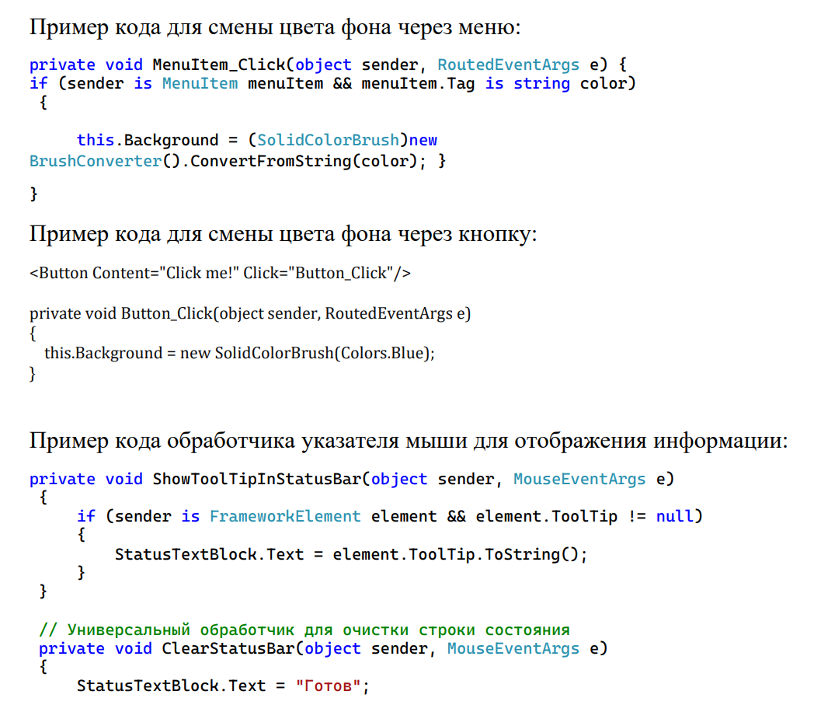

Разработать WPF-приложение с меню, панелью инструментов и строкой состояния. С помощью пунктов меню пользователь может изменять цвет фона окна, получить информацию о разработчике, а также закрыть окно. Кнопки панели инструментов дублируют команды меню. При наведении на пункты меню или кнопки панели инструментов в строке состояния отображается информация об этих элементах управления

Пример вида `ItemMenu`:

{width=2318px height=1098px}

{width=1048px height=934px}