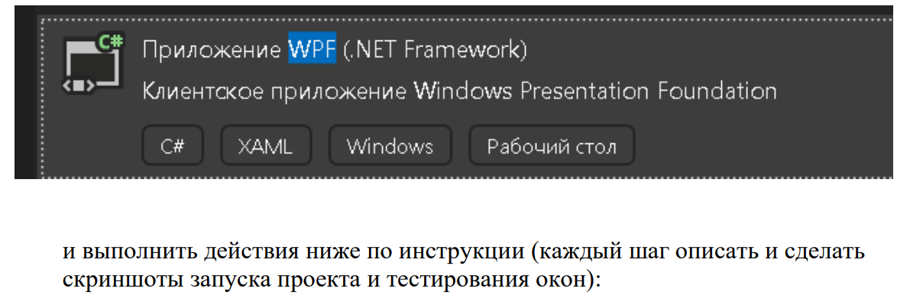
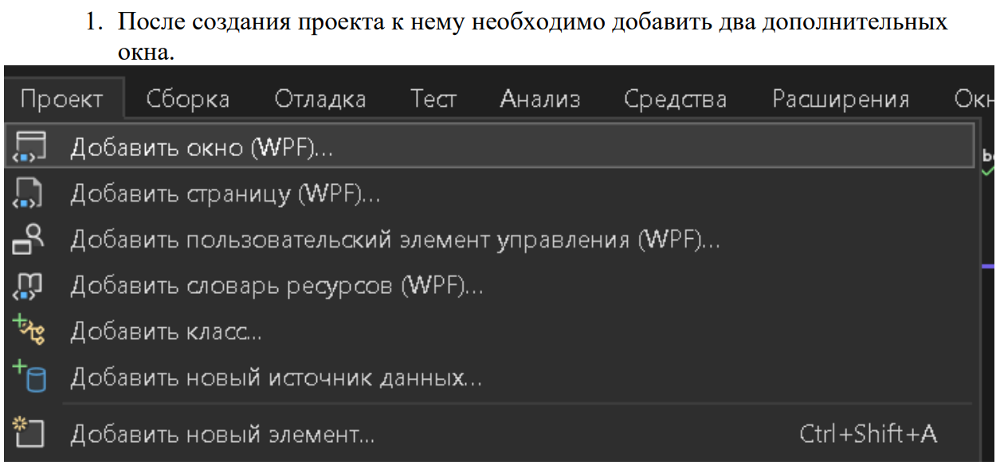
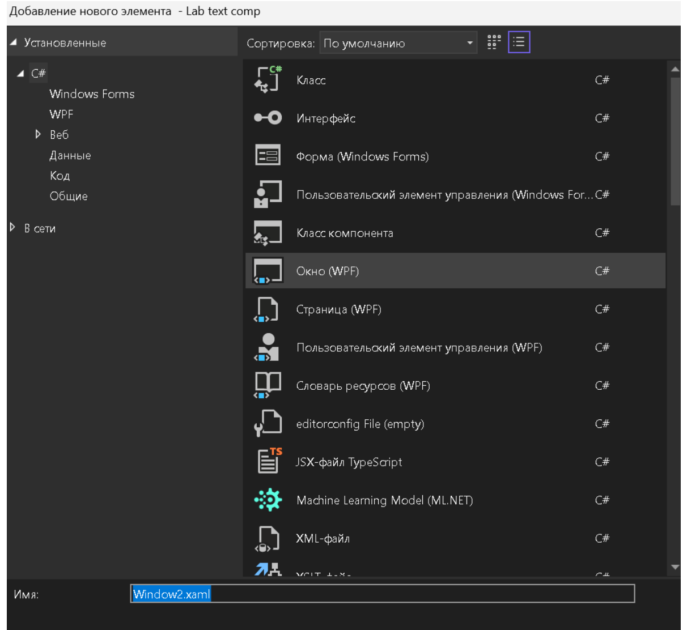
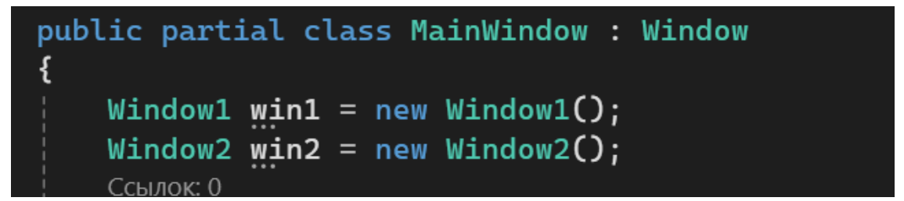
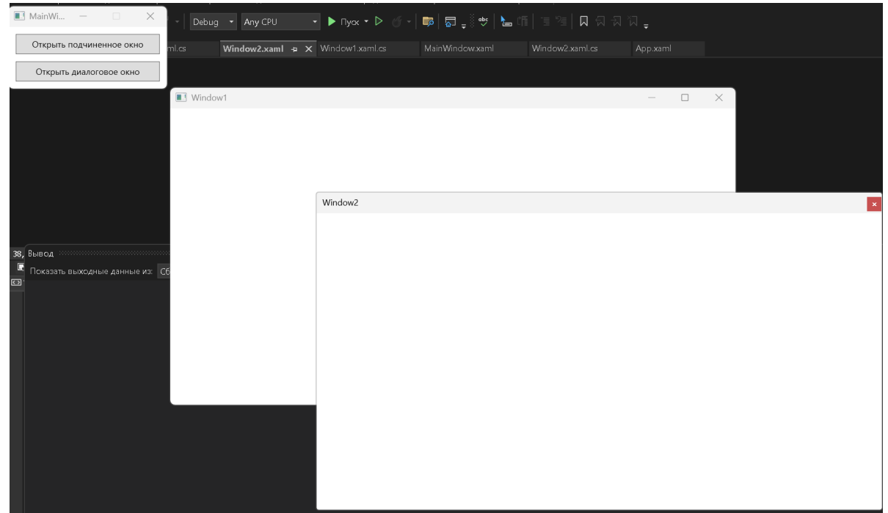
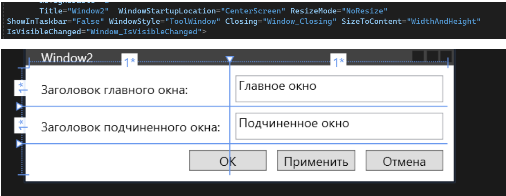

**Цель лабораторной работы:** научиться проектировать WPF-приложение с несколькими формами, изучить взаимодействие окон

### Теоретическая справка:

<https://metanit.com/sharp/wpf/20.2.php>

<https://professorweb.ru/my/WPF/UI_WPF/level23/23_3.php>

### Задание 1

Создать проект WPF (.NET Framework)

{width=1191px height=391px}

{width=1255px height=589px}

{width=1212px height=1112px}

2\.Достаточно использовать имена, предлагаемые по умолчанию – Window1 для первого окна, Window2 для второго.

Разметка окон:

`MainWindow.xaml`

```xml
<Window x:Class="Primer.MainWindow"
 xmlns="http://schemas.microsoft.com/winfx/2006/xaml/presentation"
 xmlns:x="http://schemas.microsoft.com/winfx/2006/xaml"
 xmlns:d="http://schemas.microsoft.com/expression/blend/2008"
 xmlns:mc="http://schemas.openxmlformats.org/markup-compatibility/2006"
 xmlns:local="clr-namespace:Primer"
 mc:Ignorable="d"
 Title="MainWindow" SizeToContent="WidthAndHeight" ResizeMode="CanMinimize"
Loaded="Window_Loaded">
 <StackPanel Margin="5">
 <Button x:Name="button1" MinWidth="200" Margin="5"
Content="Открыть подчиненное окно"
Padding="5" Click="button1_Click" />
 <Button x:Name="button2" Margin="5"
Content="Открыть диалоговое окно" Padding="5"
Click="button2_Click" />
 </StackPanel>
</Window>
```

`Window1.xaml`

```xml
<Window x:Class="Primer.Window1"
 xmlns="http://schemas.microsoft.com/winfx/2006/xaml/presentation"
 xmlns:x="http://schemas.microsoft.com/winfx/2006/xaml"
 xmlns:d="http://schemas.microsoft.com/expression/blend/2008"
 xmlns:mc="http://schemas.openxmlformats.org/markup-compatibility/2006"
 xmlns:local="clr-namespace:Primer"
 mc:Ignorable="d"
 Title="Window1" Height="450" Width="800" ShowInTaskbar="False"
Closing="Window_Closing">
 <Grid>

 </Grid>
</Window>
```

`Window2.xaml`

```xml
<Window x:Class="Primer.Window2"
 xmlns="http://schemas.microsoft.com/winfx/2006/xaml/presentation"
 xmlns:x="http://schemas.microsoft.com/winfx/2006/xaml"
 xmlns:d="http://schemas.microsoft.com/expression/blend/2008"
 xmlns:mc="http://schemas.openxmlformats.org/markup-compatibility/2006"
 xmlns:local="clr-namespace:Primer"
 mc:Ignorable="d"
 Title="Window2" Height="450" Width="800" WindowStartupLocation="CenterScreen"
ResizeMode="NoResize"
ShowInTaskbar="False" WindowStyle="ToolWindow" Closing="Window_Closing">
 <Grid>

 </Grid>
</Window>
```

3\.В файле `MainWindow.xaml.cs` в начало описания класса **MainWindow** добавьте операторы:

```
Window1 win1 = new Window1();
Window2 win2 = new Window2();
```

{width=1155px height=258px}

4\. Определите обработчики для класса MainWindow:

```
private void Window_Loaded(object sender, RoutedEventArgs e)
{
 win1.Owner = this;
 win2.Owner = this;
 win1.Left = this.Left + this.ActualWidth - 10;
 win1.Top = this.Top + this.ActualHeight - 10;
}
private void button1_Click(object sender, RoutedEventArgs e)
{
 win1.Show();
}
private void button2_Click(object sender, RoutedEventArgs e)
{
 win2.ShowDialog();
}
```

#### Результат

Программа включает **три окна**, демонстрирующие основные типы окон в графических Windows-приложениях:

| Окно                   | Тип                  | Описание                                                                       |
|------------------------|----------------------|--------------------------------------------------------------------------------|
| `MainWindow`           | Фиксированный размер | Главное окно, отображается сразу при запуске.                                  |
| `win1` (тип `Window1`) | Переменный размер    | Подчинённое окно, вызывается из главного, отображается в **обычном режиме**.   |
| `win2` (тип `Window2`) | Диалоговое окно      | Подчинённое окно, вызывается из главного, отображается в **модальном режиме**. |

#### Поведение окон

-  **Главное окно** `MainWindow`\
   Появляется на экране **немедленно** при запуске приложения.\
   Место для его размещения выбирается **операционной системой**.\
   Завершение программы происходит только при **закрытии главного окна**.

-  **Окно** `win1` **(обычный режим)**\
   Вызывается нажатием соответствующей кнопки в главном окне.\
   Отображается **около правого нижнего угла** главного окна с **небольшим наложением**.\
   После открытия позволяет свободно переключаться на другие окна приложения.

-  **Окно** `win2` **(модальный/диалоговый режим)**\
   Вызывается нажатием соответствующей кнопки в главном окне.\
   Отображается **в центре экрана**.\
   Пока открыто -- **переключение на другие окна приложения заблокировано**.\
   Требует обязательного закрытия для возврата к работе с главным окном.

{width=1210px height=700px}

**Выполните тестирование и прикрепите скриншот.**

5\. Для классов **Window1** и **Window2** определите следующие одинаковые обработчики события **Closing**:

```
<Window x:Class="WINDOWS.Window1"
…
Closing="Window_Closing" >
<Window x:Class="WINDOWS.Window2"
…
Closing="Window_Closing" >
```

Код обработчика в классах окон:

```
private void Window_Closing(object sender,
System.ComponentModel.CancelEventArgs e)
 {
 e.Cancel = true;
 Hide();
 }
```

**Результат.** Теперь окна win1 и win2 можно многократно закрывать и открывать в ходе выполнения программы. **Выполните тестирование и прикрепите скриншот.**

6\. Для окна MainWindow измените обработчик **button1_Click**:

```
private void button1_Click(object sender, RoutedEventArgs e)
{
 if (win1.IsVisible)
 win1.Close();
 else
 win1.Show();
}
```

Для окна Window1 определите обработчик события **IsVisibleChanged**:

```
<Window x:Class="WINDOWS.Window1"
…
IsVisibleChanged="Window_IsVisibleChanged" >
```

```
private void Window_IsVisibleChanged(object sender,
DependencyPropertyChangedEventArgs e)
 {
 (Owner.FindName("button1") as Button).Content = IsVisible ?
 "Закрыть подчиненное окно" : "Открыть подчиненное окно";
 }
```

**Результат.** Заголовок кнопки button1 главного окна и действия при ее нажатии зависят от того, отображается на экране подчиненное окно win1 или нет. Подчиненное окно можно закрыть не только с помощью кнопки button1 главного окна, но и любым стандартным способом, принятым в Windows (например, с помощью комбинации клавиш Alt+F4); при любом способе закрытия подчиненного окна заголовок кнопки button1 будет изменен. Подчеркнем, что изменять надпись на кнопке button1 в обработчике button1_Click не следует именно по той причине, что закрыть подчиненное окно можно не только с помощью этой кнопки. **Выполните тестирование и прикрепите скриншот.**

7\. Добавьте текстовое поле в **Windows1**:

```
<Window x:Class="WINDOWS.Window1"
… >
<TextBlock x:Name="textBlock" HorizontalAlignment="Center"
VerticalAlignment="Center"/>
</Window>
```

:::lab 

В начало описания класса Window1 добавьте поле:

**int count;**

:::

В имеющийся в классе **Window1** обработчик **Window_IsVisibleChanged** добавьте следующий фрагмент:

 `if (IsVisible) textBlock.Text = "Окно открыто в " + (++count) + "-й раз.";`

**Результат**. Текст подчиненного окна win1 содержит информацию о том, сколько раз оно было открыто. При изменении размеров подчиненного окна положение находящегося на нем текста изменяется так, чтобы он всегда оставался отцентрированным как по горизонтали, так и по вертикали относительно границ окна.**Выполните тестирование и прикрепите скриншот.**

8\. Измените разметку окна Windows2:

```
<Window x:Class="WINDOWS.Window2"
…
SizeToContent="WidthAndHeight"
IsVisibleChanged="Window_IsVisibleChanged" >
<Grid Margin="5">
<Grid.RowDefinitions>
<RowDefinition/>
<RowDefinition/>
<RowDefinition/>
</Grid.RowDefinitions>
<Grid.ColumnDefinitions>
<ColumnDefinition/>
<ColumnDefinition/>
</Grid.ColumnDefinitions>
<Label Content="Заголовок главного окна:" Margin="5" />
<Label Content="Заголовок подчиненного окна:" Margin="5"
Grid.Row="1" />
<TextBox x:Name="textBox1" Grid.Column="1" Margin="5"
Text="Главное окно" MinWidth="200" />
<TextBox x:Name="textBox2" Grid.Column="1" Margin="5"
Grid.Row="1" Text="Подчиненное окно" />
<StackPanel Grid.ColumnSpan="2"
HorizontalAlignment="Right" Margin="0" Grid.Row="2"
Orientation="Horizontal">
<Button x:Name="button1" Content="ОК" Width="75"
Margin="5" IsDefault="True"
Click="button1_Click" />
<Button x:Name="textBox3" Content="Применить"
Width="75" Margin="5" Click="button2_Click" />
<Button Content="Отмена" Width="75" Margin="5"
IsCancel="True" />
</StackPanel>
</Grid>
</Window>
```

**Уберите значения Height и Width**

{width=1530px height=595px}

**Выполните тестирование и прикрепите скриншот.**

9\. В описание класса **Window2** добавьте новое свойство, доступное только для чтения, и связанное с ним поле:

```
bool dialogRes;
public bool DialogRes
{
get { return dialogRes; }
}
```

10\.Определите три обработчика, которые уже указаны в **xaml-файле:**

```
private void Window_IsVisibleChanged(object sender, DependencyPropertyChangedEventArgs e)
{
 if (IsVisible)
 dialogRes = false;
}
private void button1_Click(object sender, RoutedEventArgs e)
{
 dialogRes = true;
 Close();
}
public void button2_Click(object sender, RoutedEventArgs e)
{
 Owner.Title = textBox1.Text;
 Owner.OwnedWindows[0].Title = textBox2.Text;
}
```

:::info 

**Обратите внимание на то, что обработчик button2_Click должен иметь модификатор public**

:::

11\. В классе **MainWindow** дополните обработчик **button2_Click**:

```
private void button2_Click(object sender, RoutedEventArgs e)
{
 win2.ShowDialog();
 if (win2.DialogRes)
 win2.button2_Click(null, null);
}
```

**Результат**. Диалоговое окно win2 позволяет изменить заголовки главного и подчиненного окна. Заголовки окон изменяются либо при нажатии обычной кнопки «Применить», либо при нажатии модальной кнопки «OK» (в последнем случае диалоговое окно закрывается). Окно также закрывается при нажатии модальной кнопки «Отмена»; в этом случае заголовки окон не изменяются. Вместо кнопки «OK» можно нажать клавишу Enter, вместо кнопки «Отмена» – клавишу Esc. **Выполните тестирование и прикрепите скриншот.**

:::tip 

Заметим, что в данном случае можно было бы обойтись без модификации метода **button2_Click** класса **MainWindow**: достаточно просто вызывать метод **button2_Click** класса **Window2** в уже имеющемся обработчике **button1_Click** этого же класса **Window2**:

```
private void button1_Click(object sender, RoutedEventArgs e)
{
button2_Click(null, null);
dialogRes = true;
Close();
}
```

При этом отпадает необходимость в изменении модификатора метода **button2_Click** с **private** на **public**, и, кроме того, можно вообще обойтись без свойства **DialogRes**.

:::

12\. В классе **Window2** добавьте в метод **Window_IsVisibleChanged** следующий оператор:

```
textBox1.Focus();
```

**Результат**. При первом открытии диалогового окна фокус ввода принимает компонент textBox1. Этот же компонент оказывается активным и при последующих открытиях диалогового окна, независимо от того, какой компонент окна был активным в момент его закрытия. Таким образом, диалоговое окно всегда отображается в одном и том же начальном состоянии. Подобное поведение желательно обеспечивать для любых диалоговых окон. **Выполните тестирование и прикрепите скриншот.**

:::tip 

Отметим, что указанное действие по установке фокуса происходит при скрытии окна. В этом можно убедиться, если добавить перед оператором установки фокуса условие:

```
if (!IsVisible)
textBox1.Focus();
```

В то же время, если использовать вариант 

`if (IsVisible) textBox1.Focus();`

 то фокус на первом поле ввода при последующих открытиях окна устанавливаться не будет

:::

13\. В классе **Window1** измените обработчик **Window_Closing**:

```
private void Window_Closing(object sender, System.ComponentModel.CancelEventArgs e)
 {
 e.Cancel = true;
 if (MessageBox.Show("Закрыть подчиненное окно?",
 "Подтверждение", MessageBoxButton.YesNo,
 MessageBoxImage.Question, MessageBoxResult.No) == MessageBoxResult.Yes)
 Hide();
 }
```

**Результат**. Перед закрытием подчиненного окна win1 отображается стандартное диалоговое окно «Подтверждение» с запросом на подтверждение закрытия). При выборе варианта «Нет» (который предлагается по умолчанию) закрытие подчиненного окна отменяется. **Выполните тестирование и прикрепите скриншот.**

:::info 

14\. При выборе в диалоговом окне варианта «Да» подчиненное окно закрывается, но главное окно не становится активным. Данный недочет объясняется тем обстоятельством, что «владельцем» диалогового окна MessageBox является то окно, которое было активным в момент отображения на экране окна MessageBox (в нашем случае это подчиненное окно win1), и именно это окно должно активизироваться при закрытии окна MessageBox. Однако при выборе варианта «Да» окно win1 закрывается, и поэтому его активизация оказывается невозможной. В подобной ситуации ни одно окно на экране не будет активным, а главное окно нашей программы, скорее всего, будет скрыто окном среды Visual Studio. Одним из вариантов исправления подобного недочета является явное указание владельца окна MessageBox в дополнительном параметре, который должен располагаться первым в списке параметров. Например, в качестве этого параметра можно указать Owner. В этом случае при выборе варианта «Да» будет успешно активизировано главное окно. Однако это же окно будет активизироваться и при выборе варианта «Нет» (когда подчиненное окно останется на экране), что является неестественным.

:::

**Исправление**. Замените оператор Hide() в методе **Window_Closing** класса **Window1** на следующий составной оператор:

```
{
Hide();
Owner.Activate();
}
```

15\. **Недочет 2**. Если в программе ни разу не отображалось подчиненное окно, то при закрытии главного окна выводится запрос на подтверждение закрытия подчиненного окна, хотя это окно на экране отсутствует. 

**Исправление**. Добавьте в начало метода **Window_Closing** класса **Window1** следующий фрагмент: 

`if (!IsVisible) return;`

### Задание 2: Создание главного окна и навигация

1. Создайте WPF-приложение с главным окном (MainWindow).

2. Добавьте на главное окно кнопку "Открыть второе окно".

3. Создайте второе окно (SecondWindow) с текстовым полем (TextBox) и кнопкой "Сохранить".

4. Реализуйте открытие SecondWindow по нажатию кнопки на главном окне.

5. При закрытии SecondWindow передавайте текст из TextBox обратно в MainWindow и отображайте его в TextBlock.

### Задание 3: Передача данных между формами

1. Создайте класс User с свойствами Name, Age и Email.

2. На главном окне (MainWindow) создайте форму для ввода данных пользователя (поля для Name, Age, Email и кнопка "Сохранить").

3. При нажатии на кнопку "Сохранить" открывайте новое окно (UserDetailsWindow), передавая в него объект User.

4. В UserDetailsWindow отобразите данные пользователя в текстовых блоках (TextBlock).

Для решения задания можете использовать примеры:

<https://stackoverflow.com/questions/14433935/passing-data-between-wpf-forms> <https://stackoverflow.com/questions/24590125/how-to-pass-data-between-wpf-forms>

### Задание 4: Диалоговые окна

1. Создайте диалоговое окно (ConfirmationDialog) с текстом "Вы уверены?" и двумя кнопками: "Да" и "Нет".

2. На главном окне добавьте кнопку "Удалить запись".

3. При нажатии на кнопку "Удалить запись" открывайте диалоговое окно.

4. Если пользователь выбирает "Да", выводите сообщение "Запись удалена" в MainWindow, если "Нет" -- закрывайте диалог без действий.

## Требования к отчету

**Структура отчета:**

1. **Титульный лист**

2. **Цель работы**

3. **Условие задания**

4. **Код программы**

5. **Скриншоты тестирования программы**

6. **Вывод по цели работы**

## Примечания

-  **Оценка 5 (отлично)**:

Выполнены полностью все задания.

-  **Оценка 4 (хорошо)**:

Выполнены полностью любые 3 задания.

-  **Оценка 3 (удовлетворительно)**:

Выполнены полностью любые 2 задания.