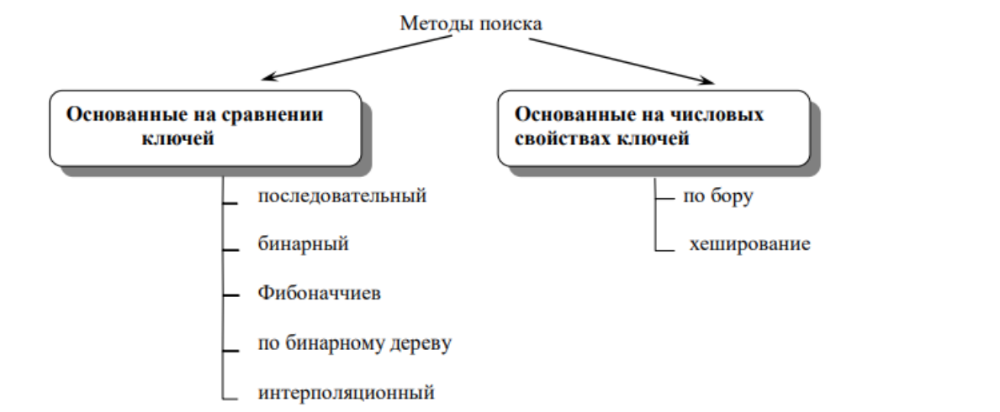
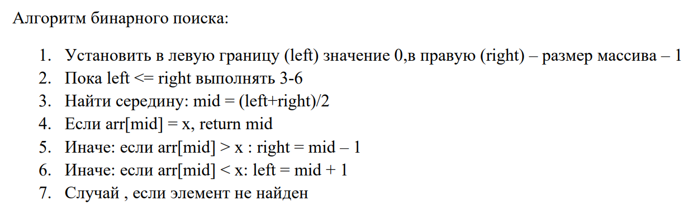

**Цель работы:** ознакомление с алгоритмами поиска в линейных и нелинейных структурах и оценкой эффективности алгоритмов.

**Теоретические сведения**

Предметы (объекты), составляющие множество, называются его элементами. Элемент множества будет называться **ключом**, и обозначаться латинской буквой “k” с индексом, указывающим номер элемента. **Поиск** – процесс нахождения конкретной информации в ранее созданном множестве данных.

Поиск в отсортированном массиве происходит гораздо быстрее, чем в массиве неотсортированном. В этих двух случаях используются разные алгоритмы поиска. Кроме того, массив изначально может заполняться так, чтобы сделать поиск в нем максимально простым.

Алгоритмы поиска можно разбить на следующие группы:

{width=1189px height=491px}

**Задача поиска:**

Пусть дано множество ключей \{k1, k2, k3...kn}. Необходимо отыскать во множестве ключ ki. Поиск может быть завершён в двух случаях:

1. Ключ во множестве отсутствует;

2. Ключ найден во множестве.

**Последовательный поиск**

В последовательном поиске исходное множество не упорядоченно, т.е. имеется произвольный набор ключей \{k1, k2, k3...kn}. Метод заключается в том, что отыскиваемый ключ ki последовательно сравнивается со всеми элементами множества. При этом поиск заканчивается досрочно, если ключ найден.

## ПОИСК В НЕУПОРЯДОЧЕННОМ МАССИВЕ

Простейшим методом поиска элемента, находящегося в неупорядоченном массиве, является последовательный просмотр каждого элемента массива. Перебор элементов заканчивается либо тогда, когда найдется элемент с искомым ключом, либо когда будет достигнут конец массива – это значит, что такого элемента в массиве нет. Результатом поиска желательно иметь индекс искомого элемента, если элемент найден

```
static int SearchSimple(int[] a, int x)
{ int L = a.Length; int i = 0;
 // с проверкой выхода за границу массива 
while (i < L && a[i] != x) i++; 
if (i < L) 
// если элемент найден, возвращаем его индекс 
return i; 
else 
// если элемент не найден, возвращаем -1 
return -1; 
}
```

В этом алгоритме выход из цикла осуществляется по двум условиям: элемент найден или достигнут конец массива. Проверку выхода за границу массива можно опустить, если искомый элемент гарантированно находится в массиве. Такой гарантией может служить барьер – дополнительный элемент массива, значение которого равно искомому элементу. Установка барьера производится до цикла поиска.

```
static int SearchBarrier(int[] a, int x) { 
int L = a.Length;
// увеличиваем размер массива на 1 
Array.Resize(ref a, ++L); 
a[L - 1] = x; // устанавливаем барьер 
int i = 0; // без проверки выхода за границу массива 
while (a[i] != x) i++; 
if (i < L - 1) return i;
else return -1;
}
```

В этом примере для изменения размера массива использован обобщенный статический метод Resize класса Array из пространства имен System. Благодаря наличию барьера в условии продолжения для цикла отсутствует проверка выхода за границу массива. В алгоритмах поиска основной выполняемой операцией является сравнение. Очевидно, что при последовательном поиске в среднем требуется (N+1)/2 сравнений.

***Таким образом, данный алгоритм характеризуется линейной функцией скорости роста – O(N).***

**Бинарный поиск.**

-  Основан на сравнении ключей

-  Основан на числовых свойствах ключей

В бинарном поиске исходящее множество должно быть упорядоченно по возрастанию. Иными словами каждый последующий ключ больше предыдущего \{k1≤k2≤k3≤k4...kn1≤kn}.

Отыскиваемый ключ сравнивается с центральным элементом множества, если он меньше центрального, то поиск продолжается в левом подмножестве, в противном случае в правом.

Центральный элемент находится по формуле **N эл-та =\[n/2\]+1**, где квадратные скобки обозначают, что от деления берётся только целая часть (всегда округляется в меньшую сторону). В методе бинарного поиска анализируются только центральные элементы.

Пример. Дано множество \{7,8,12,16,18,20,30,38,49,50,54,60,61,69,75,79,80,81,95,101,123,198} Найти во множестве ключ K=61.

1. N эл-та =\[n/2\]+1=\[22/2\]+1=12

K\~k12

61>60

Дальнейший поиск в правом подмножестве \{61,69,75,79,80,81,95,101,123,198}.

Значок ”\~” обозначает сравнение элементов (чисел, значений).

1. N эл-та =\[n/2\]+1=\[12/2\]+1=7

K\~k19

61\<95

Дальнейший поиск в левом подмножестве \{61,69,75,79,80,81} (относительно предыдущего подмножества).

1. N эл-та =\[n/2\]+1=\[6/2\]+1=4

K\~k16

61\<79

Дальнейший поиск в левом подмножестве \{61,69,75,79}

1. N эл-та =\[n/2\]+1=\[4/2\]+1=3

   K\~k15

   61\<75

   Дальнейший поиск в левом подмножестве \{61,69} .

2. N эл-та =\[n/2\]+1=\[2/2\]+1=2

K\~k14

61\<69

Дальнейший поиск в левом подмножестве.

1. Шаг 6 K\~k13 61=61. Вывод: искомый ключ найден под номером 13

{width=1240px height=368px}

## ПОИСК В УПОРЯДОЧЕННОМ МАССИВЕ

Используем алгоритм бинарного поиска. При каждом сравнении из рассмотрения исключается половина элементов – не имеет смысла искать элемент больше среднего в левой части, содержащей меньшие значения. Максимальное число требующихся сравнений равно **log2N**.

```
static int SearchBinary(int[] a, int x) 
{
 int m, left = 0, right = a.Length - 1;
 do
 {
 m = (left + right) / 2;
 if (x > a[m])
 left = m + 1;
 else
 right = m - 1;
 }
while ((a[m] != x) && (left <= right));
 if (a[m] == x)
 return m;
 else
 return -1;
}  
```

## СТРОКИ

В языке C# строковые значения представляет тип string, а вся функциональность работы с данным типом сосредоточена в классе System.String. Собственно `string` является псевдонимом для класса String. Объекты этого класса представляют текст как последовательность символов Unicode. Максимальный размер объекта String может составлять в памяти 2 ГБ, или около 1 миллиарда символов.

### Создание строк

```
string s1 = "hello";
string s2 = new String('a', 6); // результатом будет строка "aaaaaa"
string s3 = new String(new char[] { 'w', 'o', 'r', 'l', 'd' });
string s4 = new String(new char[] { 'w', 'o', 'r', 'l', 'd' }, 1, 3); // orl
 
Console.WriteLine(s1);  // hello
Console.WriteLine(s2);  // aaaaaaa
Console.WriteLine(s3);  // world
Console.WriteLine(s4);  // orl
var s2 = "Create by var";
Console.WriteLine(s2);
```

### Строка как набор символов

Так как строка хранит коллекцию символов, в ней определен индексатор для доступа к этим символам:

`public char this[int index] {get;}`

Применяя индексатор, мы можем обратиться к строке как к массиву символов и получить по индексу любой из ее символов:

```
string message = "hello";
// получаем символ
char firstChar = message[1]; // символ 'e'
Console.WriteLine(firstChar);   //e
 
Console.WriteLine(message.Length);  // длина строки  
```

Используя свойство **Length**, как и в обычном массиве, можно получить длину строки.

### Перебор строк

```
string message = "hello";
 
for(var i =0; i < message.Length; i++)
{
    Console.WriteLine(message[i]);
}
foreach(var ch in message)
{
    Console.WriteLine(ch);
}
```

### Сравнение строк

Строки сравниваются по значению их символов

```
string message1 = "hello";
string message2 = "hello";
 
Console.WriteLine(message1 == message2);    // true
```

Для сравнения строк применяется статический метод **Compare**:

```
string s1 = "hello";
string s2 = "world";
 
int result = string.Compare(s1, s2);
if (result<0)
{
    Console.WriteLine("Строка s1 перед строкой s2");
}
else if (result > 0)
{
    Console.WriteLine("Строка s1 стоит после строки s2");
}
else
{
    Console.WriteLine("Строки s1 и s2 идентичны");
}
// результатом будет "Строка s1 перед строкой s2"
```

Данная версия метода Compare принимает две строки и возвращает число. Если первая строка по алфавиту стоит выше второй, то возвращается число меньше нуля. В противном случае возвращается число больше нуля. И третий случай - если строки равны, то возвращается число 0.

В данном случае так как символ h по алфавиту стоит выше символа w, то и первая строка будет стоять выше.

### Многострочные строки

Начиная с C# 11 с помощью трех пар двойных кавычек можно оформить многострочный текст, в том числе с применением интерполяции:

```
void Print()
{
    string text = """
              <element attr="content">
                <body>
                </body>
              </element>
              """;
    Console.WriteLine(text);
}
```

### Объединение строк

Конкатенация строк или объединение может производиться как с помощью операции `+`, так и с помощью метода Concat:

```
string s1 = "hello";
string s2 = "world";
string s3 = s1 + " " + s2; // результат: строка "hello world"
string s4 = string.Concat(s3, "!!!"); // результат: строка "hello world!!!"
 
Console.WriteLine(s4);
```

Для объединения строк также может использоваться метод **Join**:

```
string s5 = "apple";
string s6 = "a day";
string s7 = "keeps";
string s8 = "a doctor";
string s9 = "away";
string[] values = new string[] { s5, s6, s7, s8, s9 };
 
string s10 = string.Join(" ", values);
Console.WriteLine(s10); // apple a day keeps a doctor away
```

Использованная выше версия метода получает два параметра: строку-разделитель (в данном случае пробел) и массив строк, которые будут соединяться и разделяться разделителем.

### Смена регистра

Для приведения строки к верхнему и нижнему регистру используются соответственно функции ToUpper() и ToLower():

```
string hello = "Hello world!";
 
Console.WriteLine(hello.ToLower()); // hello world!
Console.WriteLine(hello.ToUpper()); // HELLO WORLD!
```

### Поиск в строке

С помощью метода **IndexOf** мы можем определить индекс первого вхождения отдельного символа или подстроки в строке:

```
string s1 = "hello world";
char ch = 'o';
int indexOfChar = s1.IndexOf(ch); // равно 4
Console.WriteLine(indexOfChar);
 
string substring = "wor";
int indexOfSubstring = s1.IndexOf(substring); // равно 6
Console.WriteLine(indexOfSubstring);
```

Подобным образом действует метод **LastIndexOf**, только находит индекс последнего вхождения символа или подстроки в строку.

Еще одна группа методов позволяет узнать начинается или заканчивается ли строка на определенную подстроку. Для этого предназначены методы **StartsWith** и **EndsWith**. Например, в массиве строк хранится список файлов, и нам надо вывести все файлы с расширением exe:

```
var files = new string[]
{
    "myapp.exe",
    "forest.jpg",
    "main.exe",
    "book.pdf",
    "river.png"
};
 
for (int i = 0; i < files.Length; i++)
{
    if (files[i].EndsWith(".exe"))
        Console.WriteLine(files[i]);
}
```

## Поиск подстроки в строке:

Возвращает True если строка содержит указанный символ или подстроки.

```
Console.WriteLine(phrase.Contains("z")); // Вывод: False
string[] people = { "Tom", "Tim", "Bob", "Sam" };
 
// проверяем, есть ли строка Tom
bool hasTom = people.Contains("Tom");     // true
Console.WriteLine(hasTom);
 
// проверяем, есть ли строка Mike
bool hasMike = people.Contains("Mike");     // false
Console.WriteLine(hasMike);
```

### Разделение строк

С помощью функции **Split** мы можем разделить строку на массив подстрок. В качестве параметра функция **Split** принимает массив символов или строк, которые и будут служить разделителями. Например, подсчитаем количество слов в сроке, разделив ее по пробельным символам:

```
string text = "И поэтому все так произошло";
 
string[] words = text.Split(new char[] { ' ' });
 
foreach (string s in words)
{
    Console.WriteLine(s);
}
```

Это не лучший способ разделения по пробелам, так как во входной строке у нас могло бы быть несколько подряд идущих пробелов и в итоговый массив также бы попадали пробелы, поэтому лучше использовать другую версию метода:

**string\[\] words = text.Split(new char\[\] \{ ' ' }, StringSplitOptions.RemoveEmptyEntries);**

Второй параметр StringSplitOptions.RemoveEmptyEntries говорит, что надо удалить все пустые подстроки.

## **Тип Char**

Тип данных System.Char используется для хранения одного символа юникода. В C# есть псевдоним char, который можно использовать при объявлении переменных char:

```
Console.WriteLine("Write your name:");
string name = Console.ReadLine();  
bool isValid = true;  
for(int i = 0; i < name.Length; i++)  
{  
    char ch = name[i];  
    if((i == 0) && ((!Char.IsLetter(ch)) || (!Char.IsUpper(ch))))  
    {  
    Console.WriteLine("The first character has to be an uppercase letter!");  
    isValid = false;  
    break;  
    }  
    if(Char.IsDigit(ch))  
    {  
    Console.WriteLine("No digits allowed!");  
    isValid = false;  
    break;  
    }  
}  
if (isValid)  
    Console.WriteLine("Hello, " + name);
```

Мы просто перебираем имя, введенное пользователем, и используем различные версии методов Is\*, чтобы проверить, что ввод соответствует нашим простым требованиям. И есть несколько других полезных методов, таких как метод *Char.IsLetterOrDigit()*. Полный их список можно посмотреть на [documentation](https://msdn.microsoft.com/en-us/library/system.char(v=vs.110).aspx#Methods).

## Требования к отчету

**Структура отчета:**

1. **Титульный лист**

2. **Цель работы**

3. **Условие задания**

4. **Код программы**

5. **Скриншоты тестирования программы**

6. **Вывод по цели работы**

## Примечания

-- Оценка «5» выставляется при выполнении всех заданий, наличии полных и обоснованных выводов, а также при наличии корректных ответов на вопросы по заданиям 1-3.\
-- Оценка «4» выставляется при выполнении заданий 1–3.\
-- Оценка «3» выставляется при выполнении заданий 1–2.

**Дополнительно:**

<https://devpractice.ru/c-sharp-lesson-5-strings/#p32>