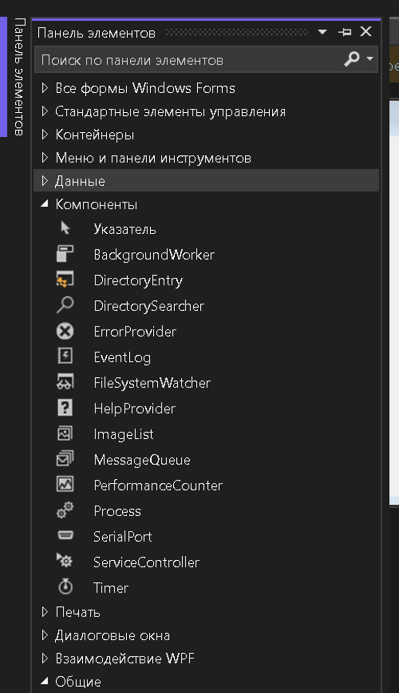
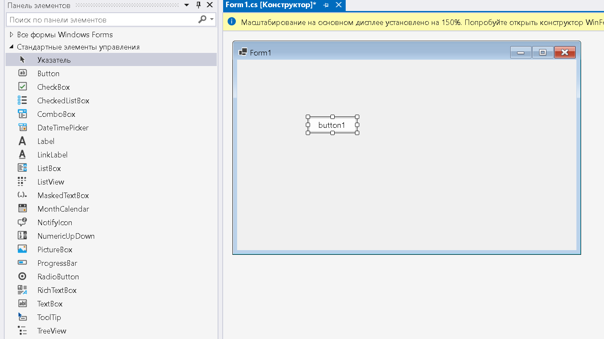
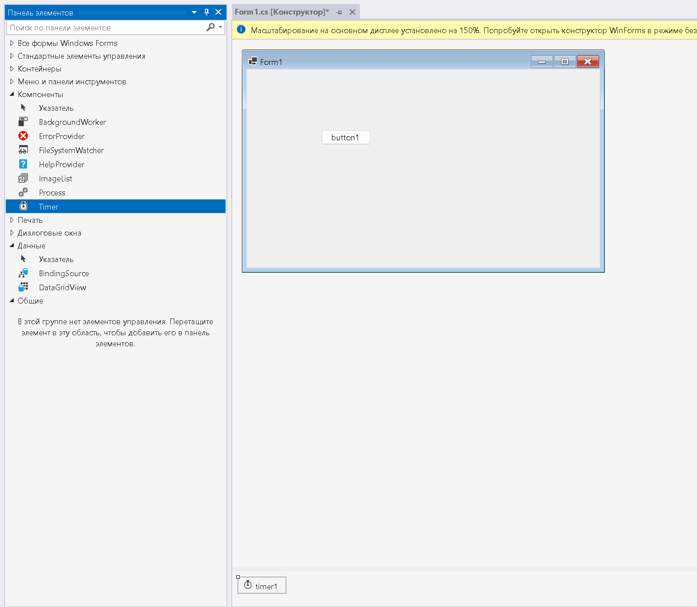

**Цель работы:** Ознакомиться с технологией Windows Forms.

## Теоретическая справка:

<https://learn.microsoft.com/ru-ru/dotnet/desktop/winforms/>

### Теория компонентов в Windows Forms (C#)

В среде визуального программирования **Windows Forms** компоненты (элементы управления) -- это строительные блоки, из которых формируется визуальное представление и логика работы приложения.

Для языка программирования **C#** компоненты -- это классы, порожденные прямо или косвенно от базовых классов .NET:

-  `System.Windows.Forms.Control` -- для визуальных элементов.

-  `System.ComponentModel.Component` -- для невизуальных элементов. Экземпляры компонентов -- это объекты данных классов, существующие в виде полей класса формы (`Form`).

**Компонент = Состояние (свойства) + Действия (методы) + Обратные связи (события).**

#### 1\. Состояние компонента (Свойства)

Состояние компонента описывается его **свойствами (Properties)**. Свойства -- это атрибуты компонента, которые определяют, как он отображается на экране (размер, цвет, шрифт) и как функционирует (включен/выключен, текст метки).

В C# свойства объявляются с использованием аксессоров `get` и `set`.

-  **Изменяемые:** имеют оба аксессора (чтение и запись).

-  **Неизменяемые:** имеют только `get` (только для чтения).

В зависимости от доступности в среде разработки свойства подразделяются на:

-  **Свойства времени проектирования:** отображаются в окне **«Свойства» (Properties Window)** в Visual Studio. Их можно изменять визуально до запуска программы. В коде они доступны как публичные свойства класса. Видимость в дизайнере регулируется атрибутами (например, `[Browsable(true)]`).

-  **Свойства времени выполнения:** доступны только через код во время работы приложения и не отображаются в окне свойств дизайнера (например, `[Browsable(false)]`).

#### 2\. Действия компонента (Методы)

Действия, выполняемые компонентом -- это его **методы (Methods)**. Вызовы методов помещаются в исходный код программы (code-behind) и происходят во время выполнения приложения. Методы не имеют визуального представления в дизайнере форм. Они определяют логику поведения, например, метод `Focus()` для установки фокуса или `Refresh()` для перерисовки элемента.

#### 3\. Обратные связи компонента (События)

Обратные связи компонента -- это его **события (Events)**. События обеспечивают интерактивность компонентов (реакция на клик мыши, нажатие клавиши, загрузку формы). В C# события реализуются на основе **делегатов**. Свойство события содержит ссылку на метод-обработчик (event handler). Связь между событием и кодом обработчика устанавливается либо в коде (подписка через `+=`), либо визуально в окне свойств на вкладке «События» (значок молнии).

#### 4\. Классификация компонентов

Все множество компонентов в Windows Forms делится на две группы: **визуальные** и **невизуальные**.

Доступ к компонентам .NET можно получить из панели элементов > компоненты

{width=781px height=1352px}

***Если ее не видно, то нужно выбрать «Вид» > «Панель элементов» в строке меню или нажать клавиши CTRL + ALT + X.***

Компоненты на форме можно перетаскивать мышью, визуально устанавливая их положение. Когда вы выделяете компонент, обратите внимание на точки, которые появляются вокруг контура выделения. В те стороны, на которых есть жирные точки, можно растягивать компонент. Например, выделите форму, и у нее на рамке выделения окажутся точки только справа и снизу. Это значит, что вы можете изменять высоту и ширину формы перемещением правого и нижнего краев формы.

-  **Визуальные компоненты (Controls):** Это элементы пользовательского интерфейса (кнопки, текстовые поля, метки). Они наследуются от класса `Control`. Они видны на поверхности формы и выглядят одинаково на стадии проектирования и во время работы программы.

{width=1424px height=801px}

-  **Невизуальные компоненты (Components):** Это компоненты, не имеющие графического представления на самой форме. Они наследуются от класса `Component`.

   -  **На стадии проектирования:** они отображаются в специальной области под формой, называемой **панелью компонентов (Component Tray)**, в виде иконок.

   -  **Во время работы:** они не видны как элементы интерфейса, но выполняют свою функцию.

   -  *Примеры:*

      -  `Timer` -- выполняет код через заданные интервалы времени.

      -  `OpenFileDialog` / `SaveFileDialog` -- отображают стандартные диалоговые окна (всплывают только при вызове метода `ShowDialog`).

      -  Компоненты доступа к базам данных

   -  {width=1579px height=1376px}

## Требования к отчету

**Структура отчета:**

1. **Титульный лист**

2. **Цель работы**

3. **Условие задания**

4. **Код программы**

5. **Скриншоты тестирования программы**

6. **Вывод по цели работы**

## Примечания

-  **Оценка 5 (отлично)**:

Выполнены полностью все задания.

-  **Оценка 4 (хорошо)**:

Выполнены полностью любые 3 задания.

-  **Оценка 3 (удовлетворительно)**:

Выполнены полностью любые 2 задания.