## Теоретическая информация

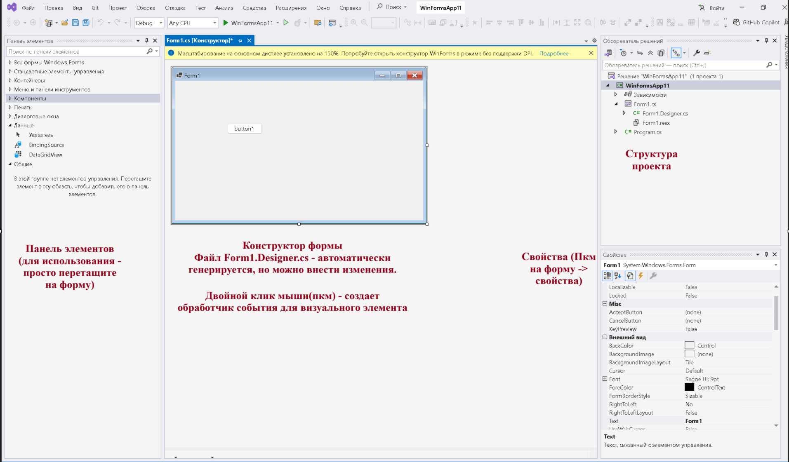{width=1913px height=1121px}

### **Интерфейс Windows Forms**

Макет интерфейса может отличаться в зависимости от версии и настроек, однако для работы необходимы три ключевых окна:

1. **Графический дизайнер** -- центральная область, отображающая форму будущего приложения (по умолчанию `Form1`).

2. **Обозреватель решений (Solution Explorer)** -- расположен справа, содержит все файлы проекта (в т.ч. `Form1.cs`).

3. **Окно свойств (Properties Window)** -- инструмент для настройки размера, внешнего вида и поведения выбранного компонента или формы.

**Как открыть окно свойств**

Существует несколько способов вызова:

-  **Через меню:** `Вид` -> `Окно свойств`.

-  **Горячая клавиша:** `F4`.

-  **Контекстное меню:** ПКМ по объекту -> `Свойства`.

### Работа с формами

Формы являются основными строительными блоками. Они предоставляют контейнер для различных элементов управления. А механизм событий позволяет элементам формы отзываться на ввод пользователя, и, таким образом, взаимодействовать с пользователем.

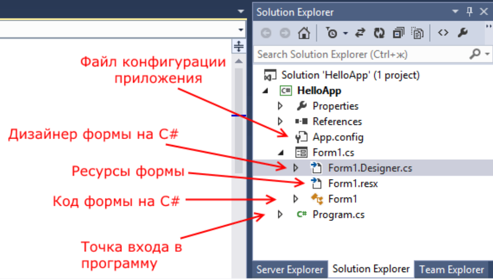{width=1067px height=606px}

Точкой входа в графическое приложение является класс **Program** в файле **Program.cs**, а не сама форма.

**Файлы формы**

Форма состоит из нескольких связанных файлов:

-  **Form1.Designer.cs** -- содержит частичный класс формы. В нем автоматически генерируются:

   -  `Dispose()` -- освобождение ресурсов (аналог деструктора).

   -  `InitializeComponent()` -- инициализация свойств формы и добавление элементов управления.

-  **Form1.cs** -- содержит программную логику и пользовательский код формы.

-  **Form1.resx** -- хранит ресурсы проекта (используется для локализации на разные языковые культуры).

**Настройка компонентов**

Для управления свойствами элементов (размер, внешний вид, поведение) используется окно **Properties (Свойства)** в Visual Studio.

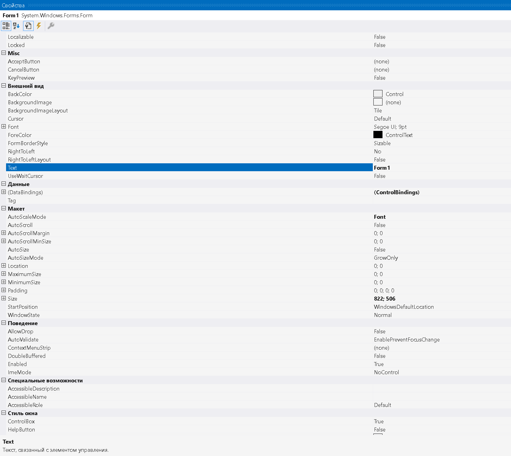{width=1686px height=1505px}


**Настройка свойств формы**

Для настройки нужно выделить форму (щелкнуть на любом ее свободном месте). В окне **Свойства** отображается имя редактируемого объекта. Значения свойств объектов, установленные по умолчанию, имеют обычное начертание, а измененные значения – **полужирное начертание**.

**Визуальные свойства**

У формы есть различные свойства. Например, можно установить цвет переднего плана (`ForeColor`) и фона (`BackColor`), текст заголовка (`Text`), который отображается в верхней части формы, размер формы (`Size`) и другие свойства. Для некоторых свойств, таких как `BackColor` и `ForeColor`, значения можно определить средствами специального редактора. Поскольку выбор цвета важен для дизайна пользовательского интерфейса, следует отнестись к нему очень внимательно. Чтобы облегчить чтение форм, следует применять высококонтрастные цветовые схемы.

Свойство `BackGroundImage` позволяет использовать изображение вместо однотонного фона. Если задано фоновое изображение, то изменение свойства `BackColor` формы по умолчанию отразится на значении одноименного свойства всех размещенных на ней элементов управления.

**Границы и панель задач**

Свойство `ShowInTaskBar` получает или задает значение, указывающее, отображается ли форма на панели задач Windows. Свойство `FormBorderstyle` устанавливает тип границы, которая появляется вокруг формы. Значения могут быть следующие:

-  `Sizable`

-  `SizableToolWindow`

-  `Fixed3D`

-  `FixedDialog`

-  `Fixedsingle`

-  `FixedToolWindow`

-  `None`

Большинство значений этих свойств очевидно, за исключением двух инструментальных окон со стилями `SizableToolWindow` и `FixedToolWindow` – окна не будут появляться на панели задач, независимо от того, как установлено свойство `ShowInTaskBar`. Также инструментальные окна не будут показываться в списке окон, когда пользователь нажмет комбинацию клавиш `Alt + Tab`.

**Позиционирование**

Для позиционирования окна формы на экране при ее первом отображении используется свойство `StartPosition`, которое принимает значение из перечисления `FormStartPosition`:

-  `CenterParent` – форма центрируется в клиентской области родительской формы;

-  `CenterScreen` – форма центрируется на текущем экране;

-  `Manual` – местоположение формы основано на свойстве `Location`;

-  `WindowsDefaultBounds` – форма располагается в позиции по умолчанию, определяемой Windows, и имеет размеры по умолчанию;

-  `WindowsDefaultLocation` – форма располагается в позиции по умолчанию, определяемой операционной системой.

**Работа с кодом**

С помощью значений свойств можно изменить внешний вид формы, но все то же самое можно сделать динамически в коде. Для перехода к коду формы можно вызвать контекстное меню формы и выбрать команду **View Code (Просмотр кода)** или дважды щелкнуть на компоненте формы, что не только открывает код, но и создает (или открывает для редактирования) соответствующий обработчик события.

### Добавление форм. Взаимодействие между формами

Чтобы добавить еще одну форму в проект, можно нажать правой кнопкой мыши на имя проекта в окне Solution Explorer (**Обозреватель решений**) и выбрать Add (**Добавить**) ->Windows Form... Затем в диалоговом окне ввести имя формы

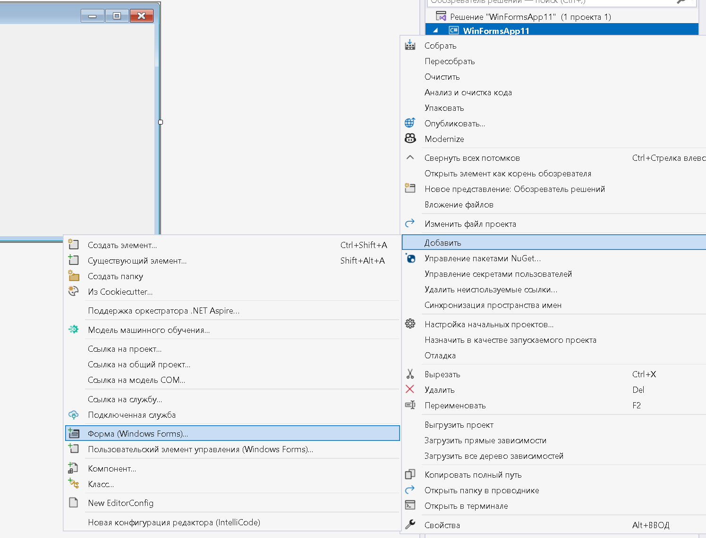{width=1495px height=1141px}

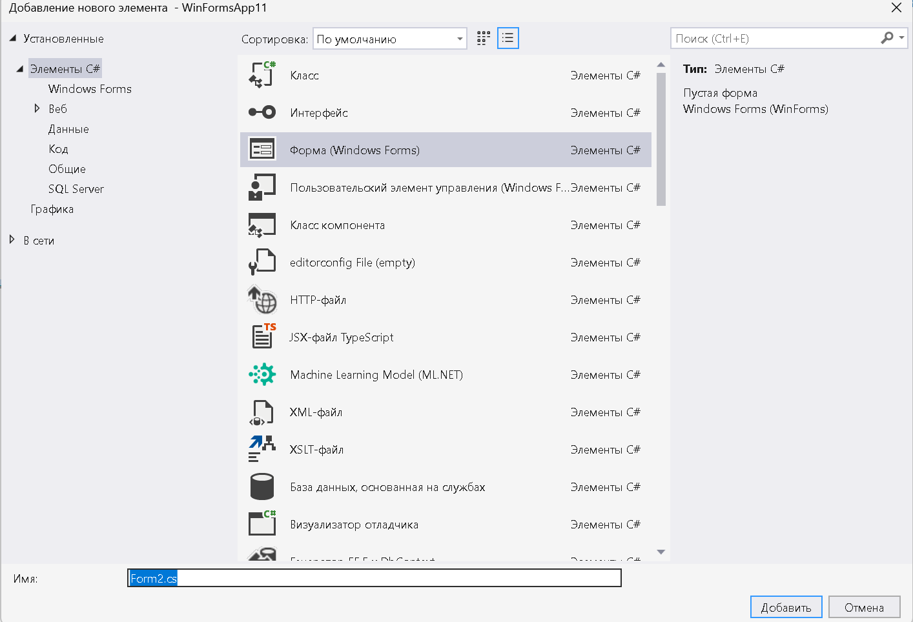{width=1414px height=964px}

Теперь в проекте две формы.

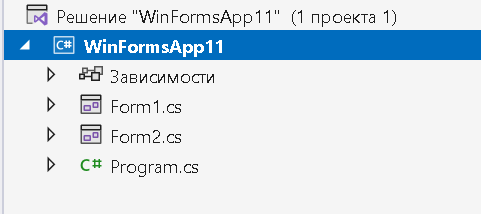{width=481px height=214px}

**Осуществим взаимодействие между двумя формами.**

Допустим, первая форма по нажатию на кнопку будет вызывать вторую форму. Во-первых, добавим на первую форму Form1 кнопку и двойным щелчком по ней перейдем в файл кода. Попадем в обработчик события нажатия кнопки

```
private void button1_Click(object sender, EventArgs e)
{
}
```

Добавим в него код вызова второй формы Form2:

```
private void button1_Click(object sender, EventArgs e)
{
Form2 newForm = new Form2();
newForm.Show();
}
```

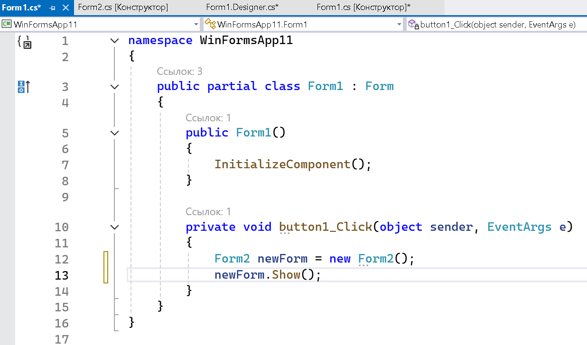{width=1237px height=728px}

Пока вторая форма не знает о существовании первой. Сделаем так, чтобы вторая форма воздействовала на первую. **Для этого воспользуемся передачей ссылки на форму в конструкторе**

Перейдем к коду второй формы. Пока он пустой и содержит только конструктор. Изменим файл кода второй формы:

```
public partial class Form2 : Form
{
public Form2()
{
InitializeComponent();
}
public Form2(Form1 f)
{
InitializeComponent();
f.BackColor = Color.Yellow;
}
}
```

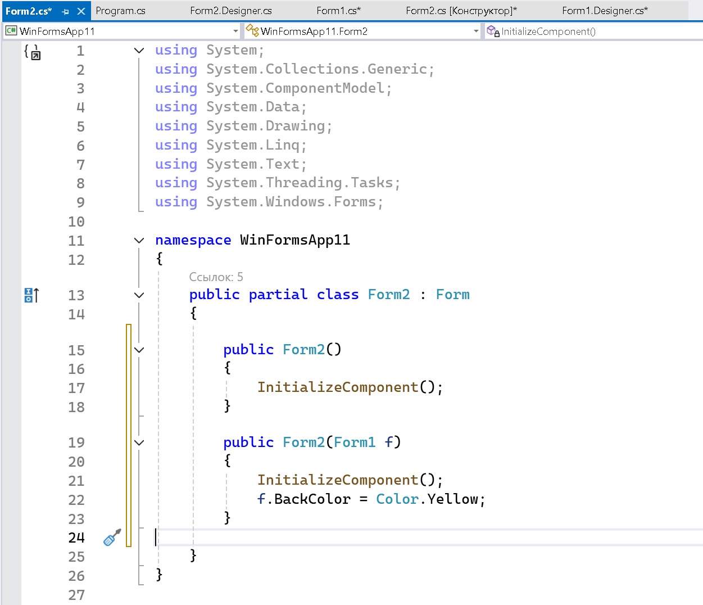{width=1251px height=1076px}

**Запустим приложение:**

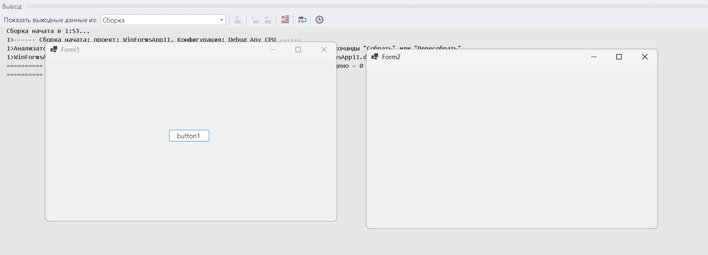{width=1946px height=703px}

Фактически добавили здесь ***новый конструктор public Form2(Form1 f),*** в котором получаем первую форму и устанавливаем ее фон в желтый цвет. Теперь перейдем к коду первой формы, где вызывали вторую форму и изменим его:

```
private void button1_Click(object sender, EventArgs e)
{
Form2 newForm = new Form2(this);
newForm.Show();
}
```

Поскольку слово **this** представляет ссылку на текущий объект **Form1**, то при создании второй формы она будет получать ссылку и через нее управлять первой формой. Теперь после нажатия на кнопку будет создана вторая форма, которая сразу изменит цвет первой формы.

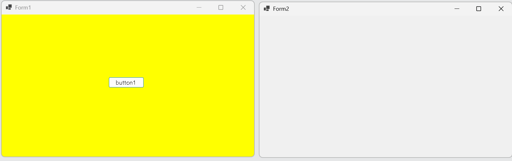{width=1622px height=510px}

:::info 

При работе с несколькими формами надо учитывать, что одна из них является главной – та, которая запускается первой в файле **Program.cs**. Если одновременно открыто несколько форм, то при закрытии главной формы закрывается приложение и вместе с ним все остальные формы.

:::

## Задание 1. Технология Windows Forms

-  Запустите **Microsoft Visual Studio**.

-  Создайте новый проект **Windows Forms** (.NET Framework) в своей папке.

-  Изучите элементы управления, используемые для редактирования.

-  Изучите структуру проекта в **Обозревателе решений**.

-  Откройте файл с кодом формы. Для этого вызвать контекстное меню формы и выбрать команду **Перейти к коду** или нажать клавишу **F7**.

-  Переименуйте все файлы, связанные с формой в **MainForm**.

Для этого вызовите контекстное меню файла **Form1.cs** и выберите команду **Переименовать** (рисунок 2), введите имя MainForm.cs и подтвердите переименование всех связанных ссылок (рисунок 3).

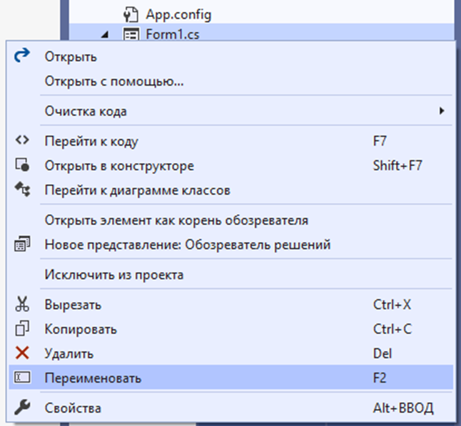{width=646px height=598px}

Рисунок 5 – Диалоговое окно переименования файлов проекта

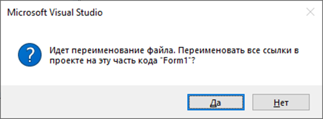{width=646px height=238px}

Рисунок 6 – Диалоговое окно для подтверждения переименования файла

-  Ознакомьтесь со свойствами формы.

-  Настройте свойства формы:

   -  для свойства **Text** ввести значение **Технология Windows Forms**, затем нажать клавишу **Enter**. Теперь форма в заголовке окна должна содержать соответствующий текст;

   -  определить расположение формы после запуска программы на выполнение – в центре экрана (**StartPosition**);

   -  изменить цвет формы, для свойства **BackColor** формы);

   -  задать прозрачность (**Opacity**) 95%;

   -  добавить рисунок в центр формы. Используйте элемент PictureBox > свойство Image.

-  Добавьте на форму справа от рисунка объекты:

   -  контейнер для группировки (GroupBox) с заголовком **Направление движения**; внутри него разместить три переключателя (RadioButton): **по горизонтали** (для свойства Checked – значение True), **по вертикали** и **по контуру**;

   -  две кнопки с текстом **Движение** и **Выход** так, чтобы они были расположены вблизи от центра формы. Определить их свойства самостоятельно.

-  Расположите метку (Label) в верхнем левом углу. Введите текст, например, **Hello World**, размер которого **24**, **полужирный** (свойство **Font**).

-  Изучите изменения, внесенные в файл MainForm.Designer.cs.

-  Вызовите обработчик события нажатия на левую кнопку (Click) дважды щелкнув по кнопке с текстом **Выход**.

-  Переименуйте метод (вызовите соответствующую команду из контекстного меню или нажмите «горячие клавиши»), введите новое имя **Exit**.

Этот метод будет отвечать за вывод диалогового окна (рисунок 7) и завершения работы программы.

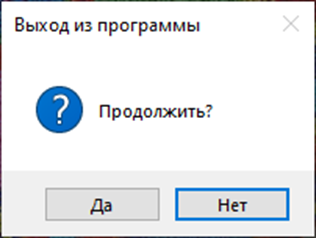{width=316px height=238px}

Рисунок 7 – Диалоговое окно для завершения работы

За формирование и вывод диалогового окна будет отвечать команда:

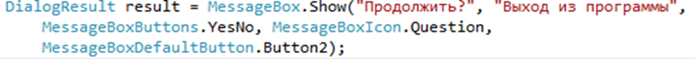{width=1048px height=91px}

За завершение работы команда:

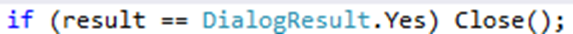{width=573px height=34px}

Так как выход из программы организован с помощью диалогового окна, то можно убрать кнопки управления окном (свойству **ControlBox** присвоить значение **False**).

-  Аналогично создайте обработчик события с именем **Motion** для кнопки **Движение**.

Данный метод будет отвечать за движение метки по форме в одном из направлений, определенном с помощью переключателей.

Создайте три дополнительных метода для организации движения:

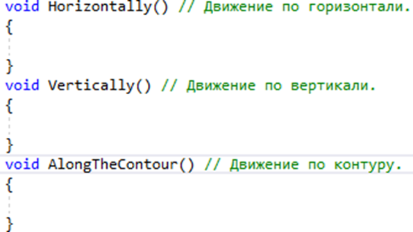{width=595px height=335px}

-  В методе **Motion** определите условия для вызова этих методов:

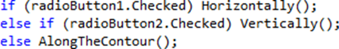{width=579px height=84px}

-  Введите в методы команды, задающие движение метки по форме, с учетом их размеров (так, чтобы при изменении размеров формы или метки не пришлось редактировать код методов).

Пример:

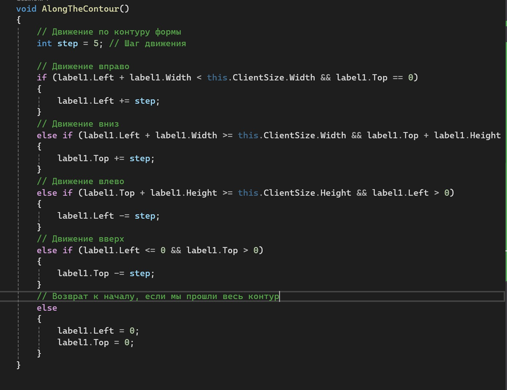{width=1088px height=838px}