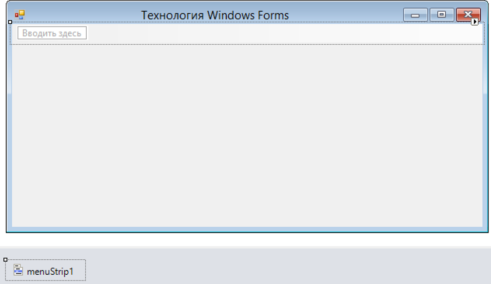
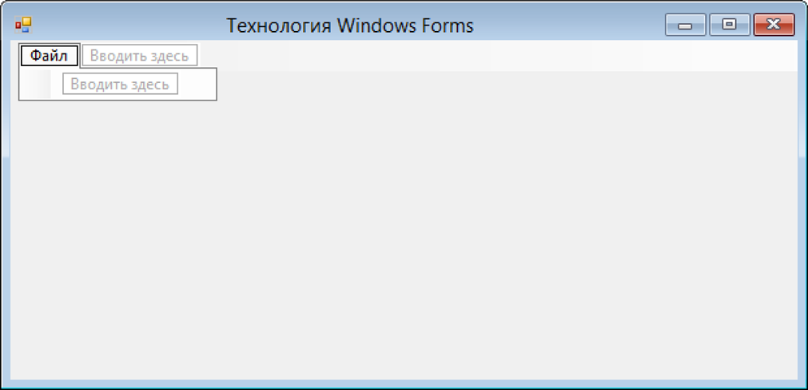
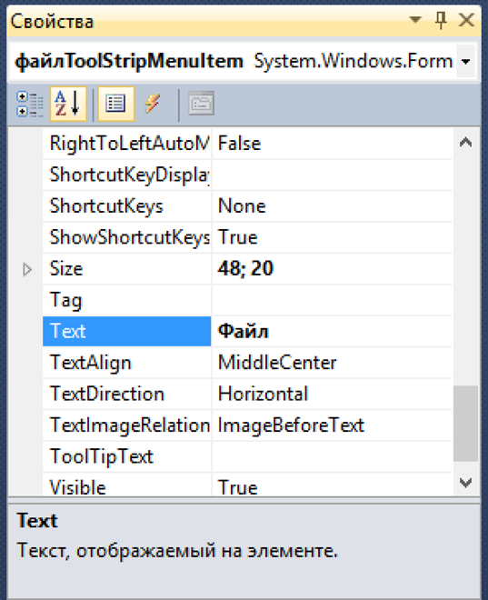
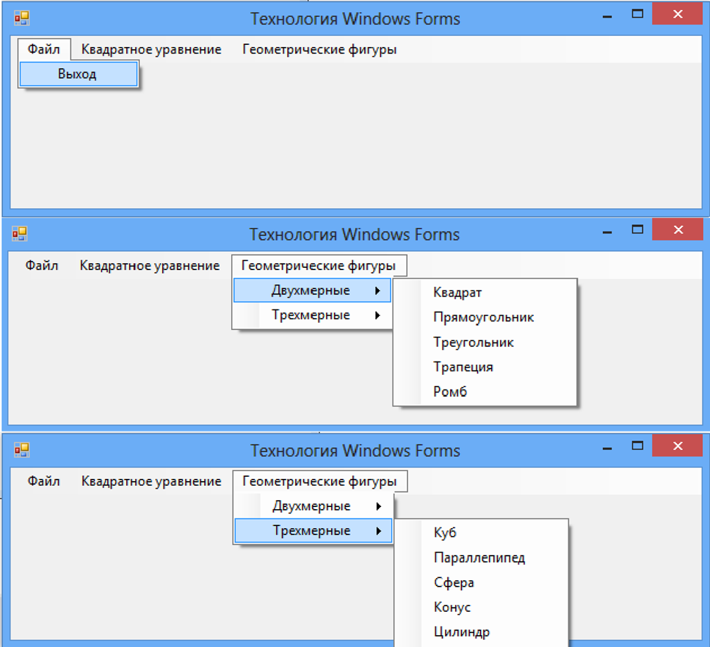
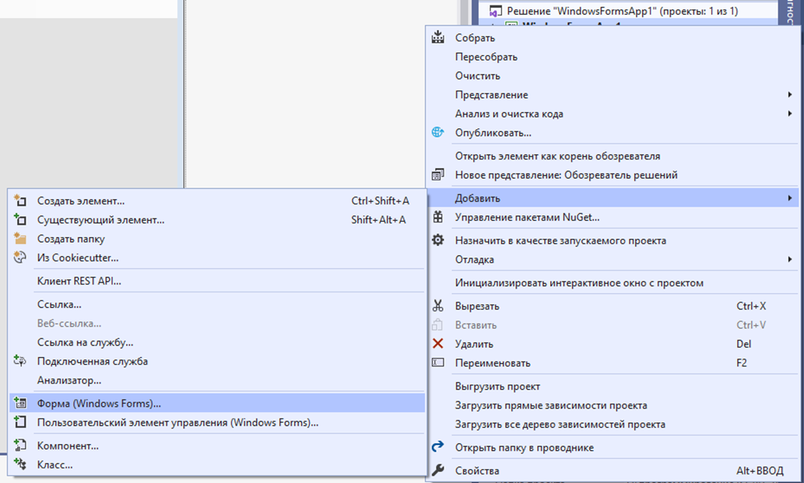
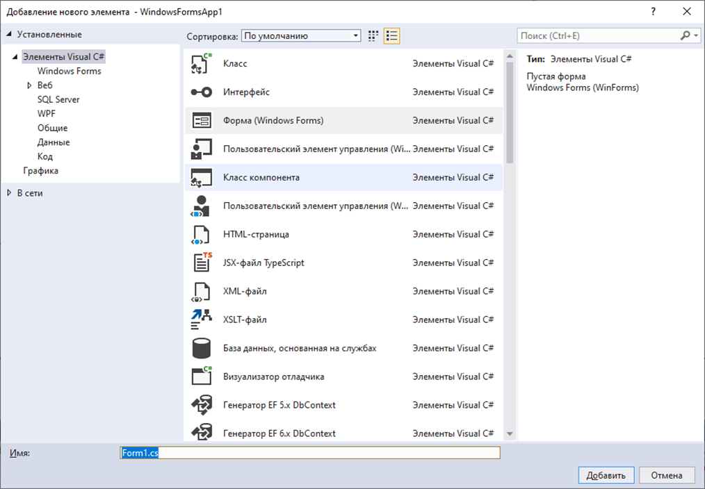
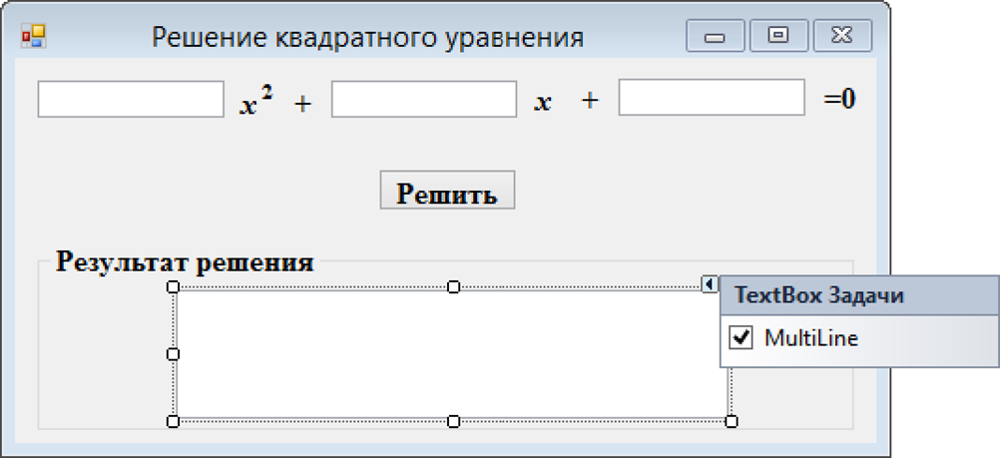
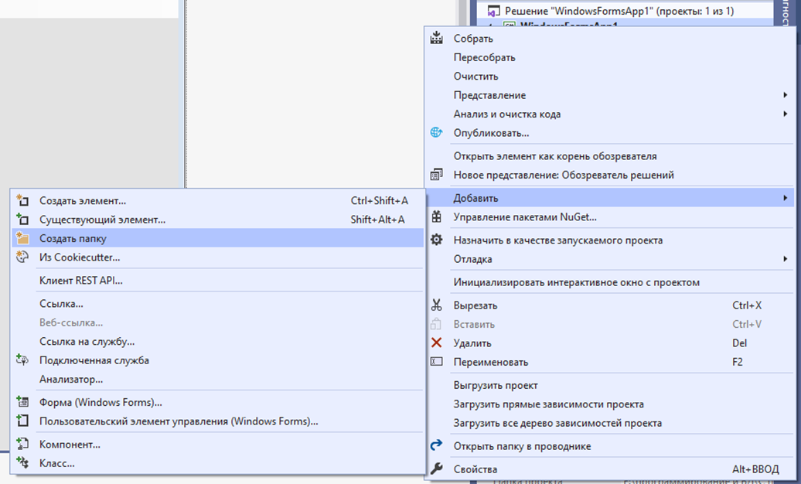

-  Создайте новый проект **Windows Forms** (.NET Framework) в своей папке.

-  Переименуйте все файлы, связанные с формой в **MainForm**.

-  Настройте свойства формы.

-  Добавьте на форму объект меню (**MenuStrip**).

Элемент управления **MenuStrip** представляет контейнер для структуры меню формы.Можно добавить объекты **ToolStripMenuItem** в объект MenuStrip, который представляет отдельные команды в структуре меню. Каждый объект ToolStripMenuItem может быть командой для приложения или родительским меню для других элементов вложенного меню. Элемент управления **MenuStrip** дает возможность визуально конструировать систему главного меню формы (рисунок 8). Перетаскивание этого элемента управления из панели Toolbox на пустую форму автоматически прикрепит меню к верхнему краю формы. После того как поместили на форму этот элемент управления, выбор элемента MenuStrip активирует смарт-тег. Смарт-тег позволяет автоматически вставить в меню стандартные пункты и выставить свойства **RenderMode**, **Dock** и **GripStyle**

Рисунок 8 – Форма, содержащая элемент управления «Главное меню»

{width=1007px height=585px}

-  Введите название нового пункта меню, например Файл (рисунок 9). Введенный текст появляется и в редакторе «**Меню**», и в поле **Text** в окне **Свойства** (рисунок 10). Изменить свойства нового пункта меню можно в любом из этих мест.

{width=1011px height=489px}

Рисунок 9 – Ввод пунктов меню

{width=537px height=660px}

Рисунок 10 – Окно свойств меню

Как только будет введено название пункта меню, справа появится поле для ввода нового элемента, а также появится область для ввода подпункта.

-  Создайте следующее меню (рисунок 11).

{width=1008px height=920px}

-  Введите обработчик события для подпункта «**Выход**» в пункте «**Файл**» (см. лабораторную работу №1).

-  Создайте дополнительную форму, которая будет вызываться при выборе пункта меню «**Квадратное уравнение**».

Для добавления в проект новой формы, можно щелкнуть правой кнопкой мыши на **имени проекта** в окне **Обозреватель решений** и в контекстном меню выбрать пункт **Добавить** – **Форма Windows** (рисунок 12).

{width=1033px height=621px}

Рисунок 12 – Добавление новой формы в проект

-  Введите новое имя кодового файла, в соответствии с решаемой в нем задачей (решение квадратного уравнения, рисунок 13).

{width=1014px height=704px}

Рисунок 13 – Диалоговое окно создания формы

-  Введите заголовок формы **Решение квадратного уравнения**.

-  Создайте обработчик события для щелчка мышью по пункту **Квадратное уравнение**, который будет открывать вторую форму. Для этого в обработчике создайте новый объект формы и вызовите форму через метод Show().

-  Расположите на форме объекты в соответствии с рисунком 14.

{width=1002px height=459px}

Рисунок 14 – Окно формы «Решение квадратного уравнения»

-  Создайте в проекте две новые **папки**: **Classes** и **UserControls** (рисунок 15).

{width=1036px height=626px}

Рисунок 15 – Создание в проекте новой папки

-  Создайте в папке **Classes** класс для решения квадратного уравнения.

-  Измените для класса пространство имен на то, которое используется в проекте (удалить **.Classes**). Введите код. Если подтянулось пространство имен проекта – то ничего не менять!

-  Создайте обработчик события для кнопки «**Решить**». *Примечание*: для ввода данных используйте метод **double.TryParse**().