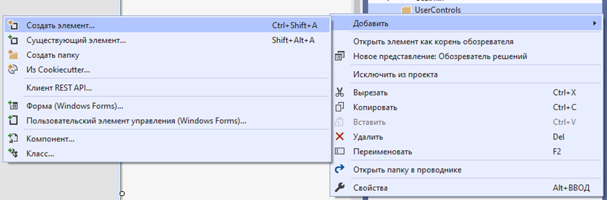
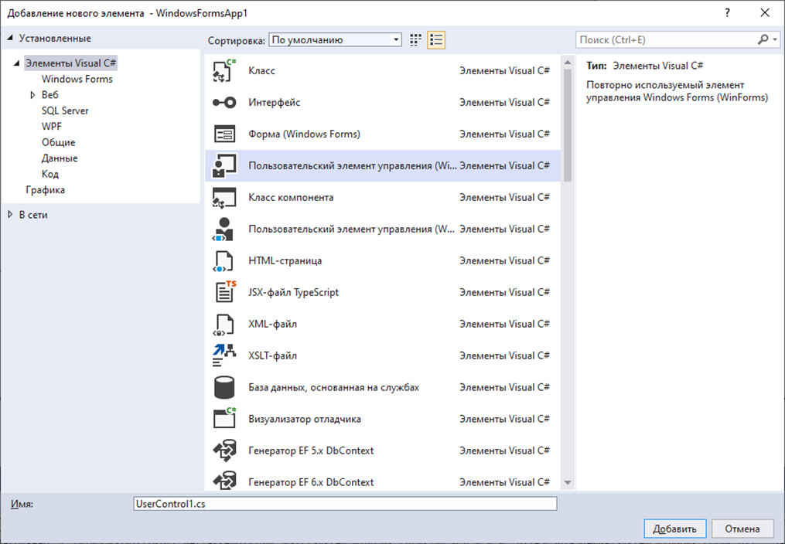
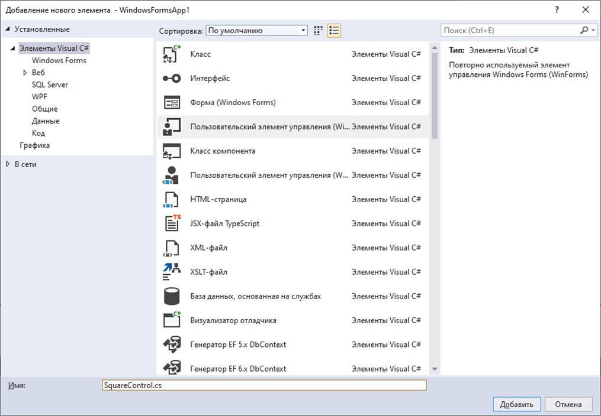
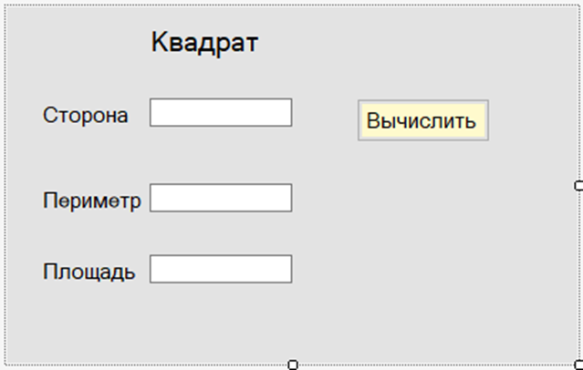
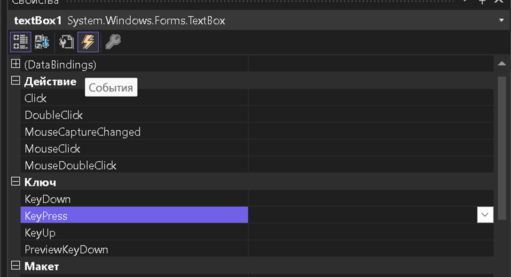
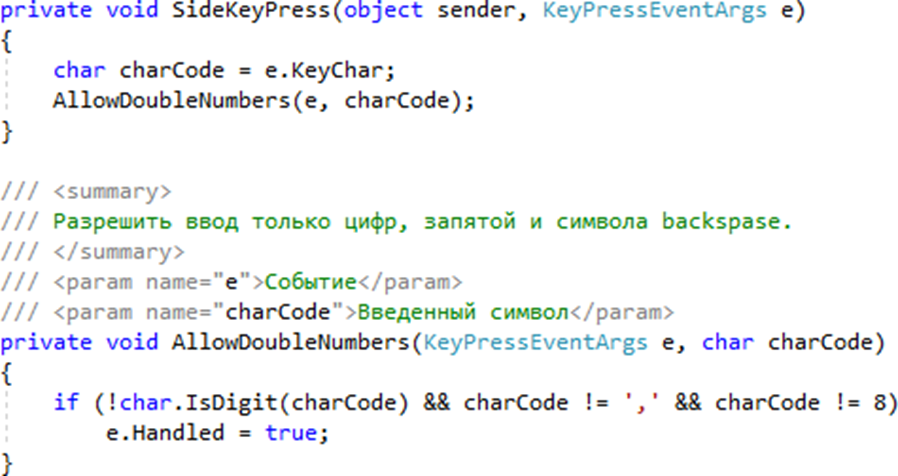
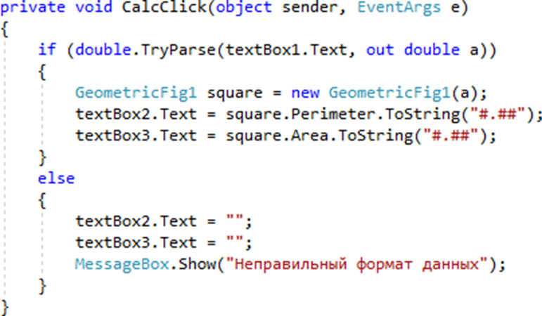
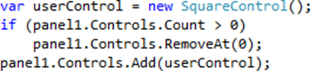
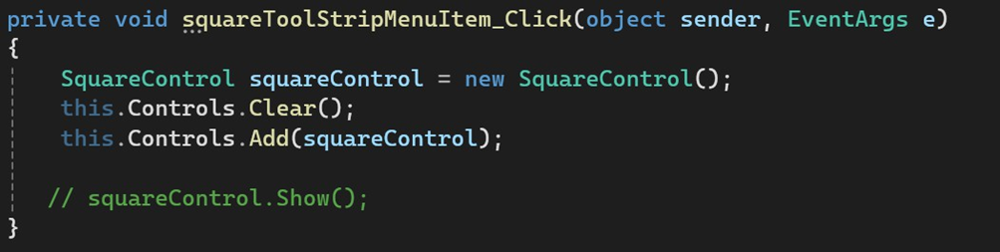

-  Откройте проект, созданный в задании 2

-  Создайте в папке **UserControls** новый элемент (рисунок 16).

{width=1025px height=340px}

Рисунок 16 – Добавление в папку проекта нового элемента

-  Выберите тип элемента – Пользовательский элемент управления (рисунок 17, а) и ввести его имя (рисунок 17, б).

{width=1015px height=704px}

17 (a)

{width=1015px height=704px}

17 (б)

Рисунок 17 – Выбор пользовательского элемента управления в диалоговом окне

-  Задать размеры созданного контрола: 400; 250

-  Расположить на нем элементы управления в соответствии с рисунком 18.

{width=639px height=406px}

Рисунок 18 – Расположение элементов управления на SquareControl

-  Для полей, в которых будут выводиться значения периметра (**textBox2**) и площади (**textBox3**) задайте свойство **Enabled**: **False**.

-  В поле для ввода стороны квадрата (**textBox1**) разрешите ввод только вещественных чисел. Для этого в списке событий выберите **KeyPress**, создайте обработчик события и введите имя **SideKeyPress**.

{width=1087px height=591px}

{width=898px height=476px}

-  Измените пространство имен для класса. ***Примечание*****: так как описание класса разделено на две части, то изменения должны быть сделаны в каждой из них. Если подтянулось пространство имен проекта – то ничего не менять!**

-  Создайте в папке **Classes** класс для нахождения периметра и площади квадрата, прямоугольника и треугольника.

-  Создайте обработчик события для кнопки «Вычислить»:

{width=771px height=450px}

-  Добавьте в проект классы и пользовательские элементы управления для вычисления периметров и площадей геометрических фигур на плоскости (прямоугольника, треугольника, равнобедренной трапеции и ромба); площадей поверхности и объемов фигур в пространстве (куба, прямоугольного параллелепипеда, сферы, конуса и цилиндра).

-  Поместите на форму **MainForm** контейнер **Panel**, размеры которой должны быть не меньше, чем у **SquareControl**.

-  Добавьте обработчик события для выбора команды меню: 

**Геометрические фигуры – Двумерные – Квадрат.**

-  Введите для него код:

{width=515px height=118px}

Или

{width=1003px height=253px}

-  Аналогичным образом добавьте обработчик события для любой из оставшихся команд меню.