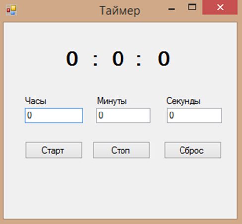
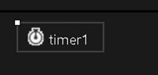
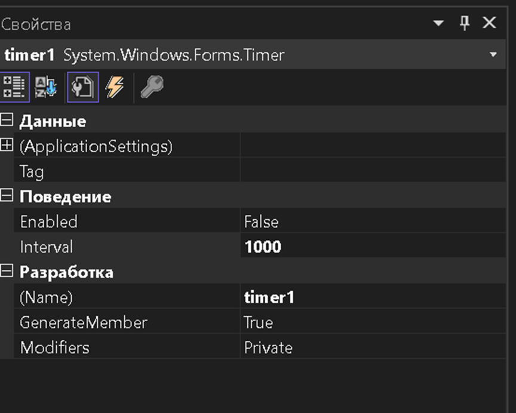
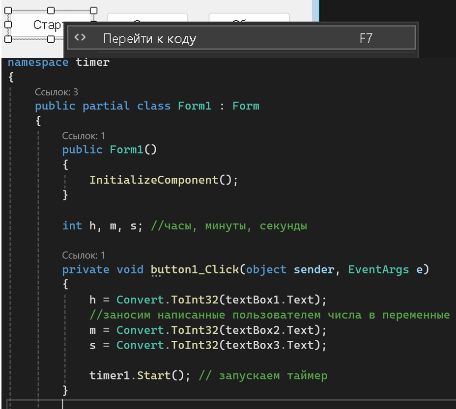
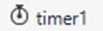
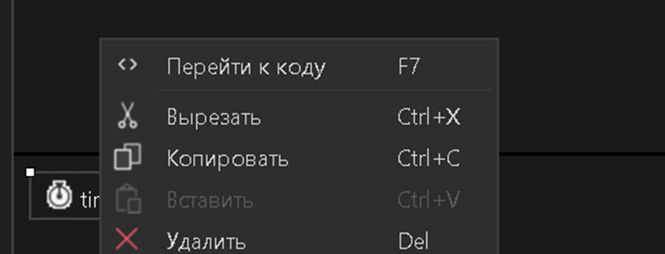
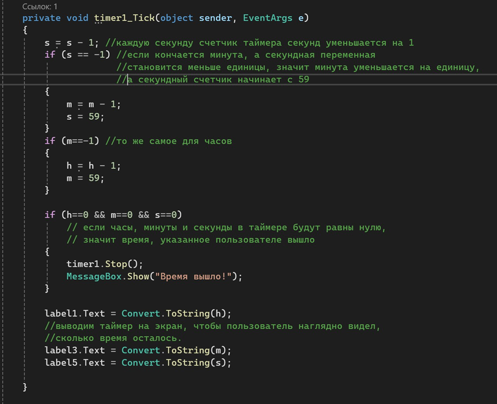
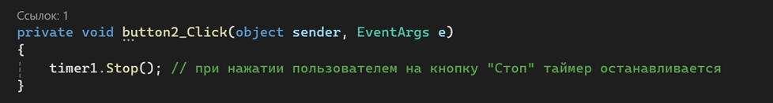
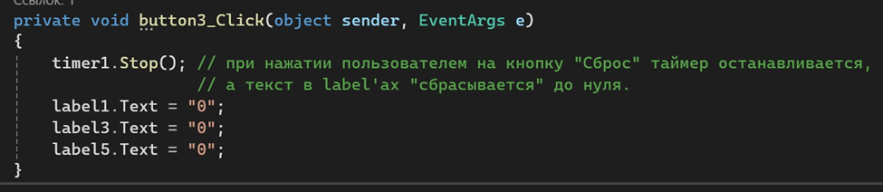

-  Создать проект формы:

{width=488px height=452px}

Элементы: 0, :, Часы, Минуты, Секунды – **Label**

Старт, Стоп, Сброс – **Button**

**TextBox** – где хранятся значения часов , минут и секунд

**Timer** – невизуальный компонент

Timer является компонентом для запуска действий, повторяющихся через определенный промежуток времени. Примечание: при переносе элемента Timer в форму, на неё ничего не появляется. Лишь в нижней части окна программы под формой появляется значок:

{width=313px height=150px}

-  Щёлкнем на значок таймера Значок таймера на C# и в окне «Свойства» в группе

«Поведение» устанавливаем значение параметра Interval равным 1000. Данный параметр определяет длину тика таймера в миллисекундах, указав 1000, мы сделали один тик равным одной секунде.

{width=864px height=692px}

После оформления и настройки приступаем к коду. Вводим целочисленные переменные h -- часы, m- минуты, s -- секунды.

Затем дважды щёлкаем мышью на кнопке «Старт» и переходим на участок кода, отвечающий за клик на эту кнопку. И пишем следующий код:

{width=928px height=833px}

-  Также нам надо настроить счёт времени самого таймера. Для этого дважды кликаем на элементе {width=103px height=31px} и внутри тела кода, в который нас отправило, пишем:

{width=827px height=316px}

{width=983px height=799px}

-  Теперь надо разобраться с кнопками «Стоп» и «Сброс». В первом случае при нажатии на кнопку пользователем, таймер просто останавливается и может быть возобновлён после нажатия на кнопку «Старт». При нажатии на вторую кнопку счётчики сбрасываются и при нажатии на «Старт», отчёт начнётся заново.

   -  Код кнопки «Стоп»:

{width=978px height=131px}

-  В кнопке «Сброс» нам надо помимо остановки сбросить значения переменных до нулей:

{width=975px height=212px}

-  Запустить проект и протестировать форму.