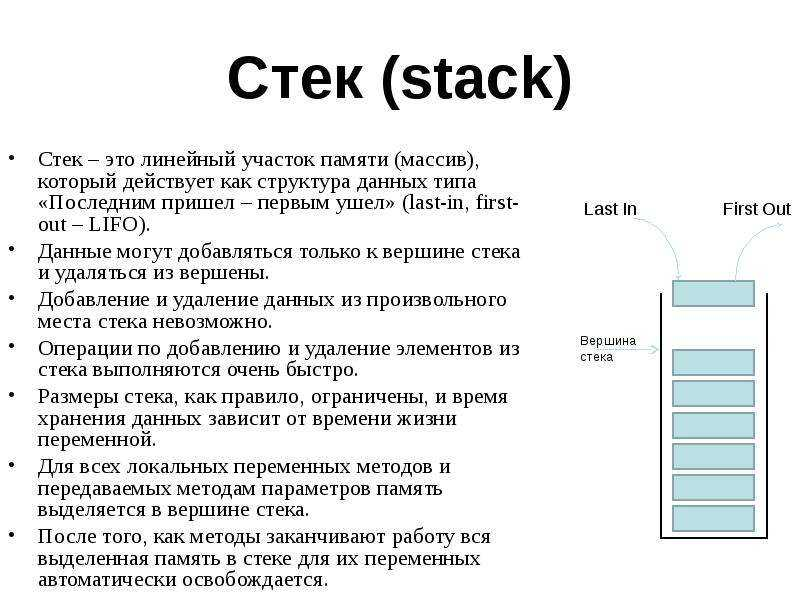

**Цель работы:** получение навыков построения алгоритмов с использованием рекурсии.

## **Теоретические сведения**

В C# допускается, чтобы метод вызывал самого себя. Этот процесс называется ***рекурсией***, а метод, вызывающий самого себя, -- ***рекурсивным***

Если вспомнить математику, то там можно встретить принцип математической индукции. Он заключается в следующем: некоторое утверждение справедливо для всякого натурального *n*, если

1. оно справедливо для *n = 1*;

2. из справедливости утверждения для какого-либо произвольного натурального *n = k* следует его справедливость для *n = k+1*.

{width=856px height=697px}

Пример рекурсивной процедуры:

void Rec(int a)\
\{\
if (a>0) \{ Rec(a-1); }\
Console.WriteLine(a);\
}

Схематично работу рекурсии можно изобразить блок-схемой.

{width=695px height=197px}

Процедура `Rec()` выполняется с параметром 3. Затем в внутри процедуры с параметром 3 вызывается процедура с параметром 2 и т.д., пока не произойдет вызов процедуры с параметром 0. При вызове процедуры с параметром 0 рекурсивного вызова уже не произойдет и процедура с параметром 0 напечатает число 0 и закончит работу. Затем управление передается обратно в процедуру с параметром 1, она также заканчивает свою работу печатает число 1 и т.д. до процедуры с параметром 3. \
\
Все вызвавшиеся процедуры хранятся в памяти, до тех пор пока не закончат свою работу. Количество одновременно работающих процедур называется **глубиной рекурсии**.

### Классическим примером рекурсии служит вычисление факториала числа.

При создании рекурсивной функции в ней обязательно должен быть некоторый **базовый вариант**, с которого начинается вычисление функции. В случае с факториалом это факториал числа 1, который равен 1. Факториалы всех остальных положительных чисел будет начинаться с вычисления факториала числа 1, который равен 1.

```
using System; 
using System.Collections.Generic; 
using System.Linq; using System.Text;
namespace ConsoleApplication1 {
class Program { 
       //Рекурсивный метод
      static int factorial(int i) { 
      int result;        

      if (i == 0 || i == 1) return 1;
     
      result = factorial(i - 1) * i;
      
      return result;
    }
    // Итеративный метод вычисления факториала
    // Сложность: O(n) - линейная, выполняется n итераций цикла
    static int factorial_iterative(int n)
    {
        // Проверка на отрицательные числа
        if (n < 0)
            throw new ArgumentException("Факториал определен только для неотрицательных чисел");
        
        // Факториал 0 и 1 равен 1
        if (n == 0 || n == 1)
            return 1;
        
        int result = 1;
        
        // Умножаем все числа от 2 до n
        for (int i = 2; i <= n; i++)
        {
            result *= i;
        }
        
        return result;
    }

    static void Main(string[] args)
    {
        label1:
        Console.WriteLine("Введите число: ");
        try
        {
            int i = int.Parse(Console.ReadLine());
            Console.WriteLine("Рекурсивный метод: {0}! = {1}", i, factorial(i));
            Console.WriteLine("Итеративный метод: {0}! = {1}", i, factorial_iterative(i));
        }
        catch (FormatException)
        {
            Console.WriteLine("Некорректное число");
            goto label1;
        }
        catch (ArgumentException ex)
        {
            Console.WriteLine(ex.Message);
            goto label1;
        }
        catch (OverflowException)
        {
            Console.WriteLine("Слишком большое число для вычисления факториала");
            goto label1;
        }

        Console.ReadLine();
    }
 }
}
```

| **Метод**   | **Временная сложность** | **Пространственная сложность** |
|-------------|-------------------------|--------------------------------|
| Рекурсивный | O(n)                    | O(n)                           |
| Итеративный | O(n)                    | O(1)                           |

Итеративный метод:

-  Итеративный метод выполняет ровно n-1 итераций цикла (для n ≥ 2)

-  На каждой итерации выполняется одна операция умножения

-  Используется только одна дополнительная переменная `result`, поэтому память не зависит от входных данных

Рекурсивный метод:

**Временная сложность O(n):**

-  Функция вызывает саму себя ровно n раз (для n ≥ 1)

-  На каждом уровне рекурсии выполняется константное количество операций (сравнение, умножение, возврат)

-  Общее количество операций пропорционально n

**Пространственная сложность O(n):**

-  Каждый рекурсивный вызов создает новый стековый фрейм

-  При вычислении factorial(n) в стеке одновременно находится n фреймов:

   -  factorial(n)

   -  factorial(n-1)

   -  factorial(n-2)

   -  ...

   -  factorial(1)

-  Глубина рекурсии = n, поэтому требуется O(n) дополнительной памяти

Программы, в которых используются рекурсивные алгоритмы, отличаются простотой, наглядностью и компактностью текста. Это обуславливается тем, что рекурсивная процедура указывает, **что нужно делать**, а нерекурсивная больше акцентирует внимание на том, **как нужно делать**.

Однако за простоту рекурсивных алгоритмов приходится расплачиваться неэкономным использованием оперативной памяти, так как выполнение рекурсивных процедур требует значительно большего размера памяти во время выполнения.

При каждом рекурсивном вызове для локальных переменных, а также для параметров процедуры, выделяются новые ячейки памяти. Таким образом, какой-либо переменной на разных уровнях рекурсии будут соответствовать различные ячейки памяти. Поэтому воспользоваться значением переменной *i*\-го уровня можно только, находясь на этом уровне.

Каждое обращение к рекурсивной подпрограмме вызывает независимую активацию этой подпрограммы. Совокупность данных, необходимых для одной активации рекурсивной подпрограммы, называется **фреймом активации**.

Фрейм активации включает:

-  Копии всех локальных переменных подпрограммы;

-  Копии параметров-значений;

-  4-байтовые адреса параметров-переменных и параметров-констант;

-  Копию результата (для функции);

-  Служебную информацию – около 12 байт (в зависимости от способа вызова: дальний или ближний).

Все фреймы размещаются в стеке, и при большом количестве вызовов возможно переполнение стека.\
*(Размер стека устанавливается в настройках среды, по умолчанию = 16 Кб, его максимальный размер -- 64 Кб.)*


{width=800px height=600px}

{width=627px height=274px}

Одной из наиболее встречающихся ошибок при создании рекурсивных подпрограмм является **«зациклившаяся» или бесконечная рекурсия**.\
В отличие от бесконечного цикла, обычно она завершается аварийно при переполнении стека.

При написании рекурсивных методов следует непременно указать в соответствующем месте условный оператор, например `if`, чтобы организовать возврат из метода без рекурсии. В противном случае возврата из вызванного однажды рекурсивного метода может вообще не произойти. Подобного рода ошибка весьма характерна для реализации рекурсии в практике программирования.

В этом случае рекомендуется пользоваться операторами, содержащими вызовы метода `WriteLine()`, чтобы следить за происходящим в рекурсивном методе и прервать его выполнение, если в нём обнаружится ошибка.

### **Пример зацикленной рекурсии**

```
void InfiniteRecursion()
{
    InfiniteRecursion(); // вызывает саму себя без условия выхода
}
```

### **Формула рекурсивной функции**

```
[возвращаемый_тип] ИмяФункции([параметры])
{
    // 1. Базисное условие (условие окончания рекурсии)
    if ([условие_выхода])
    {
        return [базовое_значение]; // например: 0, 1, null, пустой список и т.д.
    }
    // 2. Рекурсивный шаг (условие продолжения)
    // — изменяем параметр(ы) так, чтобы приближаться к базису
    // — вызываем саму себя с новыми параметрами
    
    [возвращаемый_тип] результат = ИмяФункции([изменённые_параметры]);
    // 3. Обработка результата (если нужно)
    return [обработанный_результат]; // например: результат + 1, результат * n и т.д.
}
```

### Рекурсивная функция Фибоначчи

\
Другим распространенным показательным примером рекурсивной функции служит функция, вычисляющая числа Фибоначчи. n-й член последовательности Фибоначчи определяется по формуле: f(n)=f(n-1) + f(n-2), причем f(0)=0, а f(1)=1. То есть последовательность Фибоначчи будет выглядеть так 0 (0-й член), 1 (1-й член), 1, 2, 3, 5, 8, 13, 21, 34, 55, 89, 144, .... Для определения чисел этой последовательности определим следующий метод:

```
int Fibonachi(int n)
{
    if (n == 0 || n == 1) return n; //базисное условие (базовый вариант)
     
    return Fibonachi(n - 1) + Fibonachi(n - 2); //шаг рекурсии
}
 
int fib4 = Fibonachi(4);
int fib5 = Fibonachi(5);
int fib6 = Fibonachi(6);
 
Console.WriteLine($"4 число Фибоначчи = {fib4}");
Console.WriteLine($"5 число Фибоначчи = {fib5}");
Console.WriteLine($"6 число Фибоначчи = {fib6}");
```

То есть, если мы ищем нулевой или первый элемент последовательности, то возвращается это же число - 0 или 1. Иначе возвращается результат выражения Fibonachi(n - 1) + Fibonachi(n - 2);

**Временная сложность O(2^n):**

-  Каждый вызов функции порождает 2 новых вызова (Fibonachi(n-1) и Fibonachi(n-2))

-  Количество операций растет экспоненциально относительно n

-  Для n = 6: примерно 2^6 = 64 операций

**Пространственная сложность O(n):**

-  Максимальная глубина рекурсии = n

-  В стеке одновременно находится не более n вызовов

-  Память используется для хранения стековых фреймов

### Пример блок-схемы для рекурсивной функции:

{width=1172px height=959px}


## Требования к отчету

**Структура отчета:**

1. **Титульный лист**

2. **Цель работы**

3. **Условие задания**

4. **Блок-схема алгоритма**

5. **Код программы**

6. **Скриншоты тестирования программы**

7. **Указание сложности алгоритма (по памяти и по времени)**

8. **Вывод по цели работы**

## Примечания

-- Оценка «5» – Решены все задачи, приведены блок-схемы алгоритмов, указана сложность алгоритмов, даны ответы на контрольные вопросы.\
-- Оценка «4» – Решены все задачи,указана сложность алгоритмов, даны ответы на контрольные вопросы.\
-- Оценка «3» – Решены все задачи, даны ответы на контрольные вопросы.

## Контрольные вопросы

1\. Что такое рекурсия?

2\. Приведите примеры рекурсивных процессов из жизни.

3\. На чем основан рекурсивный метод программирования?

4\. В чем заключается суть рекурсивного процесса?

5\. Перечислите основные достоинства и недостатки рекурсивных определений.

### Дополнительно:

<http://techn.sstu.ru/kafedri/подразделения/1/MetMat/shaturn/theoralg/8.htm>

<https://www.recursionvisualizer.com/>

<https://recursion.vercel.app/>

Ханойские башни:

<https://csharpstar.com/towers-of-hanoi-in-csharp/>

<https://education.yandex.ru/handbook/algorithms/article/rekursivnye-algoritmy>

[video:https://rutube.ru/video/eb6065b35f3105952c206269d5efb376/?r=wd]


