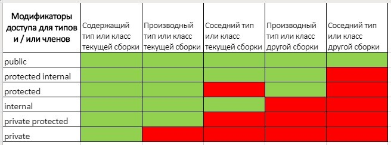
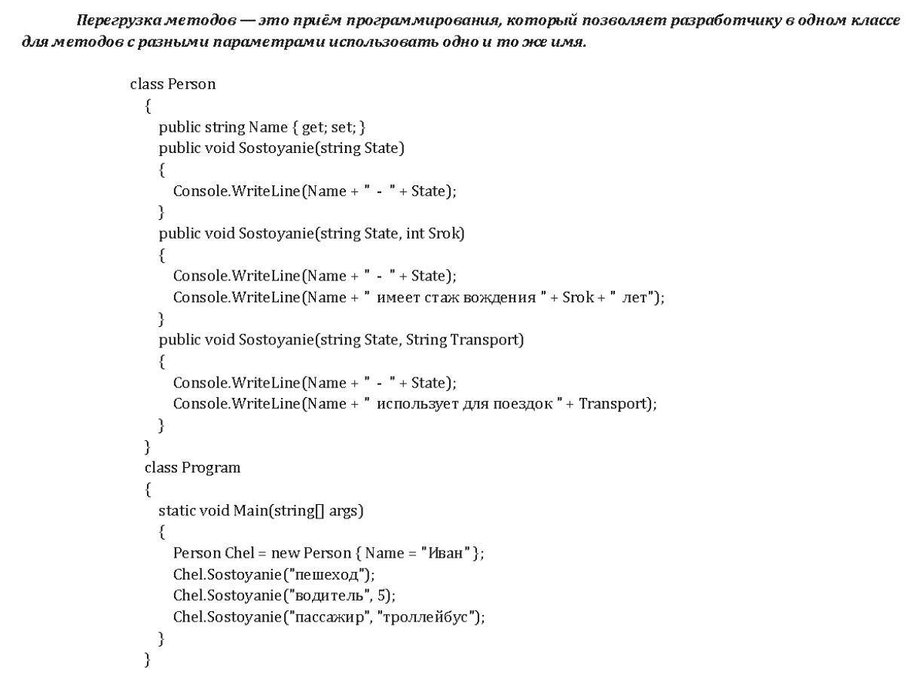

**Цель работы:** Познакомиться с основой объектного подхода в языке C#, созданием объектов, классов и перегрузкой методов в классе.

## Теоретический материал

### Классы и объекты

Класс является основой для создания объектов. В классе определяются данные и код, который работает с этими данными. Объекты являются экземплярами класса. Методы и переменные, составляющие класс, называются членами класса. При определении класса объявляются данные, которые он содержит, и код, работающий с этими данными. Данные содержатся в переменных экземпляра, которые определены классом, а код содержится в методах.

В С# определены несколько специфических разновидностей членов класса. Это -- переменные экземпляра, статические переменные, константы, методы, конструкторы, деструкторы, индексаторы, события, операторы и свойства. Непосредственно инициализация переменных в объекте (переменных экземпляра) происходит в конструкторе. В классе могут быть определены несколько конструкторов.

Синтаксис класса:

```
class имя_класса{ тип_доступа тип имя_переменной1; 
тип_доступа тип имя_переменной2; … 
тип_доступа возвращаемый_тип 
имя_метода1(список_параметров) { 
тело_метода 
} 
}
```

Пример класса:

```
class DemoClass
{
 // Поле класса
int field = 0;
 // Свойство класса
public int Property {get;set;}
 // Метод класса
public void Method()
{
 Console.WriteLine("Method");
}
}
```

Пример класса с конструктором класса

```
class Animal{
//поля класса
public string Name;
private int Weight;
protected int Type;
//!Конструктор класса
public int Animal(int W, int T, string N){
Weight=W; Type=T; Name=N; 
} 
public int GetWeight(){return Weight;} }
```

где тип\_доступа может быть:

-  public – доступ к классу возможен из любого места одной сборки либо из другой сборки, на которую есть ссылка;

-  internal – доступ к классу возможен только из сборки, в которой он объявлен.

Также, могут использованы следующие модификаторы:

-  protected - Используется для вложенных классов. Доступ только из элементов данного и производных классов

-  private - (для вложенных классов). Доступ только из элементов класса, внутри которого описан данный класс.

-  abstract - Абстрактный класс. Применяется в иерархиях

-  sealed - Бесплодный класс. Применяется в иерархиях

-  static - Статический класс.

{width=656px height=243px}

Создание обьекта:

**имя\_класса имя\_обьекта = new имя\_класса();**

При создании объекта класса происходит вызов соответствующего конструктора класса.

**Пример:**

DemoClass demo = new DemoClass();

**При наличии конструктора с параметрами, нужно передать нужные параметры при создании объекта, в том порядке, в каком они указаны в конструкторе!**

Animal cat = new Animal(3,1,"Муся");

### Конструктор и деструктор

Конструктор класса – метод для инициализации объекта при его

создании. Он имеет то же имя, что и его класс. В конструкторах тип

возвращаемого значения не указывается явно. Конструкторы используются

для присваивания начальных значений переменным экземпляра,

определенным классом, и для выполнения любых других процедур

инициализации, необходимых для создания объекта.


Все классы имеют конструкторы независимо от того, определен он или

нет. По умолчанию в С# предусмотрено наличие конструктора, который

присваивает нулевые значения всем переменным экземпляра (для

переменных обычных типов) и значения null (для переменных ссылочного

типа). Но если конструктор явно определен в классе, то конструктор по

умолчанию использоваться не будет.


*имя\_класса(список\_параметров) \{тело\_конструктора}*


Деструктор – метод, вызывающийся автоматически при уничтожении

объекта класса (непосредственно перед “сборкой мусора”). Деструктор не

имеет параметров и возвращаемого значения.


*\~имя\_класса() \{тело\_деструктора}*


### Полиморфизм(перегрузка методов)

{width=1209px height=917px}

Полиморфизм может быть применен к любому методу, в том числе и к конструктору!

## Требования к отчету

**Структура отчета:**

1. **Титульный лист**

2. **Цель работы**

3. **Условие задания**

4. **Код программы**

5. **Скриншоты тестирования программы**

6. **Вывод по цели работы**

## Примечания

**Оценка 5:**

-  Работа оформлена по образцу

-  Полностью решены все 3 задания

**Оценка 4:**

-  Работа оформлена по образцу

-  Решены 2 задания 

**Оценка 3:**

-  Работа оформлена по образцу

-  Решено 1 задание