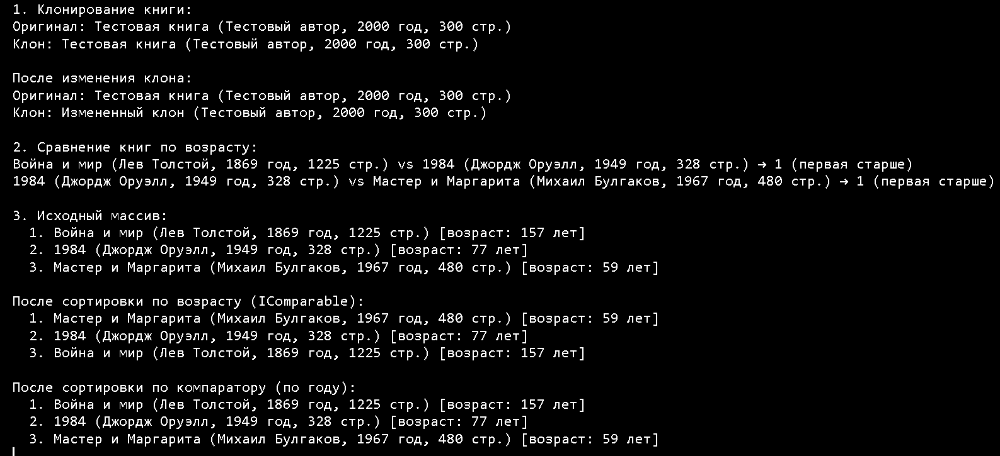

Реализовать для класса, соответствующего вашему варианту (см. ниже), интерфейсы `ICloneable` и `IComparable` (допускается вместо реализации `IComparable` использовать отдельный компаратор).

В методе `Main` продемонстрируйте:

1. Создание тестовых объектов (минимум 3-4).

2. Глубокое копирование одного объекта.

3. Сравнение объектов по указанному критерию (сортировка массива или попарное сравнение).

4. Вывод результатов на экран.

**Вариант 1. Авиалайнер**

Класс `Airliner` с полями: *Модель, Производитель, Взлетный вес, Количество пассажиров*.

**Что требуется:**

-  Реализовать глубокое копирование авиалайнера.

-  Сравнивать авиалайнеры по **удельному весу на пассажира** (Взлетный вес / Количество пассажиров). Чем меньше значение, тем эффективнее конструкция.

---

**Вариант 2. Товар**

Класс `Product` с полями: *Наименование, Цена, Дата производства, Срок годности (сутки), Количество*.

**Что требуется:**

-  Создавать полную копию товара.

-  Сравнивать товары по **оставшемуся сроку годности** (Дата производства + Срок годности) или по **общей стоимости** (Цена × Количество).

---

**Вариант 3. Поезд**

Класс `Train` с полями: *Номер поезда, Пункт отправления, Дата и время отправления, Дата и время прибытия*.

**Что требуется:**

-  Клонировать объект поезда.

-  Сравнивать поезда по **длительности маршрута** (разница между прибытием и отправлением). Более долгие маршруты считаются "большими".

---

**Вариант 4. Фильм**

Класс `Movie` с полями: *Название, Продолжительность (минуты), Бюджет*.

**Что требуется:**

-  Реализовать глубокое копирование фильма.

-  Сравнивать фильмы по **стоимости одной минуты** (Бюджет / Продолжительность). Фильм с меньшей стоимостью минуты считается более экономичным.

---

**Вариант 5. Авиарейс**

Класс `Flight` с полями: *Номер рейса, Дата/время вылета, Дата/время прилета, Расстояние (км)*.

**Что требуется:**

-  Создавать копию объекта рейса.

-  Сравнивать рейсы по **средней скорости** (Расстояние / Время в пути). Учитывайте, что рейс может пересекать полночь.

---

**Вариант 6. Поезд (длительные маршруты)**

Класс `Train` с полями: *Номер поезда, Направление, Дата/время отправления, Дата/время прибытия*.

**Что требуется:**

-  Клонировать объект поезда.

-  Сравнивать поезда по **длительности пути** и определять, превышает ли она **24 часа**.

---

**Вариант 7. Киносеанс**

Класс `Session` с полями: *Название фильма, Время начала, Стоимость билета*.

**Что требуется:**

-  Реализовать глубокое копирование сеанса.

-  Сравнивать сеансы по **стоимости билета** (дешевле -> "меньше") или по **времени начала** (раньше -> "меньше").

---

**Вариант 8. Легковой автомобиль**

Класс `Car` с полями: *Госномер, Модель, Год выпуска, Дата регистрации*.

**Что требуется:**

-  Создавать полную копию автомобиля.

-  Сравнивать автомобили по **году выпуска** (новее -> "больше") или по **дате регистрации**.

---

**Вариант 9. Грузовой автомобиль**

Класс `Truck` с полями: *Госномер, Модель, Грузоподъемность (тонн), Дата регистрации*.

**Что требуется:**

-  Клонировать объект грузовика.

-  Сравнивать грузовики по **грузоподъемности** (больше -> "больше"), а при равенстве -- по **дате регистрации** (новее -> "больше").

---

**Вариант 10. Работник по контракту**

Класс `EmployeeContract` с полями: *ФИО, Должность, Дата подписания контракта, Срок действия (месяцы)*.

**Что требуется:**

-  Реализовать глубокое копирование контракта.

-  Сравнивать контракты по **дате окончания** (Дата подписания + Срок действия). Более поздняя дата окончания -> "больше".

---

**Вариант 11. Автомобиль и техосмотр**

Класс `CarInspection` с полями: *Госномер, Тип, Модель, Дата последнего техосмотра*.

**Что требуется:**

-  Создавать копию объекта автомобиля.

-  Сравнивать автомобили по **давности техосмотра** (сколько дней прошло с даты осмотра). Больший интервал -> "старше" по техобслуживанию.

---

**Вариант 12. Работник и стаж**

Класс `Employee` с полями: *ФИО, Должность, Дата приема на работу*.

**Что требуется:**

-  Клонировать объект работника.

-  Сравнивать работников по **стажу** (количество дней с даты приема). Больший стаж -> "старше" в компании.

### Пример выполнения

Реализовать класс `Book` с полями: название книги, автор, год издания, количество страниц. Реализовать для данного класса интерфейсы `ICloneable` и `IComparable` (или компаратор) для сравнения книг по **"возрасту" издания** (чем раньше год издания -- тем "старше" книга). Обеспечить возможность:

-  создания точной копии объекта книги (клонирования);

-  сравнения двух книг по году издания для определения более раннего/позднего издания.

**Что требуется:**

**Клонировать объект книги** -- создать полную копию экземпляра `Book` с идентичными значениями всех полей.

**Сравнивать книги по возрасту издания** (разница между текущим годом и годом издания). Больший возраст -> книга считается "старше".

```
using System;

namespace BookLibrary
{
    public class Book : ICloneable, IComparable<Book>
    {
        // Поля класса (public свойства для простоты доступа)
        public string Title { get; set; }
        public string Author { get; set; }
        public int Year { get; set; }
        public int Pages { get; set; }

        // Конструктор
        public Book(string title, string author, int year, int pages)
        {
            Title = title;
            Author = author;
            Year = year;
            Pages = pages;
        }

        // Реализация ICloneable - глубокое копирование
        public object Clone()
        {
            // Создаем новый объект с теми же значениями полей
            return new Book(Title, Author, Year, Pages);
        }

        // Реализация IComparable<Book> - сравнение по "возрасту" издания
        public int CompareTo(Book other)
        {
            if (other == null) return 1;
            
            // Рассчитываем возраст книги (сколько лет прошло с года издания)
            int currentYear = DateTime.Now.Year;
            int thisAge = currentYear - this.Year;
            int otherAge = currentYear - other.Year;
            
            // Возвращаем отрицательное значение, если текущая книга МЛАДШЕ (меньший возраст)
            // Положительное значение, если текущая книга СТАРШЕ (больший возраст)
            return thisAge.CompareTo(otherAge);
        }

        // Переопределение ToString для удобного вывода
        public override string ToString()
        {
            return $"{Title} ({Author}, {Year} год, {Pages} стр.)";
        }
    }

    // Дополнительный компаратор для сравнения по году издания
    public class BookYearComparer : System.Collections.Generic.IComparer<Book>
    {
        public int Compare(Book x, Book y)
        {
            if (x == null && y == null) return 0;
            if (x == null) return -1;
            if (y == null) return 1;
            
            // Сравниваем по году: меньший год = старше книга
            return x.Year.CompareTo(y.Year);
        }
    }

    class Program
    {
        static void Main(string[] args)
        {

            // 1. Создаем несколько книг
            Book book1 = new Book("Война и мир", "Лев Толстой", 1869, 1225);
            Book book2 = new Book("1984", "Джордж Оруэлл", 1949, 328);
            Book book3 = new Book("Мастер и Маргарита", "Михаил Булгаков", 1967, 480);

            // 2. Демонстрация клонирования
            Console.WriteLine("1. Клонирование книги:");
            Book original = new Book("Тестовая книга", "Тестовый автор", 2000, 300);
            Book clone = (Book)original.Clone();
            
            Console.WriteLine($"Оригинал: {original}");
            Console.WriteLine($"Клон: {clone}");
            
            // Изменяем клон - оригинал не меняется
            clone.Title = "Измененный клон";
            Console.WriteLine($"\nПосле изменения клона:");
            Console.WriteLine($"Оригинал: {original}");
            Console.WriteLine($"Клон: {clone}\n");

            // 3. Сравнение книг (IComparable)
            Console.WriteLine("2. Сравнение книг по возрасту:");
            Console.WriteLine($"{book1} vs {book2} → {book1.CompareTo(book2)} ({GetCompareResult(book1.CompareTo(book2))})");
            Console.WriteLine($"{book2} vs {book3} → {book2.CompareTo(book3)} ({GetCompareResult(book2.CompareTo(book3))})\n");

            // 4. Массив для сортировки
            Book[] books = { book1, book2, book3 };
            Console.WriteLine("3. Исходный массив:");
            PrintBooks(books);

            // Сортировка по IComparable (по возрасту)
            Array.Sort(books);
            Console.WriteLine("\nПосле сортировки по возрасту (IComparable):");
            PrintBooks(books);

            // Сортировка по компаратору
            Array.Sort(books, new BookYearComparer());
            Console.WriteLine("\nПосле сортировки по компаратору (по году):");
            PrintBooks(books);
        }

        // Вспомогательные методы
        static void PrintBooks(Book[] books)
        {
            int currentYear = DateTime.Now.Year;
            for (int i = 0; i < books.Length; i++)
            {
                int age = currentYear - books[i].Year;
                Console.WriteLine($"  {i+1}. {books[i]} [возраст: {age} лет]");
            }
        }

        static string GetCompareResult(int result)
        {
            return result < 0 ? "первая младше" : result > 0 ? "первая старше" : "одинаковый возраст";
        }
    }
}
```

{width=1587px height=725px}