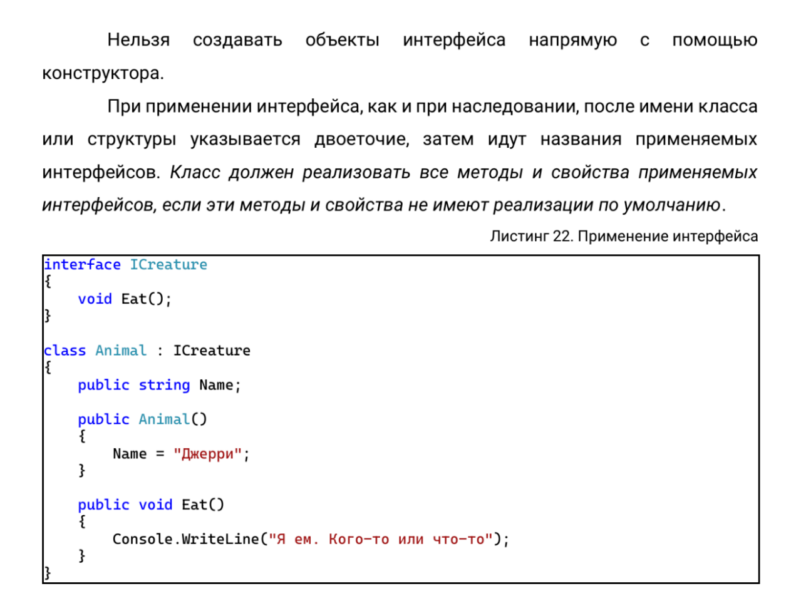
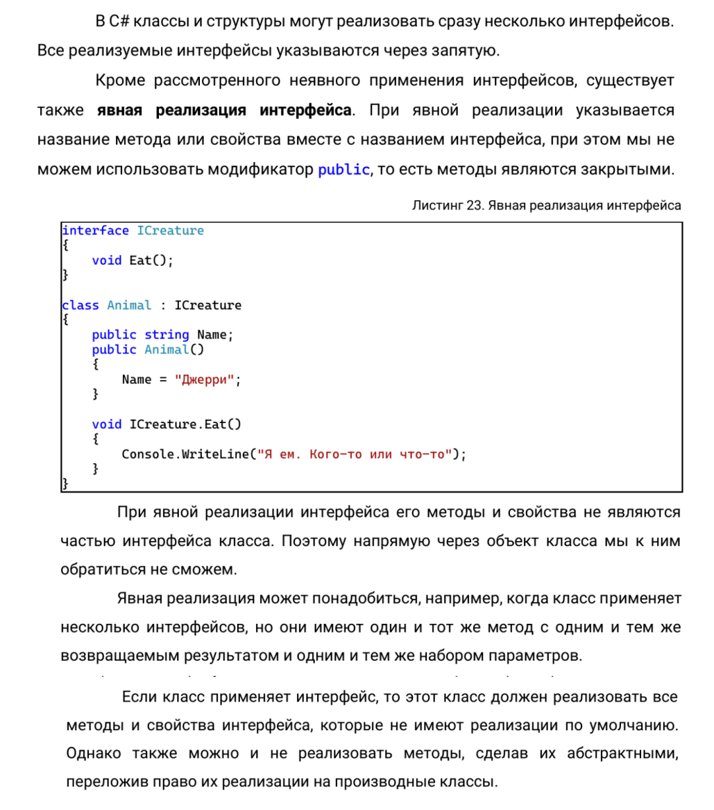

**Цель работы:** изучить основные принципы использования интерфейсов и абстрактных классов

## Теоретический материал

### АБСТРАКТНЫЕ КЛАССЫ 

Кроме обычных классов в C# есть **абстрактные классы**. Абстрактный класс похож на обычный класс. Он также может иметь переменные, методы, конструкторы, свойства. Единственное, что при определении абстрактных классов используется ключевое слово **abstract**:

```
abstract class Human
{
public int Length {
get; set; }
public double Weight {
get; set; }
}
```

:::danger 

Но главное отличие состоит в том, что мы не можем использовать конструктор абстрактного класса для создания его объекта. Например, следующим образом: 

**Human h = new Human();**

:::

Зачем нужны абстрактные классы? 

Допустим, в нашей программе для банковского сектора мы можем определить две основных сущности: клиента банка и сотрудника банка. Каждая из этих сущностей будет отличаться, например, для сотрудника надо определить его должность, а для клиента - сумму на счете. Соответственно клиент и сотрудник будут составлять отдельные классы **Client** и **Employee**. В то же время обе этих сущности могут иметь что-то **общее**, например, имя и фамилию, какую-то другую общую функциональность. И эту общую функциональность лучше вынести в какой-то отдельный класс, например, **Person**, который описывает человека. ***То есть классы Employee (сотрудник) и Client (клиент банка) будут производными от класса Person.*** И так как все объекты в нашей системе будут представлять либо сотрудника банка, либо клиента, то напрямую мы от класса Person создавать объекты не будем. Поэтому имеет смысл сделать его абстрактным:

```
abstract class Person {
public string FirstName { get; set; }
public string LastName { get; set; }
public Person(string name, string surname)
{
FirstName = name;
LastName = surname;
}
public void Display()
{
Console.WriteLine(FirstName + " " +
LastName);
}
}
class Client : Person
{
public int Sum { get; set; } // сумма
на счету
public Client(string name, string surname,
int sum)
: base(name, surname)
{
Sum = sum;
}
}
class Employee : Person
{
public string Position { get; set; } //
должность
public Employee(string name, string surname, string position):base(name, surname)
{
Position = position;
}
```

:::note 

Затем мы сможем использовать эти классы:

Client client = new Client("Tom", "Smith",500);

Employee employee = new Employee ("Bob","Tompson", "Apple");

client.Display();

employee.Display();


Или даже так:

Person client = new Client("Tom", "Smith",500);

Person employee = new Employee ("Bob","Tompson", "Операционист");

[highlight:light-pink]**Но мы НЕ можем создать объект Person, используя конструктор класса Person:**[/highlight] 

[highlight:light-pink]**Person person = new Person ("Bill", "Gates"); //ОШИБКА!!!!**[/highlight] 

Однако несмотря на то, что напрямую мы не можем вызвать конструктор класса Person для создания объекта, тем не менее конструктор в абстрактных классах то же может играть важную роль.

:::

В частности, в классе Person конструктор инициализирует свойства FirstName и LastName. И хотя напрямую он не вызывается, тем не менее производные классы Client и Employee могут обращаться к нему. Используя механизм наследования, мы можем дополнять и переопределять общий функционал базовых классах в классах-наследниках. 

***Однако напрямую мы можем наследовать только от одного класса, в отличие, например, от языка С++, где имеется множественное наследование. В языке C# подобную проблему позволяют решить интерфейсы.*** Они играют важную роль в системе ООП. Интерфейсы позволяют определить некоторый функционал, не имеющий конкретной реализации. Затем этот функционал реализуют классы, применяющие данные интерфейсы.

### ИНТЕРФЕЙСЫ

Для определения интерфейса используется ключевое слово **interface**. *Как правило, названия интерфейсов в C# начинаются с заглавной буквы I, например, IComparable, IEnumerable (так называемая венгерская нотация), однако это не обязательное требование, а больше стиль программирования.*

 Интерфейсы также, как и классы, могут содержать свойства, методы и события, только без конкретной реализации. Определим следующий интерфейс IAccount, который будет содержать методы и свойства для работы со счетом клиента. Для добавления интерфейса в проект можно нажать правой кнопкой мыши на проект и в появившемся контекстном меню выбрать Add-> New Item и в диалоговом окне добавления нового компонента выбрать Interface:

{width=1212px height=907px}


Изменим пустой код интерфейса **IAccount** на следующий:

```
interface IAccount
{
// Текущая сумма на счету
int CurrentSum { get; }
// Положить деньги на счет
void Put(int sum);
// Взять со счета
void Withdraw(int sum);
```

**У интерфейса методы и свойства не имеют реализации, в этом они сближаются с абстрактными методами абстрактных классов.**

 Сущность данного интерфейса проста: он определяет свойство для текущей суммы денег на счете и два метода для добавления денег на счет и изъятия денег. Еще один момент в объявлении интерфейса: все его члены - методы и свойства не имеют модификаторов доступа, но фактически по умолчанию доступ public, так как цель интерфейса - определение функционала для реализации его классом. Поэтому весь функционал должен быть открыт для реализации.

{width=1263px height=960px}

{width=1029px height=1166px}


### Исключения