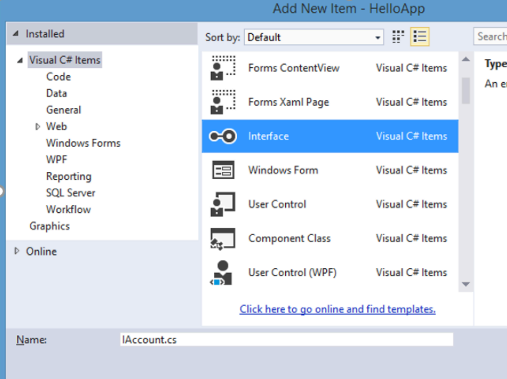
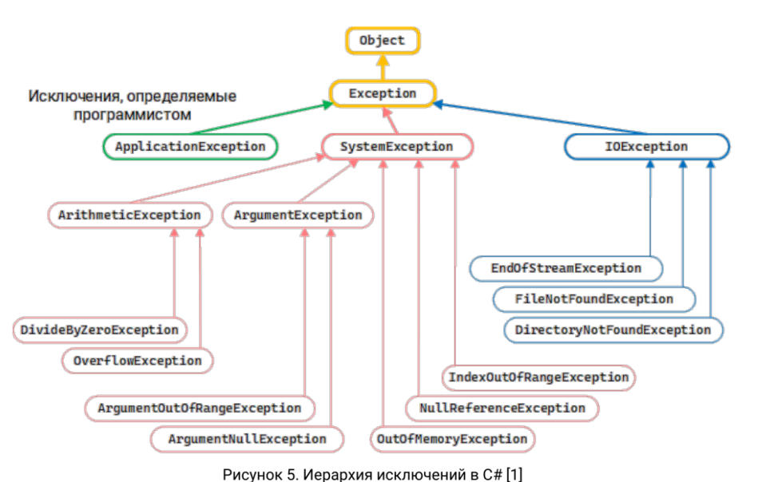
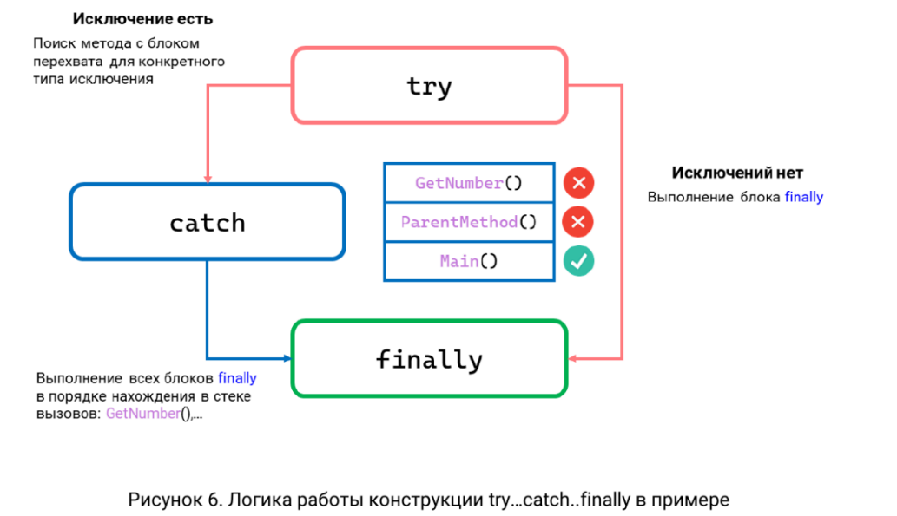
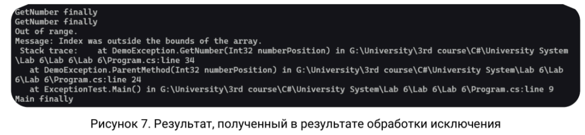
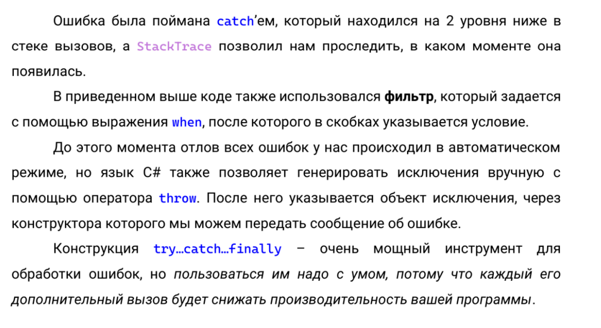

**Цель работы:** изучить основные принципы использования интерфейсов и абстрактных классов

## Теоретический материал

### АБСТРАКТНЫЕ КЛАССЫ

Кроме обычных классов в C# есть **абстрактные классы**. Абстрактный класс похож на обычный класс. Он также может иметь переменные, методы, конструкторы, свойства. Единственное, что при определении абстрактных классов используется ключевое слово **abstract**:

```
abstract class Human
{
public int Length {
get; set; }
public double Weight {
get; set; }
}
```

:::danger 

Но главное отличие состоит в том, что мы не можем использовать конструктор абстрактного класса для создания его объекта. Например, следующим образом:

**Human h = new Human();**

:::

Зачем нужны абстрактные классы?

Допустим, в нашей программе для банковского сектора мы можем определить две основных сущности: клиента банка и сотрудника банка. Каждая из этих сущностей будет отличаться, например, для сотрудника надо определить его должность, а для клиента - сумму на счете. Соответственно клиент и сотрудник будут составлять отдельные классы **Client** и **Employee**. В то же время обе этих сущности могут иметь что-то **общее**, например, имя и фамилию, какую-то другую общую функциональность. И эту общую функциональность лучше вынести в какой-то отдельный класс, например, **Person**, который описывает человека. ***То есть классы Employee (сотрудник) и Client (клиент банка) будут производными от класса Person.*** И так как все объекты в нашей системе будут представлять либо сотрудника банка, либо клиента, то напрямую мы от класса Person создавать объекты не будем. Поэтому имеет смысл сделать его абстрактным:

```
abstract class Person {
public string FirstName { get; set; }
public string LastName { get; set; }
public Person(string name, string surname)
{
FirstName = name;
LastName = surname;
}
public void Display()
{
Console.WriteLine(FirstName + " " +
LastName);
}
}
class Client : Person
{
public int Sum { get; set; } // сумма
на счету
public Client(string name, string surname,
int sum)
: base(name, surname)
{
Sum = sum;
}
}
class Employee : Person
{
public string Position { get; set; } //
должность
public Employee(string name, string surname, string position):base(name, surname)
{
Position = position;
}
```

:::note 

Затем мы сможем использовать эти классы:

Client client = new Client("Tom", "Smith",500);

Employee employee = new Employee ("Bob","Tompson", "Apple");

client.Display();

employee.Display();


Или даже так:

Person client = new Client("Tom", "Smith",500);

Person employee = new Employee ("Bob","Tompson", "Операционист");

[highlight:light-pink]**Но мы НЕ можем создать объект Person, используя конструктор класса Person:**[/highlight]

[highlight:light-pink]**Person person = new Person ("Bill", "Gates"); //ОШИБКА!!!!**[/highlight]

Однако несмотря на то, что напрямую мы не можем вызвать конструктор класса Person для создания объекта, тем не менее конструктор в абстрактных классах то же может играть важную роль.

:::

В частности, в классе Person конструктор инициализирует свойства FirstName и LastName. И хотя напрямую он не вызывается, тем не менее производные классы Client и Employee могут обращаться к нему. Используя механизм наследования, мы можем дополнять и переопределять общий функционал базовых классах в классах-наследниках.

***Однако напрямую мы можем наследовать только от одного класса, в отличие, например, от языка С++, где имеется множественное наследование. В языке C# подобную проблему позволяют решить интерфейсы.*** Они играют важную роль в системе ООП. Интерфейсы позволяют определить некоторый функционал, не имеющий конкретной реализации. Затем этот функционал реализуют классы, применяющие данные интерфейсы.

### ИНТЕРФЕЙСЫ

Для определения интерфейса используется ключевое слово **interface**. *Как правило, названия интерфейсов в C# начинаются с заглавной буквы I, например, IComparable, IEnumerable (так называемая венгерская нотация), однако это не обязательное требование, а больше стиль программирования.*

Интерфейсы также, как и классы, могут содержать свойства, методы и события, только без конкретной реализации. Определим следующий интерфейс IAccount, который будет содержать методы и свойства для работы со счетом клиента. Для добавления интерфейса в проект можно нажать правой кнопкой мыши на проект и в появившемся контекстном меню выбрать Add-> New Item и в диалоговом окне добавления нового компонента выбрать Interface:

{width=1212px height=907px}


Изменим пустой код интерфейса **IAccount** на следующий:

```
interface IAccount
{
// Текущая сумма на счету
int CurrentSum { get; }
// Положить деньги на счет
void Put(int sum);
// Взять со счета
void Withdraw(int sum);
```

**У интерфейса методы и свойства не имеют реализации, в этом они сближаются с абстрактными методами абстрактных классов.**

Сущность данного интерфейса проста: он определяет свойство для текущей суммы денег на счете и два метода для добавления денег на счет и изъятия денег. Еще один момент в объявлении интерфейса: все его члены - методы и свойства не имеют модификаторов доступа, но фактически по умолчанию доступ public, так как цель интерфейса - определение функционала для реализации его классом. Поэтому весь функционал должен быть открыт для реализации.

{width=1263px height=960px}

{width=1029px height=1166px}


### Исключения

Далеко не всегда ошибки случаются по вине того, кто кодирует приложение. Иногда приложение генерирует ошибку из-за действий конечного пользователя, или же ошибка вызвана контекстом среды, в которой выполняется код. В любом необходимо ожидать возникновения ошибок в своих приложениях и проводить кодирование в соответствии с этими ожиданиями. В .NET Framework предусмотрена развитая система обработки ошибок. Механизм обработки ошибок С# позволяет закодировать пользовательскую обработку для каждого типа ошибочных условий, а также отделить код, потенциально порождающий ошибки, от кода, обрабатывающего их. Для обработки таких ситуаций в C# предназначена конструкция **try...catch...finally**. Логика их выполнения будет следующая: сначала выполняются все

инструкции в блоке try. Если в этом блоке не возникло исключений, то после его выполнения начинает выполняться блок finally. И затем конструкция завершает свою работу. При возникновении исключения CLR (общеязыковая исполняющая среда) разворачивает стек в поисках метода с блоком перехвата для конкретного типа исключения и выполняет первый найденный блок перехвата. Во многих случаях исключение может быть вызвано не тем методом, который был вызван непосредственно вашим кодом, а другим методом, расположенным дальше в стеке вызовов. Если нигде в стеке вызовов не найдется подходящего блока перехвата, он завершит процесс и выдаст пользователю сообщение об ошибке. Если нужный блок catch найден, то он выполняется, и после его завершения выполняется блок finally. Базовым для всех типов исключений является тип Exception. Этот тип определяет ряд свойств, с помощью которых можно получить информацию об исключении:

• InnerException: хранит информацию об исключении, которое послужило причиной текущего исключения; 

• Message: хранит сообщение об исключении, текст ошибки;

• Source: хранит имя объекта или сборки, которое вызвало исключение;

• StackTrace: возвращает строковое представление стека вызовов, которые привели к возникновению исключения;

• TargetSite: возвращает метод, в котором и было вызвано исключение.

Так как тип Exception является базовым типом для всех исключений, выражение catch (Exception ex) будет обрабатывать все исключения, которые могут возникнуть. Однако, есть более специализированные типы исключений, которые предназначены для обработки каких-то определенных исключений. Их иерархию можно представить следующим образом:

{width=969px height=604px}


Приведем пример, в котором можно проследить поиск блока перехвата и обработку определенных видов исключений. Для этого обратимся к частой ошибке, которая закрадывается в код из-за невнимательности программиста: выходу за пределы массива.

{width=1033px height=595px}

```
public class ExceptionTest
{
public static void Main()
{
DemoException ex = new DemoException();
try
{
Console.WriteLine($"First test: {ex.ParentMethod(5)}, Second test:
{ex.ParentMethod(7)}");
} catch (IndexOutOfRangeException e) {
Console.WriteLine("Out of range.\n" +
"Message: " + e.Message + "\n Stack trace: " + e.StackTrace);
} finally {
Console.WriteLine("Main finally");
}
}
}
public class DemoException
{
public int ParentMethod(int numberPosition)
{
int number = 0;
number = GetNumber(numberPosition);
return number;
}
public int GetNumber(int numberPosition)
{
int number = 0;
int[] a = { 0, 1, 2, 3, 4, 5 };
try
{
number = a[numberPosition];
} catch (ArgumentOutOfRangeException ex) when (numberPosition < 0) {
Console.WriteLine("Position can’t be less then 0.");
}
finally {
Console.WriteLine("GetNumber finally");
}
return number;
}
}
```

При попытке запустить эту программу мы получим следующее сообщение:

{width=1151px height=267px}

{width=1094px height=599px}


Создание классов исключений: <https://metanit.com/sharp/tutorial/3.17.php>

## Требования к отчету

**Структура отчета:**

1. **Титульный лист**

2. **Цель работы**

3. **Условие задания**

4. **Код программы**

5. **Скриншоты тестирования программы**

6. **Вывод по цели работы**

## Примечания

-  **Оценка 5 (отлично)**:\
   Выполнены все задания.

-  **Оценка 4 (хорошо)**:\
   Выполнены задания 1-2.

-  **Оценка 3 (удовлетворительно)**:\
   Выполнено задание 1.